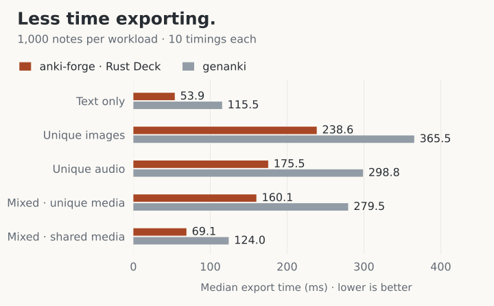

# anki-forge

English · [简体中文](README.zh-CN.md)

[Website](https://ankiforge.dev/) · [Documentation](https://ankiforge.dev/docs/) ·
[GitHub](https://github.com/morehardy/anki-forge) · [Issues](https://github.com/morehardy/anki-forge/issues)

**Turn your data into Anki decks.**

Create Basic, Cloze, and custom cards with Rust, Node.js, or Python. Bundle
images, audio, and video into a single `.apkg` file, ready to import into Anki.

[Performance](#performance-you-can-inspect) · [Quick start](#quick-start) ·
[Card examples](#more-than-a-text-card) · [Choose your language](#choose-your-language)

## Why anki-forge?

- **Make the cards your content needs.** Basic, Cloze, custom HTML/CSS templates,
  images, audio, and video. [See examples ↓](#more-than-a-text-card)
- **Spend less time exporting.** A Rust core handles deck generation and media
  packaging. Normal exports need no Anki installation.
  [See five measured workloads ↓](#performance-you-can-inspect)
- **Build once. Keep improving.** Compare against a previous release, check note
  identity and update risks, and inspect structured build reports.
  [See the update workflow ↓](#build-once-keep-improving)

## Performance you can inspect

**1,000 text notes in 53.9 ms**, versus 115.5 ms with genanki — **53.3% less
export time**. Across all five 1,000-note workloads, the measured Rust exports
took **34.7–53.3% less time**. These archived measurements compare the former Rust `Deck` API with
genanki. They do not measure the current Project API; Node and Python bindings
were not benchmarked.

<picture>
  <source media="(max-width: 600px) and (prefers-color-scheme: dark)" srcset="docs/assets/readme/export-times-dark-mobile.svg">
  <source media="(max-width: 600px)" srcset="docs/assets/readme/export-times-light-mobile.svg">
  <source media="(prefers-color-scheme: dark)" srcset="docs/assets/readme/export-times-dark.svg">
  
</picture>

Median export times from **10 runs per implementation and workload**, measured
in one session on an **Apple M1 Pro** on **2026-09-21**. Timings include process
startup through exit.
The default APKG formats differ, and results describe the
[recorded source snapshot](benchmarks/results/20260921-readme-genanki/source-snapshot.json),
not a published release or a cross-platform guarantee.

**Verification in this benchmark:** all 840 exports passed content checks, and
all 40 Anki import, content, and representative-render checks passed.

<details>
<summary>Method, memory tradeoffs, and full results</summary>

The complete matrix covers five workloads at 100, 200, 500, and 1,000 notes.
Both implementations were measured in the same session, with alternating order,
10 timing samples and 5 separate peak-RSS samples per cell. Desktop background
load and filesystem cache were uncontrolled.

Memory use varies by workload. At 1,000 unique images, Rust used **40.25 MiB**
peak RSS versus **35.77 MiB** for genanki. Package-size differences include the
libraries' different default formats and compression. GUI interaction and
audible playback were not part of the benchmark checks.

Read the [full report](benchmarks/results/20260921-readme-genanki/report.md),
[raw timings](benchmarks/results/20260921-readme-genanki/comparison.csv), and
[reproduction instructions](benchmarks/results/20260921-readme-genanki/README.md).
The README chart is generated from that archived CSV; it introduces no new measurements.

</details>

## Quick start

The [complete Basic example](anki_forge/examples/target_api_basic.rs) turns one
word pair — **hola → hello** — into `spanish.apkg`, ready to import into Anki Desktop:

```rust
use ankiforge::{BuildOptions, Note, Project};

fn main() -> anyhow::Result<()> {
    let mut project = Project::new("spanish")?.default_deck("Spanish");
    project.add("hola", Note::basic("hola", "hello"))?;
    project.build(BuildOptions::to("spanish.apkg"))?;
    Ok(())
}
```

Run it from source with **Rust 1.92.0**:

```sh
git clone https://github.com/morehardy/anki-forge.git
cd anki-forge
cargo run -q -p ankiforge --example target_api_basic
```

Import `spanish.apkg` from the current directory into Anki to study **hola → hello**.
The library embeds its default resources; no separate contract files are needed.
These instructions use the source checkout; see [API status](#choose-your-language)
for distribution details.

**Using another language?** Start with the [Node.js / TypeScript SDK](bindings/node/README.md)
or the [Python source setup](bindings/python/README.md#from-a-source-checkout).

<details>
<summary>Add this checkout to your own Rust application</summary>

Adjust the path to your local checkout. The example uses `anyhow` for error handling:

```sh
cargo add ankiforge --path ../anki-forge/anki_forge
cargo add anyhow
```

Use `Project` for stock and custom notes, owned media, comparison, and updates. Continue with the [Rust authoring guide](docs/rust-guide.md).

</details>

## More than a text card

Keep your content, templates, and media together. A single deck can combine:

- **Basic:** show **hola**, then reveal **hello**.
- **Cloze:** show “A sound's pitch depends on its […]”, then reveal **frequency**.
- **Custom + media:** play a one-second tone alongside a waveform image, then
  reveal **A4 · 440 Hz**. Define the card's layout and style with HTML/CSS.

Build all three cards with the self-contained
[showcase example](anki_forge/examples/readme_showcase.rs):

```sh
cargo run -q -p ankiforge --example readme_showcase
```

It writes `readme-showcase.apkg`: three cards plus a generated waveform and a
one-second audio tone. No media downloads are required. You can also
[download the generated sample deck](docs/assets/readme/showcase.apkg?raw=true)
or read the [sample verification and reproduction guide](docs/assets/readme/README.md).

| Build something richer | Start here |
| --- | --- |
| Your own fields, layouts, and card-generation rules | [Custom note types](anki_forge/examples/target_api_custom_notetype.rs) |
| Pictures, sound, and template media | [Media example](anki_forge/examples/target_api_media.rs) · [troubleshooting](docs/troubleshooting.md) |
| Reusable templates, CSS, and assets | [Template bundles](docs/template-bundles.md) |
| Image Occlusion | [Supported mode and limitation](docs/image-occlusion.md) |

## Build once. Keep improving.

You shipped a Spanish deck. Now you want to improve a definition:

| Release | Stable note ID | Front | Back |
| --- | --- | --- | --- |
| `spanish-v1.apkg` | `es:hola` | hola | hello |
| `spanish-v2.apkg` | `es:hola` | hola | hello; hi |

Keep the previous distributed APKG. After editing the notes in your `Project`,
use it as the baseline for the next build:

```rust
let options = BuildOptions::to("spanish-v2.apkg")
    .update_from("spanish-v1.apkg");
let output = project.build(options)?;
println!("{:?}", output.report().comparison());
```

The [runnable update example](anki_forge/examples/readme_update.rs) creates both
versions and prints the comparison report:

```sh
cargo run -q -p ankiforge --example readme_update
```

The namespace and note keys identify your notes. Every generated package carries
complete identity and revision evidence; retain the original distributed APKG
and use `update_from` when producing its successor. An Anki re-export is not a
supported baseline. Anki import settings and newer local edits still govern
whether fields update. See the [update workflow](docs/updates.md) for policies,
client limitations, and verified import behavior.

## Choose your language

| Language | Entry point | Setup in this checkout |
| --- | --- | --- |
| **Rust** | `Project`, `Note`, owned schemas and media | Rust 1.92+ · [guide](docs/rust-guide.md) |
| **Node.js / TypeScript** | Native Rust `Project`, `Note` and owned values | Node 22.13+ · [SDK setup and status](bindings/node/README.md) |
| **Python** | `Project`, `Note`, custom note types, and media through the Rust runtime | CPython 3.11/3.12 · [source setup](bindings/python/README.md#from-a-source-checkout) |

Moving from genanki? See the [Python migration guide](docs/python/genanki-migration.md).

**Release status:** the checkout declares Rust `0.2.0`, Node `0.2.0`, and Python
`0.2.0`. The [Rust release audit](docs/rust-crate-release-readiness.md) records
outstanding publication gates; npm publication and full platform verification
for the Node candidate are pending. Python 0.2 has recorded wheel/source verification
([scope](bindings/python/COVERAGE.md)); this is not a PyPI publication notice.
Follow the linked source instructions and release documentation before relying
on registry availability.

## Compatibility and limitations

- Import common types from `ankiforge` and advanced types from `note`, `schema`,
  `media`, `build`, `update`, or `diagnostics`. The hidden `tools` interface requires
  `internal-tools` and is reserved for repository tooling.
- Image Occlusion supports both hide-all-guess-one and hide-one-guess-one, with
  stable mask keys. See [Image Occlusion](docs/image-occlusion.md).
- Strings are text for every note kind. Use `Content::html` for trusted markup;
  typed image and sound content retain their owned assets.
- Successful builds return `BuildOutput`. Its artifact owns temporary output;
  keeping a report snapshot alone does not retain files. See [build guarantees](docs/build-guarantees.md).

## Contributing

See the [development guide](docs/development.md) for prerequisites, checks,
architecture decisions, and release procedures. Report bugs and request features
through [GitHub issues](https://github.com/morehardy/anki-forge/issues).
For security reports, follow the [security policy](SECURITY.md).

## License

Project-owned code is licensed under [MIT](LICENSE). Mirrored and other
third-party source retains its own license.
