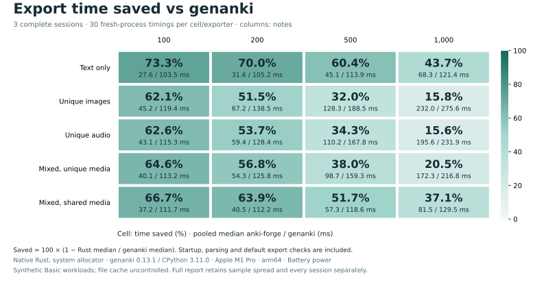
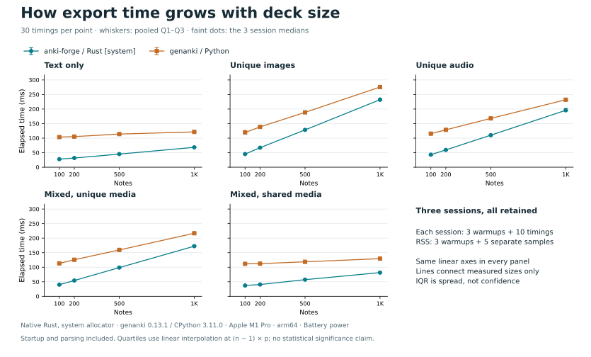
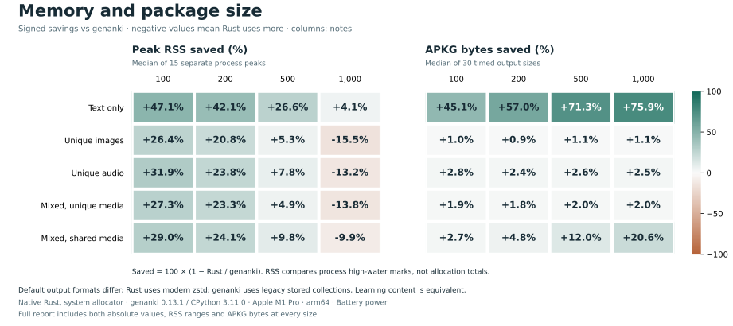

# anki-forge

`anki-forge` is a Rust-first toolkit for building Anki `.apkg` artifacts, with
advanced contract tooling and Node/Python bindings for lower-level workflows.

Most users should start with the typed Rust API:

- `Deck` for the shortest path from notes to an APKG
- `Project` for long-term decks that need stable IDs, custom note types, media,
  validation, and build reports

For downstream Rust applications, add the production crate directly:

```bash
cargo add anki_forge
```

The crates.io Rust Distribution is self-contained. It embeds the default
contract bundle and does not require this repository at runtime. Release
requirements and recovery procedures are documented in
`docs/rust-crate-release-readiness.md` and `docs/rust-release-runbook.md`.

## 1. Requirements

- Rust `1.92.0` (see `rust-toolchain.toml`)
- `cargo`
- `jq` for advanced contract-tool examples
- Optional: Node.js `18+` for Node binding examples/tests
- Optional: Python `3.11+` for Python binding examples/tests
- Optional: `protoc` + local `docs/source/anki` for the roundtrip oracle only

Suggested one-time setup from the repository root:

```bash
rustup toolchain install 1.92.0
rustup override set 1.92.0
```

## 2. Quick Start: Deck First

```rust
use anki_forge::prelude::*;

fn main() -> anyhow::Result<()> {
    let mut deck = Deck::new("Spanish");
    deck.basic()
        .note("hola", "hello")
        .stable_id("es:hola")
        .add()?;
    deck.write_apkg("spanish.apkg")?.ensure_success()?;
    Ok(())
}
```

Run the same flow locally:

```bash
cargo run -q -p anki_forge --example target_api_basic
```

This writes `spanish.apkg` in the current directory.

### 2.1 Export benchmarks

The native Rust `Deck` API is compared with genanki **0.13.1 / CPython 3.11.0**
on five synthetic Basic workloads at **100, 200, 500 and 1,000 notes**.
Three complete sessions provide **30 timings and 15 separate peak-RSS samples
per implementation/cell**, excluding warmups. Time includes process startup,
input parsing, media registration and default export checks.

This frozen three-session comparison predates the text ownership optimization
measured separately below.



At 1,000 notes, text-only export uses **43.7% less time** and unique images use
**15.8% less time**: 232.0 ms versus 275.6 ms. The three image sessions range
from 15.00% to 16.75% time saved. Memory also depends on the workload:

| Workload, 1,000 notes | Peak RSS MiB, Rust / genanki | APKG MiB, Rust / genanki |
| --- | ---: | ---: |
| Text only | 30.19 / 31.47 | 0.20 / 0.83 |
| Unique images | 40.11 / 34.73 | 61.50 / 62.17 |
| Unique audio | 39.75 / 35.12 | 30.72 / 31.51 |
| Mixed, unique media | 38.52 / 33.86 | 33.87 / 34.57 |
| Mixed, shared media | 35.39 / 32.20 | 2.56 / 3.22 |

Values are pooled medians; RSS is the median of independent process peaks.
Measured on **Apple M1 Pro, 32 GiB, macOS ARM64, battery power**, with Rust
**1.92.0 release, default features and system allocator**, on 2026-09-07.
The measured code is revision `ab7d261` plus a [frozen uncommitted patch](benchmarks/results/20260907-bounded-media/source.patch);
source and binary hashes remained unchanged across all three sessions. Native
power readings were checked before and after every export. PNG/WAV fixtures are
frozen; mixed workloads contain 30% text, 40% images and 30% audio, with 49 distinct
files in the shared case. File cache is uncontrolled. These local measurements
cover the native Rust API; Node/Python bindings are outside this comparison.
Default APKG formats differ: Rust uses modern zstd collections, while genanki
uses legacy stored collections.

All **2,520 exports** passed content/media checks, and **120 packages** passed
Anki import/content/render checks. The pinned Anki checker includes a recorded
`tokio/io-util` build-feature patch. See the [full report and raw evidence](benchmarks/results/20260907-bounded-media/report.md)
for every cell's absolute values, IQR, session variation and reproduction steps.

The [implementation report](benchmarks/results/20260907-bounded-media/implementation.md) separately compares
the shared media buffer pool with the preceding version across **29 cases**.
In that paired test, 64 × 1 MiB images used **6.0% less time** with
**1.2 MiB more RSS**; mixed file sizes used **9.5% less time**
with **1.6 MiB more RSS**. These synthetic large-file results describe
the buffering change; the standard Rust/genanki matrix above uses smaller files.
The [preceding three-session evidence](benchmarks/results/20260907-streaming-followup/report.md) remains available.

The subsequent [text ownership optimization](benchmarks/results/20260907-text-ownership/README.md)
moves strings out of the temporary Project during Deck export. In a new paired
29-case comparison on **AC power**, peak RSS for 1,000 long-field notes fell from
**60.9 to 53.6 MiB (12.0%)**; with four times the long-field content it fell from
**155.4 to 124.2 MiB (20.1%)**. At 10,000 text notes, elapsed time fell from
490.5 to 477.8 ms (2.6%). Time changes were small and mixed across other cases;
the main gain is memory. All 928 exports were byte-identical between versions,
and all 29 scenes passed Anki import/content/render checks. This comparison uses
two Rust versions; its percentages are not added to the earlier genanki results.

<details>
<summary>Time scaling, resources and implementation comparisons</summary>

Points show pooled median times; whiskers show Q1–Q3 sample spread, not confidence
intervals. Faint dots retain the three individual session medians.



Positive resource savings mean Rust uses less; negative values mean it uses more.



The separate before/after comparison uses 7 interleaved timings and 5 independent
RSS samples per version/case, with unchanged inputs and byte-identical APKGs.


The later text ownership comparison also separates peak RSS from elapsed time:


</details>

## 3. Project For Long-Term Decks

```rust
use anki_forge::prelude::*;

fn main() -> anyhow::Result<()> {
    let mut project = Project::new("Japanese Core")
        .stable_id("jp-core")
        .default_deck("Japanese::Core");
    project.add_note(Note::basic("食べる", "to eat").stable_id("jp:taberu"))?;
    project.validate().ensure_success()?;
    project.write_apkg("jp-core.apkg")?.ensure_success()?;
    Ok(())
}
```

`Project::add_note(...)` and `Project::add_notetype(...)` fail fast for errors
that are knowable at add time, such as blank or duplicate explicit stable ids,
unknown note type ids, and unknown field keys. Call
`project.validate().ensure_success()?` when you want a full Project diagnostic
checkpoint before building; build still performs normalization, media, writer,
comparison, and update-safety checks.

`BuildReport` includes an owned artifact handle, note/card/media counts, diagnostics,
warning count, inspect summary, and duration. Diagnostics expose stable codes
and structured metadata (`severity`, `domain`, `stage`, `path`,
`suggested_fix`) so callers do not need to match human-facing strings.
`inspect.observation_status` is writer-layer reporting metadata passed through
from the inspection step.

`Project::from(deck)` produces an editable Project, including the Deck's media
and identity evidence. With no `output` or `artifacts_dir`, the returned APKG is
temporary: retain its report/handle while using `artifact.path()`, or call
`artifact.persist_to(path)` for a permanent copy. The final handle's drop removes
temporary output. Explicit destinations are caller-owned and survive drop.

```rust
use anki_forge::prelude::*;

fn add_note(deck: &mut Deck) -> anyhow::Result<()> {
    if let Err(err) = deck.basic().note("hola", "hello").stable_id("   ").add() {
        match err.code() {
            ErrorCode::StableIdBlank => eprintln!("choose a non-empty stable_id"),
            ErrorCode::StableIdDuplicate => eprintln!("choose a unique stable_id"),
            other => eprintln!("anki-forge error: {}", other.as_str()),
        }
        return Err(err);
    }
    Ok(())
}
```

Custom note types, stable field/template keys, and project media are shown in:

```bash
cargo run -q -p anki_forge --example target_api_custom_notetype
cargo run -q -p anki_forge --example target_api_media
```

`Note::cloze(...)` intentionally stores the cloze `Text` field as explicit HTML
so Anki receives raw `{{cN::...}}` markers. Do not assume cloze text is escaped
like `Note::basic(...)` text.

HTML escaping happens before the writer layer. `ProductFieldContentV2::Text`
escapes text once, `ProductFieldContentV2::Html` passes trusted HTML through,
and media field content emits Anki-compatible `[sound:...]` or ``
markup. Stock `basic`, `cloze`, and custom notes that reach `writer_core` are
already HTML-ready; the writer only strips HTML to derive Anki `sfld` and `csum`.

### 3.1 Media Troubleshooting

Media export names must be helper-safe bare filenames such as `taberu.mp3`.
Avoid path components, absolute paths, URL escapes, and unsafe characters.
Register files with `project.media_mut().add_file(...).export_as("taberu.mp3")`;
inline examples can use `project.media_mut().add_bytes(...).export_as(...)`.
`write_apkg()` stages file-backed media by path by default, so large images,
audio, and video do not need to fit the inline-media limit. Use
`BuildOptions::self_contained()` only when you explicitly want a self-contained
inline authoring payload; large file-backed media should stay on the default
path-backed build path.

Common media diagnostics:

- Filename collision: the same export filename is bound to different bytes.
  Choose a unique `export_as(...)` name and update local note, template, or CSS
  references to match.
- Missing media reference: Product content refers to a local filename that is
  not registered. Register it or change the local filename in the HTML/CSS.
- CSS missing reference: CSS scanning is conservative. A local
  `url("icon.svg")` should be registered, changed to an external URL, or removed
  if the CSS rule is unused.
- CSS import reference: a local import such as `url("theme.css")` must be
  registered as packaged media, changed to an external URL, or removed if unused.
- Unused media binding: a registered file is not referenced by any note,
  template, or CSS. Remove the registration or add the intended local reference;
  this is a warning under the strict default.
- Unsafe media reference: packaged media references must be bare local
  filenames. Remove path components, absolute paths, escapes, or unsafe
  characters.
- MIME mismatch: the export filename or declared MIME does not match the
  observed source bytes. Change the export filename/declared MIME, or replace
  the source file.
- Inline too large: an explicitly self-contained build tried to inline media
  beyond the configured inline limit. Remove `self_contained()` and use the
  default path-backed build path for large assets.

`anki-forge` does not automatically rewrite filenames, HTML, or CSS because
those edits can change deck behavior and hide the authoring intent. Keep the
registered `export_as(...)` filename and local references in sync yourself.
`BuildReport::pretty_report()` is a human-facing summary. For stable
machine-readable output, use `BuildOptions::report_json(...)` or
`report.to_report_json()`; structured report JSON includes media mode details.
Automatic `report_json` requires `output` or `artifacts_dir`; JSON cannot keep a
temporary APKG alive. See [artifact ownership](anki_forge/README.md#artifact-ownership).

### 3.2 Update-Safe Builds

For long-lived decks, commit an identity lockfile next to your source.

First build:

```rust
use anki_forge::prelude::*;

let mut project = Project::new("Japanese Core")
    .stable_id("jp-core")
    .default_deck("Japanese::Core");
project.add_note(Note::basic("食べる", "to eat").stable_id("jp:taberu"))?;
project
    .build(
        BuildOptions::new()
            .output("dist/jp-core.apkg")
            .first_update_safe_build("anki-forge.lock.json"),
    )?
    .ensure_success()?;
```

Next build:

```rust
project
    .build(
        BuildOptions::new()
            .output("dist/jp-core.apkg")
            .update_safe("anki-forge.lock.json"),
    )?
    .ensure_success()?;
```

`update_safe(lockfile)` reads lockfile evidence but does not rewrite the file.
Use `write_identity_lockfile(true)` on release builds when you want new notes
and absent entries recorded for future updates.

When using `compare_to(previous_apkg)`, keep the baseline separate from the
output, `artifacts_dir/package.apkg`, report JSON, and any writable identity
lockfile. Builds reject existing same-file aliases (including relative paths,
symlinks, and hard links) with `PROJECT.PATH_COLLISION` before writing. This
includes the actual `staging/manifest.json` destination, whose links may point
outside the artifact directory. Baselines, outputs, retained packages, and
identity lockfiles (including read-only ones) must stay outside the writable
`staging/` tree and its media directory, including directory aliases. Staging
materialization must not overwrite these files before a risk rejection.

New destinations are rechecked after creation and before lockfile/report writes,
so filesystem-specific case folding cannot turn an APKG into JSON. A collision
detected after publication returns an error but keeps the valid published APKG.

The baseline is inspected once before building; GUID reconciliation and diff
use that same snapshot. The candidate APKG is compared and checked against
`fail_on(...)` before publishing the APKG or updating the identity lockfile.
On a blocked build, existing outputs and lockfiles remain unchanged, and the
report retains diff/risk evidence with `artifact: null`. A separate report JSON
can still be written; intermediate staging/media files may remain in an explicit
artifact directory. Successful publication uses atomic replacement per file,
not a transaction spanning the APKG, lockfile, and report.
Output-only builds copy directly from the private candidate to the requested
output; no extra package copy is made in the disposable artifact workspace.
Private candidates live inside the artifact workspace, so an explicit
`artifacts_dir(...)` also selects their filesystem; they are removed after the
build. Lockfiles use an exclusively reserved temporary file beside the target,
so temporary names cannot overwrite existing baselines or outputs.

## 4. Advanced: Contract Tools And Runtime

The lower-level contract flow is:

`Authoring IR -> normalize -> build -> inspect -> diff`

### 4.1 PR Verification

Before a PR, sync the base branch and run the same full verification entry point
used by GitHub Actions:

```bash
git fetch origin main
make verify-ci
```

For faster local development:

```bash
make verify-fast
```

`make verify-ci` mirrors `.github/workflows/contract-ci.yml`; a PR is ready only
after both local `make verify-ci` and the remote `contract-ci / verify` pass.

### 4.2 Contract Validation And Packaging

```bash
cargo run -q -p contract_tools -- verify --manifest "$(pwd)/contracts/manifest.yaml"
cargo run -q -p contract_tools -- summary --manifest "$(pwd)/contracts/manifest.yaml"
cargo run -q -p contract_tools -- package --manifest "$(pwd)/contracts/manifest.yaml" --out-dir "$(pwd)/dist"
```

- `verify`: validates contracts and executable gates
- `summary`: prints bundle version and component summaries
- `package`: writes versioned artifacts into `dist/`

### 4.3 Normalize -> Build -> Inspect -> Diff

```bash
mkdir -p tmp/readme-basic

cargo run -q -p contract_tools -- normalize \
  --manifest "$(pwd)/contracts/manifest.yaml" \
  --input "$(pwd)/contracts/fixtures/phase3/inputs/basic-authoring-ir.json" \
  --output contract-json > "$(pwd)/tmp/readme-basic/normalize.result.json"

jq -e '.normalized_ir' "$(pwd)/tmp/readme-basic/normalize.result.json" > "$(pwd)/tmp/readme-basic/normalized-ir.json"

cargo run -q -p contract_tools -- build \
  --manifest "$(pwd)/contracts/manifest.yaml" \
  --input "$(pwd)/tmp/readme-basic/normalized-ir.json" \
  --writer-policy default \
  --build-context default \
  --artifacts-dir "$(pwd)/tmp/readme-basic/artifacts" \
  --output contract-json > "$(pwd)/tmp/readme-basic/build.result.json"

cargo run -q -p contract_tools -- inspect \
  --staging "$(pwd)/tmp/readme-basic/artifacts/staging/manifest.json" \
  --output contract-json > "$(pwd)/tmp/readme-basic/staging.inspect.json"

cargo run -q -p contract_tools -- inspect \
  --apkg "$(pwd)/tmp/readme-basic/artifacts/package.apkg" \
  --output contract-json > "$(pwd)/tmp/readme-basic/apkg.inspect.json"

cargo run -q -p contract_tools -- diff \
  --left "$(pwd)/tmp/readme-basic/staging.inspect.json" \
  --right "$(pwd)/tmp/readme-basic/apkg.inspect.json" \
  --output contract-json > "$(pwd)/tmp/readme-basic/diff.result.json"
```

Main outputs:

- `tmp/readme-basic/artifacts/package.apkg`
- `tmp/readme-basic/staging.inspect.json`
- `tmp/readme-basic/apkg.inspect.json`
- `tmp/readme-basic/diff.result.json`

### 4.4 Rust Examples

```bash
cargo run -q -p anki_forge --example target_api_basic
cargo run -q -p anki_forge --example target_api_custom_notetype
cargo run -q -p anki_forge --example target_api_media
cargo run -q -p anki_forge --example deck_basic_flow
cargo run -q -p anki_forge --example product_basic_flow
cargo run -q -p anki_forge --example minimal_flow
```

- `target_api_basic`: shortest `Deck` API path; writes `spanish.apkg`
- `target_api_custom_notetype`: `Project` with custom note type; writes `jp-core.apkg`
- `target_api_media`: `Project` media helpers, template/CSS references, and
  pretty media report; writes `spanish-media.apkg`
- `deck_basic_flow`: broader Rust Deck API scenario
- `product_basic_flow`: lower-level product authoring example
- `minimal_flow`: file-driven runtime example

### 4.5 Stable Note Identity

New Basic, Cloze, and Image Occlusion notes use AFID (`afid:v1:*`) as stable
note IDs by default instead of legacy `generated:*` IDs. AFID comes from the
normalized identity payload: Basic defaults to the front field, Cloze uses the
cloze structure and text skeleton, and Image Occlusion uses image content,
dimensions, mode, and sorted mask geometry.

Explicit `stable_id` still wins and is saved as an explicit identity snapshot.
If callers explicitly pass a `generated:*` prefix, it is kept as an ordinary
explicit stable ID. The `afid:v1:*` namespace is reserved and cannot be passed
as an explicit stable ID.

Basic notes can choose identity fields through the typed API:

```rust
use anki_forge::{BasicIdentityField, BasicIdentityOverride, BasicIdentitySelection, BasicNote, Deck};

let mut deck = Deck::builder("Spanish")
    .basic_identity(BasicIdentitySelection::new([BasicIdentityField::Back])?)
    .build();
deck.add(BasicNote::new("hola", "hello"))?;

let override_cfg = BasicIdentityOverride::new(
    [BasicIdentityField::Front, BasicIdentityField::Back],
    "sense-disambiguation",
)?;
deck.basic()
    .note("banco", "bank / bench")
    .identity_override(override_cfg)
    .add()?;
```

`validate_report()` preserves legacy stable ID diagnostics for blank IDs,
missing/generated legacy IDs, unknown media, empty Image Occlusion masks, and
duplicate IDs. It also returns a `NoteLevelIdentityOverrideUsed` warning when a
note uses note-level identity override. AFID duplicate payloads, hash
collisions, and stable ID duplicates are blocking add-time or load-time rebuild
errors.

Serialization preserves resolved identity snapshots (`stable_id`, `recipe_id`,
`provenance`, `canonical_payload`, and `used_override`). Deserialization rebuilds
runtime indexes and validates that snapshots still match note IDs, payload
hashes, payload duplicates, and collisions.

### 4.6 Node Bindings

The 0.2 SDK provides typed `Project`, `Deck`, `Note`, custom note types, media,
validation, comparison, and APKG export through an embedded Rust Node-API addon.
The npm packages are prepared locally; publication and the full platform matrix
are still pending. See [Node SDK](bindings/node/README.md) for the release status.

```bash
npm --prefix bindings/node run setup
npm --prefix bindings/node run build
npm --prefix bindings/node run example:minimal
npm --prefix bindings/node test
npm --prefix bindings/node run test:installed
```

### 4.7 Python Bindings

```bash
PYTHONPATH=bindings/python/src python3.11 bindings/python/examples/minimal_flow.py
PYTHONPATH=bindings/python/src python3.11 -m unittest discover -s bindings/python/tests -p "test_*.py"
```

The target Product API shape sketches are documented in
`bindings/python/examples/target_api_custom.py` and
`bindings/python/examples/target_api_media.py`.

## 5. Manual Anki Desktop Scenarios

Generate every manual verification APKG:

```bash
./scripts/run_manual_desktop_scenarios.sh
```

Generate one scenario:

```bash
./scripts/run_manual_desktop_scenarios.sh S05_basic_audio
```

Output paths:

- `tmp/manual-desktop-v1/<scenario>/package.apkg`
- `tmp/manual-desktop-v1/<scenario>/apkg.inspect.json`

## 6. Roundtrip Oracle

Use this optional flow only when validating roundtrip behavior against a local
Anki upstream checkout.

Requirements:

- `docs/source/anki/rslib/Cargo.toml` exists
- `protoc` is available on `PATH`

Run:

```bash
./scripts/run_roundtrip_oracle.sh
```

## 7. FAQ

- Error: `failed to discover contracts/manifest.yaml from workspace path`
  - Confirm the current directory is inside this repository, or pass an explicit
    `cwd` from bindings.
- Error: `missing vendored upstream Anki crate ... docs/source/anki/rslib`
  - The roundtrip oracle is missing local Anki source. Normal flows are not
    affected.
- Error: `protoc is required on PATH`
  - Install `protoc` and retry. This is required only for the roundtrip oracle.

## 8. Related Docs

- [Node SDK implementation plan (draft)](docs/plans/2026-09-06-node-sdk-implementation-plan.md)
- `bindings/node/README.md`
- `bindings/python/README.md`
- `contracts/fixtures/phase3/manual-desktop-v1/README.md`
