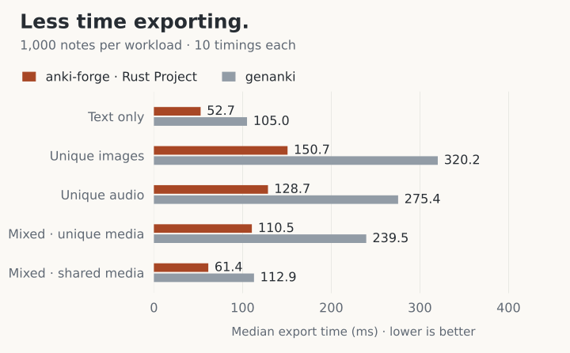

<p align="center">
  <picture>
    <source media="(prefers-color-scheme: dark)" srcset="docs/assets/brand/ankiforge-dark.svg">
    
  </picture>
</p>

<h1 align="center">anki-forge</h1>

<p align="center">
  <a href="https://github.com/morehardy/anki-forge/actions/workflows/contract-ci.yml"></a>
  <a href="https://crates.io/crates/ankiforge"></a>
  <a href="https://www.npmjs.com/package/ankiforge"></a>
  <a href="https://pypi.org/project/ankiforge/"></a>
  <a href="https://ankiforge.dev/docs/"></a>
  <a href="LICENSE"></a>
</p>

English · [简体中文](README.zh-CN.md)

[Website](https://ankiforge.dev/) · [Documentation](https://ankiforge.dev/docs/) ·
[GitHub](https://github.com/morehardy/anki-forge) · [Issues](https://github.com/morehardy/anki-forge/issues)

**Turn your data into Anki decks.**

Build Basic, Cloze, Image Occlusion and custom cards with Rust, TypeScript or Python.
Package your media, keep note identities stable, and review changes before distributing the next deck.

[Performance](#performance-you-can-inspect) · [Quick start](#quick-start) ·
[Card examples](#more-than-a-text-card) · [Update workflow](#build-once-keep-improving) ·
[Choose your language](#choose-your-language)

## Why anki-forge?

- **Make the cards your content needs.** Basic, Cloze, Image Occlusion, custom HTML/CSS templates,
  images, audio, and video. [See examples ↓](#more-than-a-text-card)
- **Spend less time exporting.** A Rust core handles deck generation and media
  packaging. Normal exports need no Anki installation.
  [See five measured workloads ↓](#performance-you-can-inspect)
- **Build once. Keep improving.** Compare against a previous release, check note
  identity and update risks, and inspect structured build reports.
  [See the update workflow ↓](#build-once-keep-improving)

## Performance you can inspect

**1,000 text notes in 52.7 ms**, versus 105.0 ms with genanki — **49.8% less export time**.
Across five 1,000-note workloads, Rust exports took **45.7–53.9% less time**. This compares the Rust
`Project` API (using `Media::files`) with genanki 0.13.1; Node and Python bindings were not benchmarked.

<picture>
  <source media="(max-width: 600px) and (prefers-color-scheme: dark)" srcset="docs/assets/readme/export-times-dark-mobile.svg">
  <source media="(max-width: 600px)" srcset="docs/assets/readme/export-times-light-mobile.svg">
  <source media="(prefers-color-scheme: dark)" srcset="docs/assets/readme/export-times-dark.svg">
  
</picture>

The benchmark passed 840 output-content checks and 40 Anki import, content and representative-render checks.
Some media workloads use more memory: unique images peaked at 92.45 MiB versus 35.59 MiB.

<details>
<summary>Method and full results</summary>

Five workloads cover 100, 200, 500 and 1,000 notes, with 10 timing runs and 5 RSS measurements per cell.
Timing includes media import, build, inspection and writing from process start to exit; background load,
page cache and differing default APKG formats were not isolated. See the report below for complete data
and reproduction steps.

| 1,000 notes | Rust RSS MiB | genanki RSS MiB | Speed ratio |
| --- | ---: | ---: | ---: |
| Text | 21.91 | 32.25 | 1.99× |
| Unique images | 92.45 | 35.59 | 2.12× |
| Unique audio | 62.66 | 35.97 | 2.14× |
| Mixed unique | 65.19 | 35.03 | 2.17× |
| Mixed shared | 29.36 | 32.66 | 1.84× |

[Full report](benchmarks/results/20261008-latest-commit-genanki/report.md) · [Raw CSV](benchmarks/results/20261008-latest-commit-genanki/comparison.csv) · [Reproduce](benchmarks/results/20261008-latest-commit-genanki/README.md)

</details>

## Quick start

Each program writes a persistent `spanish.apkg` containing **hola → hello** in the Spanish deck.

<details>
<summary>Rust</summary>

```sh
cargo new anki-deck
cd anki-deck
cargo add ankiforge@0.3.0
```

Save as `src/main.rs`:

<!-- source: anki_forge/examples/target_api_basic.rs -->
```rust
use ankiforge::{BuildOptions, Note, Project};

fn main() -> Result<(), Box<dyn std::error::Error>> {
    let mut project = Project::new("spanish")?.default_deck("Spanish");
    project.add("es:hola", Note::basic("hola", "hello"))?;
    let output = project.build(BuildOptions::to("spanish.apkg"))?;
    println!("{}", output.artifact().path().display());
    Ok(())
}
```
<!-- /source -->

```sh
cargo run
```

</details>

<details>
<summary>Node / TypeScript</summary>

```sh
mkdir anki-deck
cd anki-deck
npm install --include=optional ankiforge@0.3.0
```

Save as `main.mjs`:

<!-- source: bindings/node/examples/quickstart.mjs -->
```js
import { Project, Note, BuildOptions } from 'ankiforge';

const project = new Project('spanish').defaultDeck('Spanish');
project.add('es:hola', Note.basic('hola', 'hello'));
const output = await project.build(BuildOptions.to('spanish.apkg'));
console.log(output.artifact.path);
await output.artifact.close();
```
<!-- /source -->

```sh
node main.mjs
```

</details>

<details>
<summary>Python</summary>

```sh
python -m venv .venv
. .venv/bin/activate
python -m pip install ankiforge==0.3.0
```

Save as `main.py`:

<!-- source: bindings/python/examples/quickstart.py -->
```python
from ankiforge import Project, Note, BuildOptions

project = Project('spanish', default_deck='Spanish')
project.add('es:hola', Note.basic('hola', 'hello'))
output = project.build(BuildOptions.to('spanish.apkg'))
print(output.artifact.path)
```
<!-- /source -->

```sh
python main.py
```

</details>

Import the file into Anki to study. Normal exports need no Anki installation; see [compatibility](docs/compatibility.md) for environments. On Windows, activate the venv with `.venv\Scripts\Activate.ps1`.

## More than a text card

Keep your content, templates, and media together. A single deck can combine:

- **Basic:** show **hola**, then reveal **hello**.
- **Cloze:** show “A sound's pitch depends on its […]”, then reveal **frequency**.
- **Custom + media:** play a one-second tone alongside a waveform image, then
  reveal **A4 · 440 Hz**. Define the card's layout and style with HTML/CSS.

Build all three cards with the self-contained
[showcase example](anki_forge/examples/readme_showcase.rs):

```sh
cargo run -q -p ankiforge --example readme_showcase
```

It writes `readme-showcase.apkg`: three cards plus a generated waveform and a
one-second audio tone. No media downloads are required. You can also
[download the generated sample deck](docs/assets/readme/showcase.apkg?raw=true)
or read the [sample verification and reproduction guide](docs/assets/readme/README.md).

| Build something richer | Start here |
| --- | --- |
| Your own fields, layouts, and card-generation rules | [Custom note types](anki_forge/examples/target_api_custom_notetype.rs) |
| Pictures, sound, and template media | [Media example](anki_forge/examples/target_api_media.rs) · [troubleshooting](docs/troubleshooting.md) |
| Reusable templates, CSS, and assets | [Template bundles](docs/template-bundles.md) |
| Image Occlusion | [Create image questions](docs/image-occlusion.md) |

## Build once. Keep improving.

You shipped a Spanish deck. Now you want to improve a definition:

| Release | Stable note ID | Front | Back |
| --- | --- | --- | --- |
| `spanish-v1.apkg` | `es:hola` | hola | hello |
| `spanish-v2.apkg` | `es:hola` | hola | hello; hi |

Keep the previous distributed APKG. After editing the notes in your `Project`,
use it as the baseline for the next build:

```rust
let options = BuildOptions::to("spanish-v2.apkg")
    .update_from("spanish-v1.apkg");
let output = project.build(options)?;
println!("{:?}", output.report().comparison());
```

The [runnable update example](anki_forge/examples/readme_update.rs) creates both
versions and prints the comparison report:

```sh
cargo run -q -p ankiforge --example readme_update
```

The namespace and note keys identify your notes. Every generated package carries
complete identity and revision evidence; retain the original distributed APKG
and use `update_from` when producing its successor. An Anki re-export is not a
supported baseline. Anki import settings and newer local edits still govern
whether fields update. See the [update workflow](docs/updates.md) for policies,
client limitations, and verified import behavior.

## Choose your language

Runtime requirements and client/platform limitations are summarized in [compatibility](docs/compatibility.md).

| Language | Runtime | Package | Install | Guide |
| --- | --- | --- | --- | --- |
| Rust | Rust 1.92+ | [ankiforge 0.3.0](https://crates.io/crates/ankiforge) | `cargo add ankiforge@0.3.0` | [Rust](docs/installation.md) |
| Node / TypeScript | Node 22.13+ | [ankiforge 0.3.0](https://www.npmjs.com/package/ankiforge) | `npm install --include=optional ankiforge@0.3.0` | [Node](docs/node/quick-start.md) |
| Python | CPython 3.11+ | [ankiforge 0.3.0](https://pypi.org/project/ankiforge/) | `python -m pip install ankiforge==0.3.0` | [Python](docs/python/quick-start.md) |

## Contributing

See the [development guide](docs/development.md) for prerequisites, checks,
architecture decisions, and release procedures. Report bugs and request features
through [GitHub issues](https://github.com/morehardy/anki-forge/issues).
For security reports, follow the [security policy](SECURITY.md).

## License

Project-owned code is licensed under [MIT](LICENSE). Mirrored and other
third-party source retains its own license.
