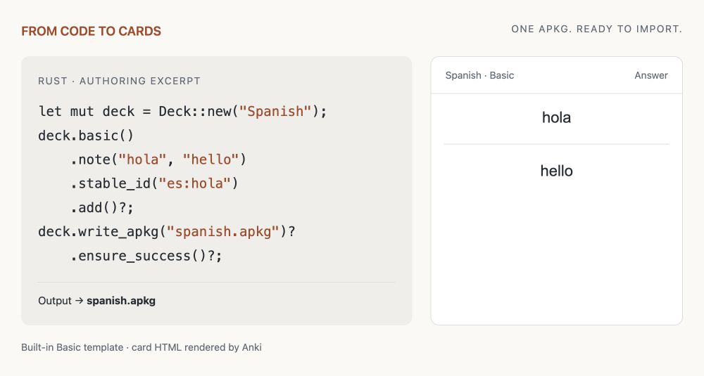
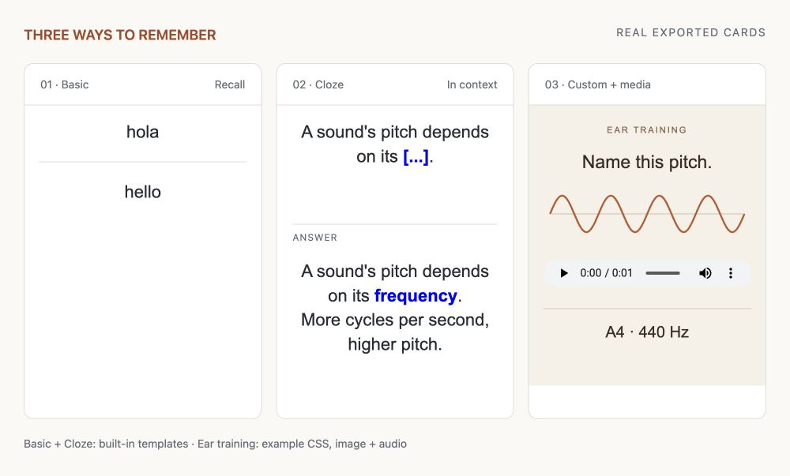

# anki-forge

[English](README.md) · 简体中文

**把你的数据，变成 Anki 牌组。**

用 Rust、Node.js 或 Python 制作内容丰富的记忆卡片。打包媒体资源、导出 `.apkg` 文件，
并在每次重新构建时检查更新风险。

[快速开始](#快速开始) · [卡片示例](#丰富的卡片形式) ·
[性能对比](#可核验的性能表现) · [选择开发语言](#选择你的开发语言)

<picture>
  <source media="(max-width: 600px) and (prefers-color-scheme: dark)" srcset="docs/assets/readme/code-to-card-dark-mobile.png">
  <source media="(max-width: 600px)" srcset="docs/assets/readme/code-to-card-light-mobile.png">
  <source media="(prefers-color-scheme: dark)" srcset="docs/assets/readme/code-to-card-dark.png">
  
</picture>

**1,000 条文本笔记，53.9 ms 完成导出**——在已记录的 Rust 基准测试中，genanki 耗时
115.5 ms，anki-forge 的**导出耗时减少了 53.3%**。Apple M1 Pro · 2026-09-21 源码快照 ·
10 次运行的中位数 · [测试范围与原始记录](#可核验的性能表现)。

## 为什么选择 anki-forge？

- **让卡片适合你的内容。** 支持基础问答（Basic）、填空（Cloze）、自定义 HTML/CSS 模板，
  以及图片、音频和视频。[查看卡片效果 ↓](#丰富的卡片形式)
- **缩短导出等待。** Rust 核心负责牌组生成和媒体打包，常规导出无需安装 Anki。
  [查看五种场景的实测结果 ↓](#可核验的性能表现)
- **发布之后，持续完善。** 与上一版牌组对比，检查笔记身份与更新风险，
  并查看结构化构建报告。[了解更新流程 ↓](#持续改进已发布的牌组)

## 快速开始

[完整的 Basic 示例](anki_forge/examples/target_api_basic.rs) 会生成 `spanish.apkg`，
可直接导入 Anki 桌面版：

```rust
use anki_forge::prelude::*;

fn main() -> anyhow::Result<()> {
    let mut deck = Deck::new("Spanish");
    deck.basic()
        .note("hola", "hello")
        .stable_id("es:hola")
        .add()?;
    deck.write_apkg("spanish.apkg")?.ensure_success()?;
    Ok(())
}
```

使用 **Rust 1.92.0** 从源码运行：

```sh
git clone https://github.com/morehardy/anki-forge.git
cd anki-forge
cargo run -q -p anki_forge --example target_api_basic
```

将当前目录下的 `spanish.apkg` 导入 Anki，即可开始学习 **hola → hello**。
库已内嵌默认资源，无需额外提供契约文件。这些步骤使用本地源码，
软件包的发布情况见 [API 与发布状态](#选择你的开发语言)。

**使用其他语言？** 从 [Node.js / TypeScript SDK](bindings/node/README.md)
或 [Python 源码安装说明](bindings/python/README.md#from-a-source-checkout) 开始。

<details>
<summary>将本地源码作为依赖添加到你的 Rust 应用</summary>

请将路径调整为本地仓库的位置。示例使用 `anyhow` 处理错误：

```sh
cargo add anki_forge --path ../anki-forge/anki_forge
cargo add anyhow
```

用 `Deck` 可以快速导出一个 APKG；需要自定义笔记类型、媒体、校验和多次更新时，
可使用 `Project`。更多内容见 [Rust 编写指南](docs/rust-guide.md)。

</details>

## 丰富的卡片形式

词汇问答、填空题，或带有专属视觉风格的听音练习——将内容、模板和媒体放在一起管理。

<picture>
  <source media="(max-width: 600px) and (prefers-color-scheme: dark)" srcset="docs/assets/readme/card-showcase-dark-mobile.png">
  <source media="(max-width: 600px)" srcset="docs/assets/readme/card-showcase-light-mobile.png">
  <source media="(prefers-color-scheme: dark)" srcset="docs/assets/readme/card-showcase-dark.png">
  
</picture>

卡片 HTML 由 Anki 从生成的 APKG 中渲染，外层采用简洁的预览样式。
听音练习的设计来自示例自带的 CSS；卡片周围的标注属于文档说明。
详见[渲染与复现说明](docs/assets/readme/README.md)。

运行自包含的[卡片展示示例](anki_forge/examples/readme_showcase.rs)，即可生成上图中的卡片：

```sh
cargo run -q -p anki_forge --example readme_showcase
```

示例会生成 `readme-showcase.apkg`，包含三张卡片，以及现场生成的波形图和一秒钟的音频，
无需下载媒体文件。也可以直接[下载已生成的示例牌组](docs/assets/readme/showcase.apkg?raw=true)。

| 想制作更丰富的卡片 | 从这里开始 |
| --- | --- |
| 自定义字段、布局和卡片生成规则 | [自定义笔记类型](anki_forge/examples/target_api_custom_notetype.rs) |
| 图片、声音和模板媒体 | [媒体示例](anki_forge/examples/target_api_media.rs) · [故障排查](docs/rust-guide.md#media-troubleshooting) |
| 可复用的模板、CSS 和资源 | [模板包](docs/template-bundles.md) |
| 图片遮挡（Image Occlusion） | [支持的模式与限制](bindings/node/README.md#deck-and-image-occlusion) |

## 持续改进已发布的牌组

假设你已经发布了一份西班牙语牌组，现在想完善一个释义：

| 版本 | 稳定笔记 ID | 正面 | 背面 |
| --- | --- | --- | --- |
| `spanish-v1.apkg` | `es:hola` | hola | hello |
| `spanish-v2.apkg` | `es:hola` | hola | hello; hi |

保留上一次分发的 APKG。修改 `Project` 中的笔记后，将它作为下一次构建的对比基线：

```rust
let options = BuildOptions::new()
    .output("spanish-v2.apkg")
    .compare_to("spanish-v1.apkg");
project.build(options)?.ensure_success()?;
```

[可直接运行的更新示例](anki_forge/examples/readme_update.rs) 会生成两个版本，并打印对比报告：

```sh
cargo run -q -p anki_forge --example readme_update
```

稳定 ID 用来保持笔记身份一致；上一版 APKG 或持续维护的身份锁文件（identity lockfile）
则提供修订依据。单独调用 `write_apkg()` 并不保证 Anki 会应用后续修改，
实际导入结果仍受 Anki 的导入设置和本地较新修改的影响。

对于长期维护的项目，请配合身份锁文件使用 `first_update_safe_build(...)` / `update_safe(...)`。
锁文件维护、风险阈值和构建报告的说明见[完整更新流程](docs/rust-guide.md#updating-distributed-decks)。

## 可核验的性能表现

**在每组 1,000 条笔记的五种测试场景中，Rust 实测导出耗时均比 genanki 少 34.7–53.3%。**
下图对比原生 Rust `Deck` API 与 genanki；Node 和 Python 绑定未参与这次性能测试。

<picture>
  <source media="(max-width: 600px) and (prefers-color-scheme: dark)" srcset="docs/assets/readme/export-times-dark-mobile.svg">
  <source media="(max-width: 600px)" srcset="docs/assets/readme/export-times-light-mobile.svg">
  <source media="(prefers-color-scheme: dark)" srcset="docs/assets/readme/export-times-dark.svg">
  
</picture>

测试于 **2026-09-21** 在一台 **Apple M1 Pro** 上的同一轮测试中完成，
**每种实现、每种场景各计时 10 次**，计时包含进程启动到退出的完整过程。
两种实现默认使用的 APKG 格式不同，结果对应[已记录的源码快照](benchmarks/results/20260921-readme-genanki/source-snapshot.json)，
不代表已发布版本，也不保证在其他平台上有相同表现。

**本次基准测试的验证结果：** 全部 840 次导出均通过内容检查，
全部 40 项 Anki 导入、内容与代表性卡片渲染检查均通过。

<details>
<summary>测试方法、内存取舍与完整结果</summary>

完整测试矩阵覆盖五种场景，以及 100、200、500、1,000 条笔记四种规模。
两种实现于同一轮测试中交替执行，每个测试组合采集 10 次耗时样本，
并另外采集 5 次峰值驻留内存（RSS）样本。测试未控制桌面后台负载和文件系统缓存。

内存占用随场景而变化。在 1,000 张独立图片的场景中，Rust 的峰值 RSS 为 **40.25 MiB**，
genanki 为 **35.77 MiB**。导出包大小的差异也包含两个库默认格式和压缩方式的影响。
本次基准检查不包含图形界面交互和实际音频播放。

查看[完整报告](benchmarks/results/20260921-readme-genanki/report.md)、
[原始耗时数据](benchmarks/results/20260921-readme-genanki/comparison.csv)
与[复现说明](benchmarks/results/20260921-readme-genanki/README.md)。
README 中的图表由这份已归档的 CSV 生成，没有引入新的测量数据。

</details>

## 选择你的开发语言

| 语言 | 使用入口 | 本地源码环境要求与安装 |
| --- | --- | --- |
| **Rust** | 用 `Deck` 快速导出；用 `Project` 自定义内容并管理更新 | Rust 1.92+ · [使用指南](docs/rust-guide.md) |
| **Node.js / TypeScript** | 原生 Rust `Deck` 和 `Project` 对象 | Node 22.13+ · [SDK 安装与状态](bindings/node/README.md) |
| **Python** | 通过 Rust 运行时使用 `Project`、`Note`、自定义笔记类型和媒体 | Python 3.11+ · [源码安装](bindings/python/README.md#from-a-source-checkout) |

从 genanki 迁移？请参考 [Python 迁移指南](docs/python/genanki-migration.md)。

**发布状态：** 当前源码声明的版本为 Rust `0.1.0`、Node `0.2.0` 和 Python `0.1.0`。
[Rust 发布审计](docs/rust-crate-release-readiness.md) 记录了尚未完成的发布条件；
Node 候选版本的 npm 发布和完整平台验证也仍待完成。
在依赖软件包仓库中的可用版本之前，请先查看上述源码安装说明和发布文档。

## 兼容性与限制

- Rust API 尚处于 1.0 之前的阶段。请使用 `anki_forge::prelude`；
  `internal-tools` 仅供仓库内部工具使用。详见[受支持的接口](anki_forge/README.md#supported-01-interface)。
- 图片遮挡目前支持 `hide-all-guess-one`。`hide-one-guess-one` 渲染器存在分组填空限制，
  详见[行为记录](bindings/node/README.md#deck-and-image-occlusion)。
- Basic 文本会进行转义。Cloze 文本保留 HTML 和原始 `{{cN::...}}` 标记，
  因此请只在该路径中使用可信的 HTML。
- 构建报告和临时产物有明确的归属与保留规则，详见[产物归属](anki_forge/README.md#artifact-ownership)。

## 参与贡献

环境要求、检查步骤、架构决策与发布流程见[开发指南](docs/development.md)。
欢迎通过 [GitHub Issues](https://github.com/morehardy/anki-forge/issues) 报告问题或提出功能需求。
安全问题请按照[安全策略](SECURITY.md)报告。

## 许可证

项目自有代码使用 [MIT 许可证](LICENSE)。镜像收录的源码和其他第三方源码保留各自的许可证。
