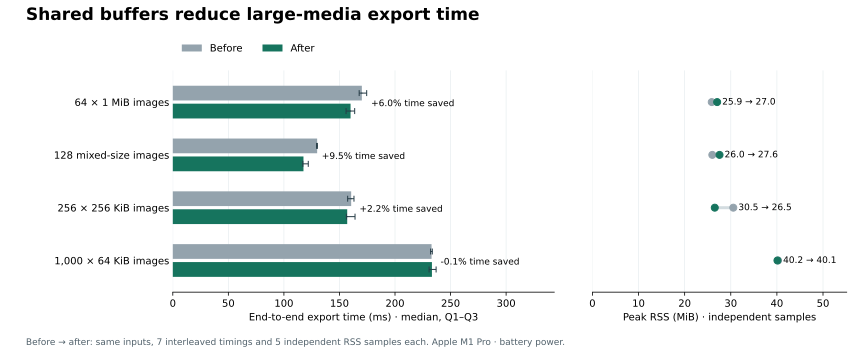

# 有总预算的媒体缓冲池

本轮只采用共享媒体缓冲池：让大文件使用其他任务尚未占用的容量，并复用已消费的固定缓冲块。公共 API、同步注册指纹、来源变更检测、完整校验和最终同步发布保持原有语义。

池内最多 72 个 64 KiB 缓冲块，合计 4.5 MiB，包括正在写入、排队和空闲的块。分配按需发生；预算耗尽时立即转入私有临时文件，不等待其他任务释放内存。消费、失败和退出都会归还缓冲块。该限制约束编码缓冲，编解码器、输入模型和分配器仍有额外成本，因此不是总 RSS 上限。

## 同场前后对比

29 个冻结输入；每个版本、每个场景 7 次交错耗时测量，以及另一次独立阶段中的 5 次 RSS 测量；每个阶段先预热 2 次。每次使用新进程，并在计时外记录原生电源来源。耗时包含启动、解析、媒体注册、默认导出及检查。保留全部样本，不挑最快轮次；文件缓存未受控。Q1–Q3 为样本分布，不是置信区间。

| 场景 | 原版本 ms [Q1, Q3] | 当前版本 ms [Q1, Q3] | 节省耗时 | 更快配对 / 7 | RSS MiB，原 → 当前 |
| --- | ---: | ---: | ---: | ---: | ---: |
| text-1000 | 65.96 [65.60, 66.68] | 66.18 [65.56, 68.63] | -0.33% | 4/7 | 30.33 → 30.20 |
| image-1000 | 232.90 [232.03, 233.57] | 233.23 [230.66, 236.99] | -0.15% | 4/7 | 40.25 → 40.12 |
| audio-1000 | 197.23 [195.68, 202.07] | 195.37 [193.14, 198.59] | +0.94% | 6/7 | 40.45 → 39.77 |
| mixed-1000 | 173.84 [172.03, 174.89] | 170.78 [169.63, 172.66] | +1.76% | 5/7 | 39.16 → 38.59 |
| shared-1000 | 79.00 [78.70, 80.88] | 79.17 [77.86, 80.51] | -0.20% | 4/7 | 35.59 → 35.27 |
| text-100 | 25.07 [24.67, 25.97] | 24.84 [24.64, 25.47] | +0.91% | 4/7 | 13.98 → 14.05 |
| text-10000 | 537.97 [536.89, 590.19] | 544.36 [539.28, 556.33] | -1.19% | 3/7 | 144.86 → 144.92 |
| long-back-1000 | 157.62 [156.99, 162.20] | 158.00 [157.79, 159.48] | -0.25% | 4/7 | 61.11 → 60.34 |
| boundary-65536 | 235.59 [234.67, 241.89] | 235.93 [233.96, 239.80] | -0.14% | 3/7 | 40.80 → 40.64 |
| boundary-65537 | 235.20 [234.73, 236.61] | 235.23 [233.83, 238.75] | -0.02% | 4/7 | 40.89 → 40.52 |
| image-256x256k | 160.55 [157.39, 163.07] | 156.98 [156.23, 164.02] | +2.22% | 5/7 | 30.55 → 26.53 |
| image-64x1m | 170.16 [167.75, 174.51] | 160.00 [155.94, 163.70] | +5.97% | 6/7 | 25.88 → 27.05 |
| image-skewed-128 | 129.93 [129.41, 130.14] | 117.61 [117.01, 121.94] | +9.48% | 7/7 | 26.00 → 27.56 |
| text-200 | 30.93 [29.94, 31.47] | 29.89 [29.21, 30.15] | +3.38% | 5/7 | 15.78 → 15.83 |
| text-500 | 43.00 [42.84, 44.34] | 43.35 [42.58, 44.51] | -0.81% | 3/7 | 21.17 → 21.25 |
| image-100 | 46.32 [44.24, 46.49] | 45.40 [44.45, 46.19] | +1.97% | 4/7 | 19.97 → 19.83 |
| image-200 | 65.46 [64.17, 65.60] | 64.71 [63.39, 66.11] | +1.14% | 2/7 | 22.45 → 22.08 |
| image-500 | 128.27 [127.05, 130.69] | 126.64 [126.16, 127.72] | +1.28% | 4/7 | 29.14 → 28.83 |
| audio-100 | 39.20 [38.41, 42.42] | 39.77 [39.37, 40.57] | -1.45% | 2/7 | 18.56 → 18.58 |
| audio-200 | 59.08 [57.24, 61.35] | 56.16 [55.03, 56.74] | +4.95% | 7/7 | 21.25 → 21.08 |
| audio-500 | 108.86 [108.54, 109.58] | 107.51 [107.27, 112.54] | +1.24% | 4/7 | 28.61 → 27.92 |
| mixed-100 | 37.58 [36.82, 37.77] | 38.26 [37.53, 39.40] | -1.80% | 2/7 | 19.47 → 19.38 |
| mixed-200 | 52.04 [51.86, 52.84] | 52.18 [52.04, 52.49] | -0.26% | 4/7 | 21.95 → 21.70 |
| mixed-500 | 98.33 [97.08, 98.51] | 99.24 [96.78, 99.72] | -0.92% | 2/7 | 28.28 → 28.14 |
| shared-100 | 34.74 [34.46, 37.11] | 35.12 [34.08, 35.81] | -1.07% | 3/7 | 19.27 → 19.20 |
| shared-200 | 40.45 [39.19, 42.13] | 39.34 [38.49, 39.82] | +2.74% | 5/7 | 21.14 → 21.06 |
| shared-500 | 52.92 [52.31, 53.11] | 53.16 [52.24, 54.22] | -0.47% | 3/7 | 26.55 → 26.34 |
| long-back-quarter-1000 | 88.11 [87.81, 89.78] | 88.49 [87.50, 90.45] | -0.42% | 3/7 | 37.25 → 37.69 |
| long-back-quadruple-1000 | 399.82 [395.97, 409.56] | 402.07 [398.88, 407.63] | -0.56% | 3/7 | 155.48 → 154.75 |

大媒体输入为固定像素、随机填充数据的有效 PNG：`image-64x1m` 含 64 个约 1 MiB 文件；`image-256x256k` 含 256 个约 256 KiB 文件；`image-skewed-128` 每四个文件中一个约 1 MiB，其余约 64 KiB。这些合成场景用于检查文件大小及落盘行为，不代表真实高分辨率图片的全部分布。两个 boundary 场景分别使用 65,536 / 65,537 字节媒体。长文本场景固定 1,000 条笔记并改变 Back 字段大小。

## 内存与未采用的改动

诊断分配器在三个文本场景中记录到相同的分配次数，Rust 请求的堆峰值差异不足 32 字节；当前实现未增加这些场景的 Rust 堆容量。进程 RSS 仍随构建产物和分配器表现变化，实际数据保留在上表，不将堆计数等同于进程内存。媒体 1 MiB 场景的累计 Rust 分配量由约 202.7 MiB 降至约 145.3 MiB；该计数包含每次分配/重分配请求，不能当成 RSS，也不能用带计数器的耗时宣称提速。

另试验了借用已导入笔记的身份信息，以减少只读取 ID 时的整份身份复制。在同场 `pool` / `pool-borrowed` 对照中，10,000 条文本的中位耗时改善约 0.6%；收益较小，未纳入当前实现。没有恢复此前已否定的 SQLite 缓存、关闭同步、延迟建索引或整次构建身份缓存方案。

## 正确性与复现

新增大媒体在空闲预算内不落盘的测试先在原实现失败，再在当前实现通过。并发共享、预算耗尽、落盘回退、空写、短写、错误和 panic 路径均已验证。仓库全功能测试共 1,011 项通过，25 项原有测试保持 ignored；默认 facade、Clippy、fmt、文档、打包及依赖策略检查通过，43 项 Python 基准测试通过。

1,788 次实验导出均按 SHA-256 绑定到对应场景的已验证 APKG。最终 29 个场景的前后共 58 个包通过独立原始 SQLite、模板、媒体与完整包检查，并逐字节相同；29 个当前版本包通过固定版本 Anki 的导入、内容与渲染检查。

另完成 [三轮 Rust / genanki 整体矩阵](report.md)：覆盖五种标准输入和四档数量，2,520 次导出检查及 120 次 Anki 导入/渲染检查。标准矩阵的单文件约为 64 KiB PNG / 32 KiB WAV，与上面的大文件对照是不同实验；不叠加两组收益，也不跨会话比较绝对时间。

全部计划、尝试、构建记录、失败测试、校验日志与源文件证据位于 [implementation/](implementation/)。两个诊断构建曾因复制文件保留旧时间戳而复用旧 crate；在测量前发现并排除，记录仍保留。修正构建器后重新编译，两份有效分配计数构建均有完整编译记录。详情见 [候选源代码证据](implementation/probes/README.md)。

[source.patch](source.patch) 固定最终实现；[implementation-summary.json](implementation-summary.json) 提供全部统计。此前的 [瓶颈审计](../20260907-post-streaming-audit/README.md) 与 [上一轮实现](../20260907-streaming-followup/implementation.md) 保留原样。
