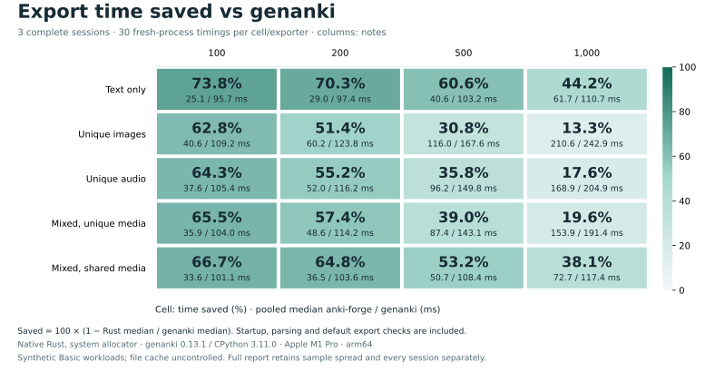
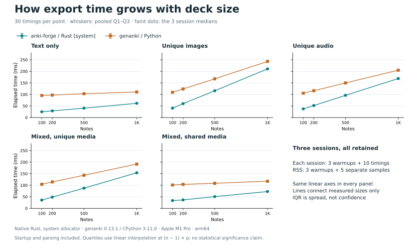
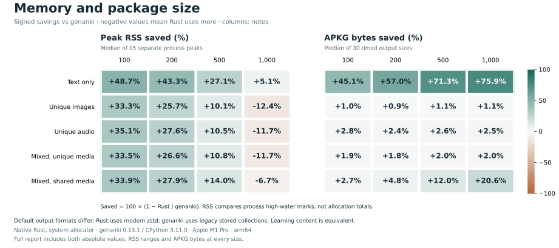

# Three-session export comparison

Measured package: base revision `ab7d261238619e99da9a6b8e5ffff8d952e6153b` plus the frozen uncommitted [source patch](source.patch). The exact [source hashes](source-snapshot.json) and patch hashes were recorded before measurement and remained unchanged across all three sessions.

Five synthetic Basic scenes × 100/200/500/1,000 notes. Each cell/exporter has 30 timing samples and 15 separate RSS samples; each session has 3 warmups before each pass. All 2,520 exports passed original SQLite/template/media checks; 120 first-timed packages passed pinned Anki import/content/render checks.

Host: Apple M1 Pro; 32 GiB RAM; 10 logical CPUs; macOS-27.0-arm64-arm-64bit. Rust 1.92.0 release/default features/system allocator; genanki 0.13.1 on native CPython 3.11.0.

Time covers fresh-process launch through exit, including imports, input parsing, media registration and default export checks. Media setup, output verification and Anki imports are outside each timed exporter. One exporter runs at a time, with adjacent interleaved controls; the same balanced seed/schedule is repeated in three sequential sessions. No controlled cold-cache or CPU-work claim is made.

PNG images are 64,152 bytes; WAV audio files are 32,044 bytes. Mixed scenes use 30% text, 40% images and 30% audio; shared media uses 49 distinct files. These fixtures do not measure Cloze, Image Occlusion, video, large individual media, bindings, long-lived processes or other hosts.

Anki verification uses the pinned upstream revision with the recorded local `tokio/io-util` build-feature patch in [plan.json](plan.json). This is local descriptive evidence with a patched oracle build, not an unmodified-upstream or cross-platform release benchmark. The patch and executable hashes are preserved; the measured package source and binaries did not change. No GUI or audible playback is exercised.

## Timing

Values pool all equally sized sessions. Q1/Q3 use linear interpolation at `(n - 1) × p`; the original per-session runner reports retain its exclusive convention. IQR describes sample spread, not confidence. Savings = `100 × (1 - Rust median / genanki median)`. No cross-scene/size average, best-run selection or p95 is used.

| Scene | Notes | Rust ms [Q1, Q3] | genanki ms [Q1, Q3] | Time saved | genanki / Rust | ms saved |
| --- | ---: | ---: | ---: | ---: | ---: | ---: |
| Text only | 100 | 25.07 [23.90, 25.39] | 95.70 [94.28, 96.40] | 73.8% | 3.82× | 70.62 |
| Text only | 200 | 28.95 [28.25, 29.79] | 97.35 [96.58, 98.25] | 70.3% | 3.36× | 68.40 |
| Text only | 500 | 40.62 [39.81, 42.00] | 103.21 [101.82, 104.59] | 60.6% | 2.54× | 62.59 |
| Text only | 1000 | 61.75 [60.75, 62.78] | 110.75 [109.45, 111.90] | 44.2% | 1.79× | 49.00 |
| Unique images | 100 | 40.64 [39.73, 42.11] | 109.19 [107.92, 109.99] | 62.8% | 2.69× | 68.55 |
| Unique images | 200 | 60.21 [58.83, 61.90] | 123.84 [122.74, 125.36] | 51.4% | 2.06× | 63.63 |
| Unique images | 500 | 116.00 [114.40, 117.49] | 167.57 [166.66, 168.84] | 30.8% | 1.44× | 51.57 |
| Unique images | 1000 | 210.56 [208.72, 212.85] | 242.89 [240.29, 246.19] | 13.3% | 1.15× | 32.33 |
| Unique audio | 100 | 37.64 [36.78, 38.74] | 105.42 [103.99, 106.29] | 64.3% | 2.80× | 67.78 |
| Unique audio | 200 | 52.02 [51.14, 54.41] | 116.15 [115.10, 117.69] | 55.2% | 2.23× | 64.13 |
| Unique audio | 500 | 96.20 [93.44, 98.02] | 149.79 [148.40, 151.83] | 35.8% | 1.56× | 53.59 |
| Unique audio | 1000 | 168.86 [166.29, 171.55] | 204.94 [202.87, 206.33] | 17.6% | 1.21× | 36.08 |
| Mixed, unique media | 100 | 35.87 [34.28, 37.02] | 103.95 [102.99, 104.43] | 65.5% | 2.90× | 68.08 |
| Mixed, unique media | 200 | 48.61 [47.70, 49.02] | 114.25 [112.87, 114.99] | 57.4% | 2.35× | 65.63 |
| Mixed, unique media | 500 | 87.35 [85.69, 89.60] | 143.10 [141.83, 144.35] | 39.0% | 1.64× | 55.75 |
| Mixed, unique media | 1000 | 153.89 [151.23, 155.66] | 191.45 [189.93, 193.45] | 19.6% | 1.24× | 37.56 |
| Mixed, shared media | 100 | 33.63 [31.83, 34.81] | 101.07 [100.21, 102.76] | 66.7% | 3.01× | 67.44 |
| Mixed, shared media | 200 | 36.47 [35.61, 37.02] | 103.60 [102.73, 104.57] | 64.8% | 2.84× | 67.14 |
| Mixed, shared media | 500 | 50.70 [49.91, 51.32] | 108.37 [107.03, 110.58] | 53.2% | 2.14× | 57.68 |
| Mixed, shared media | 1000 | 72.71 [71.30, 74.50] | 117.40 [116.03, 118.49] | 38.1% | 1.61× | 44.69 |





## Across-session variation

Each entry below is Rust/genanki median milliseconds, followed by the same-session time saving. The predeclared diagnostic flags a range exceeding 5 percentage points. All three sessions stay in the aggregate regardless of the flag; it is not a significance test.

| Scene | Notes | Session 1 | Session 2 | Session 3 | Saving spread (pp) |
| --- | ---: | ---: | ---: | ---: | ---: |
| Text only | 100 | 24.60/95.46 (74.2%) | 25.30/94.55 (73.2%) | 24.79/96.26 (74.2%) | 1.01 |
| Text only | 200 | 28.60/97.15 (70.6%) | 29.36/97.28 (69.8%) | 28.71/97.77 (70.6%) | 0.81 |
| Text only | 500 | 40.81/103.40 (60.5%) | 40.61/101.73 (60.1%) | 40.84/104.53 (60.9%) | 0.84 |
| Text only | 1000 | 61.81/111.69 (44.7%) | 61.88/110.23 (43.9%) | 61.75/110.40 (44.1%) | 0.80 |
| Unique images | 100 | 40.95/109.21 (62.5%) | 40.51/108.66 (62.7%) | 40.91/109.48 (62.6%) | 0.21 |
| Unique images | 200 | 60.60/124.90 (51.5%) | 60.14/123.83 (51.4%) | 60.10/122.58 (51.0%) | 0.51 |
| Unique images | 500 | 116.86/168.11 (30.5%) | 115.36/167.68 (31.2%) | 116.10/167.43 (30.7%) | 0.71 |
| Unique images | 1000 | 210.98/243.47 (13.3%) | 210.56/242.41 (13.1%) | 210.92/242.91 (13.2%) | 0.21 |
| Unique audio | 100 | 37.88/106.20 (64.3%) | 36.82/104.36 (64.7%) | 37.83/105.91 (64.3%) | 0.43 |
| Unique audio | 200 | 52.93/115.74 (54.3%) | 52.03/116.47 (55.3%) | 51.58/116.45 (55.7%) | 1.44 |
| Unique audio | 500 | 94.88/149.79 (36.7%) | 96.58/150.14 (35.7%) | 96.44/150.01 (35.7%) | 0.99 |
| Unique audio | 1000 | 169.73/204.80 (17.1%) | 167.13/204.39 (18.2%) | 169.25/205.99 (17.8%) | 1.11 |
| Mixed, unique media | 100 | 34.68/103.64 (66.5%) | 36.00/103.99 (65.4%) | 36.04/104.03 (65.4%) | 1.18 |
| Mixed, unique media | 200 | 48.80/114.01 (57.2%) | 48.61/113.92 (57.3%) | 48.37/114.72 (57.8%) | 0.64 |
| Mixed, unique media | 500 | 88.23/143.33 (38.4%) | 87.81/143.13 (38.7%) | 85.77/142.34 (39.7%) | 1.30 |
| Mixed, unique media | 1000 | 153.67/192.18 (20.0%) | 153.01/190.28 (19.6%) | 154.52/191.94 (19.5%) | 0.54 |
| Mixed, shared media | 100 | 33.77/101.07 (66.6%) | 33.07/100.98 (67.3%) | 33.33/101.35 (67.1%) | 0.67 |
| Mixed, shared media | 200 | 35.66/103.87 (65.7%) | 36.62/103.47 (64.6%) | 36.56/103.85 (64.8%) | 1.06 |
| Mixed, shared media | 500 | 50.05/108.25 (53.8%) | 50.75/108.14 (53.1%) | 50.98/108.96 (53.2%) | 0.70 |
| Mixed, shared media | 1000 | 72.46/117.79 (38.5%) | 73.71/116.46 (36.7%) | 72.78/117.43 (38.0%) | 1.77 |

## Memory and output size

RSS is the median [minimum, maximum] of 15 independent process high-water marks. APKG size uses only the 30 timed outputs. Rust writes a modern zstd collection plus a legacy compatibility placeholder; genanki writes a legacy stored collection. Size savings include those default format/compression choices. Matching learning content does not imply byte-identical packages or styles.

| Scene | Notes | Rust RSS MiB [min, max] | genanki RSS MiB [min, max] | Rust APKG KiB | genanki APKG KiB |
| --- | ---: | ---: | ---: | ---: | ---: |
| Text only | 100 | 14.28 [14.16, 14.42] | 27.86 [27.55, 28.56] | 72.64 | 132.21 |
| Text only | 200 | 16.11 [15.89, 16.27] | 28.41 [27.97, 28.92] | 87.91 | 204.21 |
| Text only | 500 | 21.78 [21.62, 21.95] | 29.89 [29.28, 30.12] | 133.13 | 464.21 |
| Text only | 1000 | 30.66 [30.42, 31.25] | 32.30 [31.86, 32.61] | 204.17 | 848.21 |
| Unique images | 100 | 18.95 [18.70, 19.22] | 28.41 [27.81, 28.83] | 6349.31 | 6411.18 |
| Unique images | 200 | 21.47 [21.30, 21.67] | 28.89 [28.61, 29.66] | 12641.49 | 12762.47 |
| Unique images | 500 | 28.50 [28.41, 29.00] | 31.70 [31.05, 32.27] | 31517.22 | 31868.35 |
| Unique images | 1000 | 40.28 [39.97, 40.58] | 35.84 [35.16, 36.41] | 62972.33 | 63664.82 |
| Unique audio | 100 | 18.36 [18.06, 18.59] | 28.30 [27.88, 28.78] | 3184.97 | 3275.63 |
| Unique audio | 200 | 21.03 [20.72, 21.22] | 29.05 [28.36, 29.66] | 6331.77 | 6487.38 |
| Unique audio | 500 | 28.47 [28.12, 28.77] | 31.81 [30.88, 32.23] | 15754.95 | 16174.62 |
| Unique audio | 1000 | 40.38 [40.12, 40.78] | 36.14 [35.44, 36.69] | 31452.66 | 32269.35 |
| Mixed, unique media | 100 | 18.81 [18.69, 18.97] | 28.28 [27.69, 28.73] | 3518.16 | 3588.02 |
| Mixed, unique media | 200 | 21.33 [21.22, 21.53] | 29.06 [28.69, 29.61] | 6983.60 | 7111.97 |
| Mixed, unique media | 500 | 27.91 [27.58, 28.12] | 31.30 [30.69, 31.70] | 17373.83 | 17736.09 |
| Mixed, unique media | 1000 | 38.92 [38.42, 39.16] | 34.86 [34.44, 35.34] | 34684.56 | 35400.30 |
| Mixed, shared media | 100 | 18.64 [18.48, 18.75] | 28.20 [27.72, 28.89] | 2482.42 | 2552.47 |
| Mixed, shared media | 200 | 20.59 [20.47, 20.75] | 28.58 [28.05, 29.39] | 2498.15 | 2624.47 |
| Mixed, shared media | 500 | 26.08 [25.80, 26.50] | 30.33 [29.95, 30.94] | 2544.99 | 2892.47 |
| Mixed, shared media | 1000 | 35.20 [35.00, 35.50] | 32.98 [32.39, 33.56] | 2618.29 | 3296.47 |



## Reproduce

See the [suite instructions](../../README.md) for locked preparation and measurement. [plan.json](plan.json) was saved before fixture generation or measurement. Original manifests, attempts, verified samples and compressed check records live in `round-1/`, `round-2/`, `round-3/`. Source paths inside these immutable records describe the measurement host; fixtures regenerate from the frozen repository recipe. APKG/media files and executables are excluded from this compact snapshot.

Regenerate this report offline from the archived evidence:

```sh
benchmarks/.venv/bin/python benchmarks/media_report.py benchmarks/results/20260907-inspection-parallel-hash
```

[summary.json](summary.json) contains all statistics; [evidence-sha256.json](evidence-sha256.json) pins the original evidence bytes. The renderer rejects changed evidence, differing experiment identities, incomplete cells, failed attempts or missing Anki checks before calculating scores.
