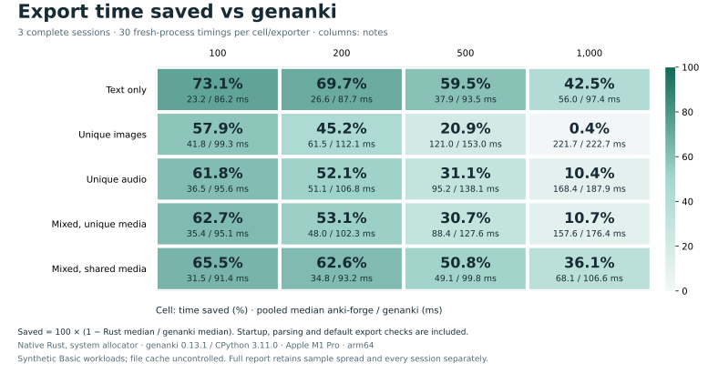
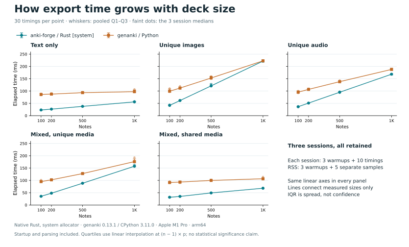
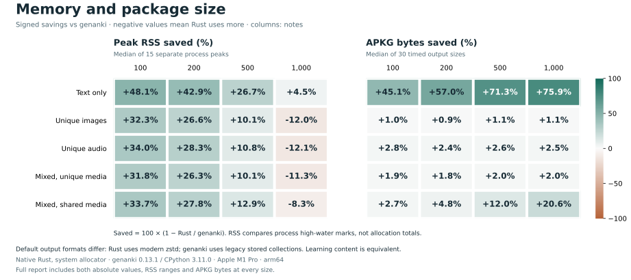

# Three-session export comparison

Measured package revision: `ab7d261238619e99da9a6b8e5ffff8d952e6153b` (clean for all three sessions).

Five synthetic Basic scenes × 100/200/500/1,000 notes. Each cell/exporter has 30 timing samples and 15 separate RSS samples; each session has 3 warmups before each pass. All 2,520 exports passed original SQLite/template/media checks; 120 first-timed packages passed pinned Anki import/content/render checks.

Host: Apple M1 Pro; 32 GiB RAM; 10 logical CPUs; macOS-27.0-arm64-arm-64bit. Rust 1.92.0 release/default features/system allocator; genanki 0.13.1 on native CPython 3.11.0.

Time covers fresh-process launch through exit, including imports, input parsing, media registration and default export checks. Media setup, output verification and Anki imports are outside each timed exporter. One exporter runs at a time, with adjacent interleaved controls; the same balanced seed/schedule is repeated in three sequential sessions. No controlled cold-cache or CPU-work claim is made.

PNG images are 64,152 bytes; WAV audio files are 32,044 bytes. Mixed scenes use 30% text, 40% images and 30% audio; shared media uses 49 distinct files. These fixtures do not measure Cloze, Image Occlusion, video, large individual media, bindings, long-lived processes or other hosts.

Anki verification uses the pinned upstream revision with the recorded local `tokio/io-util` build-feature patch in [plan.json](plan.json). This is local descriptive evidence with a patched oracle build, not an unmodified-upstream or cross-platform release benchmark. The patch and executable hashes are preserved; the measured package source and binaries did not change. No GUI or audible playback is exercised.

## Timing

Values pool all equally sized sessions. Q1/Q3 use linear interpolation at `(n - 1) × p`; the original per-session runner reports retain its exclusive convention. IQR describes sample spread, not confidence. Savings = `100 × (1 - Rust median / genanki median)`. No cross-scene/size average, best-run selection or p95 is used.

| Scene | Notes | Rust ms [Q1, Q3] | genanki ms [Q1, Q3] | Time saved | genanki / Rust | ms saved |
| --- | ---: | ---: | ---: | ---: | ---: | ---: |
| Text only | 100 | 23.22 [21.83, 24.39] | 86.24 [82.38, 90.11] | 73.1% | 3.71× | 63.02 |
| Text only | 200 | 26.57 [25.53, 27.95] | 87.68 [85.42, 91.60] | 69.7% | 3.30× | 61.11 |
| Text only | 500 | 37.85 [36.33, 39.04] | 93.49 [88.61, 96.54] | 59.5% | 2.47× | 55.64 |
| Text only | 1000 | 56.02 [55.12, 58.36] | 97.41 [95.27, 104.45] | 42.5% | 1.74× | 41.39 |
| Unique images | 100 | 41.81 [40.69, 45.12] | 99.35 [94.60, 108.56] | 57.9% | 2.38× | 57.53 |
| Unique images | 200 | 61.45 [60.28, 63.67] | 112.13 [108.82, 116.57] | 45.2% | 1.82× | 50.68 |
| Unique images | 500 | 121.02 [118.69, 128.79] | 153.01 [149.04, 160.36] | 20.9% | 1.26× | 31.99 |
| Unique images | 1000 | 221.72 [217.67, 225.97] | 222.73 [217.83, 227.32] | 0.4% | 1.00× | 1.00 |
| Unique audio | 100 | 36.48 [34.48, 38.18] | 95.60 [91.80, 101.11] | 61.8% | 2.62× | 59.12 |
| Unique audio | 200 | 51.14 [50.01, 52.39] | 106.81 [104.37, 109.91] | 52.1% | 2.09× | 55.66 |
| Unique audio | 500 | 95.22 [93.21, 98.47] | 138.15 [135.15, 141.96] | 31.1% | 1.45× | 42.93 |
| Unique audio | 1000 | 168.43 [165.42, 171.06] | 187.90 [185.05, 192.83] | 10.4% | 1.12× | 19.47 |
| Mixed, unique media | 100 | 35.44 [33.94, 36.11] | 95.13 [92.29, 99.26] | 62.7% | 2.68× | 59.69 |
| Mixed, unique media | 200 | 47.95 [46.91, 50.13] | 102.31 [100.31, 104.91] | 53.1% | 2.13× | 54.36 |
| Mixed, unique media | 500 | 88.40 [86.98, 90.18] | 127.63 [125.57, 130.86] | 30.7% | 1.44× | 39.23 |
| Mixed, unique media | 1000 | 157.57 [155.29, 161.90] | 176.36 [172.15, 187.30] | 10.7% | 1.12× | 18.80 |
| Mixed, shared media | 100 | 31.49 [30.69, 33.53] | 91.37 [89.03, 94.22] | 65.5% | 2.90× | 59.87 |
| Mixed, shared media | 200 | 34.84 [34.10, 36.89] | 93.16 [89.13, 95.04] | 62.6% | 2.67× | 58.33 |
| Mixed, shared media | 500 | 49.09 [47.13, 50.52] | 99.84 [95.15, 102.71] | 50.8% | 2.03× | 50.75 |
| Mixed, shared media | 1000 | 68.14 [66.60, 69.63] | 106.60 [103.93, 110.08] | 36.1% | 1.56× | 38.46 |





## Across-session variation

Each entry below is Rust/genanki median milliseconds, followed by the same-session time saving. The predeclared diagnostic flags a range exceeding 5 percentage points. All three sessions stay in the aggregate regardless of the flag; it is not a significance test.

| Scene | Notes | Session 1 | Session 2 | Session 3 | Saving spread (pp) |
| --- | ---: | ---: | ---: | ---: | ---: |
| Text only | 100 | 22.47/85.13 (73.6%) | 24.36/89.37 (72.7%) | 23.22/83.43 (72.2%) | 1.44 |
| Text only | 200 | 26.32/85.87 (69.3%) | 28.03/90.95 (69.2%) | 26.15/86.10 (69.6%) | 0.45 |
| Text only | 500 | 37.19/91.77 (59.5%) | 38.36/96.28 (60.2%) | 37.64/92.01 (59.1%) | 1.06 |
| Text only | 1000 | 55.55/95.38 (41.8%) | 58.95/107.24 (45.0%) | 55.81/98.17 (43.1%) | 3.27 |
| Unique images | 100 | 41.81/97.64 (57.2%) | 45.07/110.74 (59.3%) | 40.75/96.56 (57.8%) | 2.13 |
| Unique images | 200 | 60.36/112.13 (46.2%) | 63.40/119.91 (47.1%) | 61.63/109.95 (43.9%) | 3.18 |
| Unique images | 500 | 118.88/149.67 (20.6%) | 128.73/159.82 (19.5%) | 120.79/154.78 (22.0%) | 2.50 |
| Unique images | 1000 | 222.59/222.47 (-0.1%) | 220.67/223.65 (1.3%) | 222.42/222.73 (0.1%) | 1.39 |
| Unique audio | 100 | 34.71/91.55 (62.1%) | 38.23/100.37 (61.9%) | 36.27/95.33 (61.9%) | 0.18 |
| Unique audio | 200 | 50.10/106.50 (53.0%) | 51.68/109.72 (52.9%) | 51.55/105.28 (51.0%) | 1.92 |
| Unique audio | 500 | 92.69/137.65 (32.7%) | 98.15/143.32 (31.5%) | 95.65/136.64 (30.0%) | 2.67 |
| Unique audio | 1000 | 167.70/187.90 (10.7%) | 169.54/189.51 (10.5%) | 167.67/187.29 (10.5%) | 0.27 |
| Mixed, unique media | 100 | 33.96/94.50 (64.1%) | 36.05/101.58 (64.5%) | 35.07/94.56 (62.9%) | 1.59 |
| Mixed, unique media | 200 | 47.90/104.09 (54.0%) | 49.26/104.29 (52.8%) | 47.03/100.66 (53.3%) | 1.22 |
| Mixed, unique media | 500 | 89.73/127.24 (29.5%) | 88.05/130.05 (32.3%) | 88.05/126.92 (30.6%) | 2.81 |
| Mixed, unique media | 1000 | 155.31/174.76 (11.1%) | 163.70/193.10 (15.2%) | 157.91/176.11 (10.3%) | 4.89 |
| Mixed, shared media | 100 | 30.73/89.24 (65.6%) | 32.82/95.74 (65.7%) | 31.69/90.93 (65.2%) | 0.56 |
| Mixed, shared media | 200 | 34.41/89.37 (61.5%) | 36.90/94.24 (60.8%) | 34.83/93.77 (62.9%) | 2.01 |
| Mixed, shared media | 500 | 48.28/98.48 (51.0%) | 49.00/102.83 (52.3%) | 49.45/98.85 (50.0%) | 2.37 |
| Mixed, shared media | 1000 | 67.17/104.48 (35.7%) | 69.88/114.28 (38.9%) | 68.26/105.61 (35.4%) | 3.49 |

## Memory and output size

RSS is the median [minimum, maximum] of 15 independent process high-water marks. APKG size uses only the 30 timed outputs. Rust writes a modern zstd collection plus a legacy compatibility placeholder; genanki writes a legacy stored collection. Size savings include those default format/compression choices. Matching learning content does not imply byte-identical packages or styles.

| Scene | Notes | Rust RSS MiB [min, max] | genanki RSS MiB [min, max] | Rust APKG KiB | genanki APKG KiB |
| --- | ---: | ---: | ---: | ---: | ---: |
| Text only | 100 | 14.06 [13.91, 14.33] | 27.09 [26.47, 28.09] | 72.64 | 132.21 |
| Text only | 200 | 15.83 [15.69, 15.98] | 27.72 [27.03, 29.05] | 87.91 | 204.21 |
| Text only | 500 | 21.45 [21.30, 21.77] | 29.25 [28.42, 29.97] | 133.13 | 464.21 |
| Text only | 1000 | 30.45 [30.28, 31.17] | 31.89 [31.27, 32.95] | 204.17 | 848.21 |
| Unique images | 100 | 18.77 [18.56, 18.98] | 27.72 [26.73, 28.88] | 6349.31 | 6411.18 |
| Unique images | 200 | 21.17 [21.00, 21.50] | 28.83 [27.47, 29.56] | 12641.49 | 12762.47 |
| Unique images | 500 | 28.03 [27.67, 28.39] | 31.17 [30.36, 32.25] | 31517.22 | 31868.35 |
| Unique images | 1000 | 39.77 [39.61, 40.45] | 35.50 [34.31, 36.56] | 62972.33 | 63664.82 |
| Unique audio | 100 | 17.95 [17.83, 18.14] | 27.20 [26.56, 28.78] | 3184.97 | 3275.63 |
| Unique audio | 200 | 20.56 [20.28, 20.78] | 28.67 [27.55, 29.58] | 6331.77 | 6487.38 |
| Unique audio | 500 | 27.84 [27.53, 28.19] | 31.22 [30.36, 32.22] | 15754.95 | 16174.62 |
| Unique audio | 1000 | 39.88 [39.41, 40.28] | 35.56 [34.64, 36.94] | 31452.66 | 32269.35 |
| Mixed, unique media | 100 | 18.61 [18.45, 18.77] | 27.28 [26.72, 28.86] | 3518.16 | 3588.02 |
| Mixed, unique media | 200 | 20.98 [20.73, 21.12] | 28.48 [27.41, 29.66] | 6983.60 | 7111.97 |
| Mixed, unique media | 500 | 27.44 [27.20, 28.12] | 30.53 [29.83, 31.50] | 17373.83 | 17736.09 |
| Mixed, unique media | 1000 | 38.36 [38.09, 38.62] | 34.47 [33.42, 35.12] | 34684.56 | 35400.30 |
| Mixed, shared media | 100 | 18.48 [18.22, 18.62] | 27.86 [26.53, 28.75] | 2482.42 | 2552.47 |
| Mixed, shared media | 200 | 20.36 [19.97, 20.58] | 28.20 [27.17, 29.12] | 2498.15 | 2624.47 |
| Mixed, shared media | 500 | 25.95 [25.73, 26.11] | 29.78 [28.75, 30.92] | 2544.99 | 2892.47 |
| Mixed, shared media | 1000 | 35.23 [34.91, 35.53] | 32.53 [31.88, 33.69] | 2618.29 | 3296.47 |



## Reproduce

See the [suite instructions](../../README.md) for locked preparation and measurement. [plan.json](plan.json) was saved before fixture generation or measurement. Original manifests, attempts, verified samples and compressed check records live in `round-1/`, `round-2/`, `round-3/`. Source paths inside these immutable records describe the measurement host; fixtures regenerate from the frozen repository recipe. APKG/media files and executables are excluded from this compact snapshot.

Regenerate this report offline from the archived evidence:

```sh
benchmarks/.venv/bin/python benchmarks/media_report.py benchmarks/results/20260907-readme-comparison
```

[summary.json](summary.json) contains all statistics; [evidence-sha256.json](evidence-sha256.json) pins the original evidence bytes. The renderer rejects changed evidence, differing experiment identities, incomplete cells, failed attempts or missing Anki checks before calculating scores.
