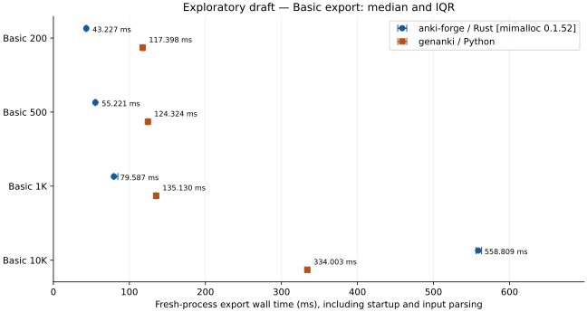

# Basic export benchmark

Run `20260907-basic-rust-genanki-optimized-04-mimalloc` · 2026-09-06T23:49:03.563721+00:00

**Rust allocator: mimalloc 0.1.52.** Adapter features: `mimalloc`. Optional host allocator configuration; not the default system-allocator result.

**Exploratory draft.** dirty checkout: exploratory measurements; upstream oracle checkout dirty/unavailable. Not a release/README advantage claim.

Host: unavailable: Command '['sysctl', '-n', 'machdep.cpu.brand_string']' returned non-zero exit status 1.; macOS-27.0-arm64-arm-64bit; arm64. CPython 3.11.0, genanki 0.13.1; anki-forge 0.1.0, Rust release; public-crate features: default.

Synthetic `basic-mixed-text-v1` (seed 20260906), one Basic card per note, no media. Each field is escaped inside its adapter. The time includes process startup, imports, JSON input parsing, default identity/checks, export and shutdown. Filesystem caches are warmed and uncontrolled; writes are closed without an fsync guarantee.

Medians [Q1, Q3] are milliseconds from 10 attempts per cell; IQR is sample spread, not confidence. Percentiles use linear interpolation (Hyndman–Fan type 7). No significance or language-only throughput claim.

| Notes/cards | anki-forge Rust, ms [IQR] | genanki, ms [IQR] | genanki / Rust | genanki − Rust, ms | Evidence |
| ---: | ---: | ---: | ---: | ---: | --- |
| 200 | 43.227 [42.205, 43.869] | 117.398 [116.808, 118.914] | 2.7158× | +74.171 | draft; Rust verified; genanki verified |
| 500 | 55.221 [54.800, 55.624] | 124.324 [123.377, 125.402] | 2.2514× | +69.103 | draft; Rust verified; genanki verified |
| 1,000 | 79.587 [79.085, 84.803] | 135.130 [133.948, 135.844] | 1.6979× | +55.543 | draft; Rust verified; genanki verified |
| 10,000 | 558.809 [555.784, 563.183] | 334.003 [331.567, 336.178] | 0.5977× | -224.805 | draft; Rust verified; genanki verified |

A ratio below 1 means Rust took longer. A negative difference means additional time in Rust.

## Separate memory and output measurements

RSS is the OS high-water mark of one completed exporter process (`single_process_peak_rss_os_v1`), from five separate memory attempts. It includes the runtime and is not a heap-allocation or whole-tree metric. Size uses only the ten timed APKGs. Values below are median [min, max].

| Notes/cards | Implementation | OS peak RSS, MiB (n=5) | APKG, KiB (n=10) | Memory status |
| ---: | --- | ---: | ---: | --- |
| 200 | rust | 15.27 [15.25, 15.39] | 87.91 [87.91, 87.91] | complete |
| 200 | genanki | 28.09 [27.78, 28.69] | 204.21 [204.21, 204.21] | complete |
| 500 | rust | 20.22 [20.19, 20.22] | 133.13 [133.13, 133.13] | complete |
| 500 | genanki | 29.64 [29.23, 29.86] | 464.21 [464.21, 464.21] | complete |
| 1,000 | rust | 28.05 [27.98, 28.06] | 204.17 [204.17, 204.17] | complete |
| 1,000 | genanki | 32.19 [31.70, 32.64] | 848.21 [848.21, 848.21] | complete |
| 10,000 | rust | 114.94 [114.89, 115.03] | 1500.37 [1500.37, 1500.37] | complete |
| 10,000 | genanki | 69.27 [68.98, 69.50] | 8004.21 [8004.21, 8004.21] | complete |

The preselected showcase size is **10,000 notes / 10,000 cards**, retained regardless of the winner. Rust writes modern `collection.anki21b` with nested zstd and a legacy compatibility placeholder; genanki writes legacy `collection.anki2` with ZIP_STORED. Stock CSS, metadata, IDs and default validation work differ. These are default-output comparisons; no package is converted or recompressed for scoring.

## Frozen synthetic data

| Notes | Input, KiB | English / mixed / escaping | Front code points, min–median–max | Back code points, min–median–max | zlib-9 compressed / raw |
| ---: | ---: | --- | --- | --- | ---: |
| 200 | 103.38 | 100 / 80 / 20 | 40–70.5–100 | 122–216–300 | 6.11% |
| 500 | 254.06 | 250 / 200 / 50 | 40–69–100 | 121–214–300 | 5.15% |
| 1,000 | 503.31 | 500 / 400 / 100 | 40–70–100 | 120–213–300 | 4.82% |
| 10,000 | 5037.22 | 5000 / 4000 / 1000 | 40–70–100 | 120–209–300 | 4.45% |

The phrase pools make this corpus repetitive. The compressor ratio is a characterization diagnostic, not a performance score or evidence that real decks have this compressibility. Exact UTF-8 byte distributions, compressor version and golden fixture hashes are in the manifest.

## Correctness and provenance

All successful attempts, including both sets of warmups, are checked after both measurement passes: physical rows, GUID/field multiplicity, card associations, templates and complete literal text. Modern semantics use the repository inspector; legacy schema-11 semantics use the benchmark-local read-only reader because the repository inspector requires a modern decks table. Independent verification requires the first timed artifact per cell to be imported into a fresh pinned Anki collection, every imported field/card to be checked and deterministic English, mixed and escaping examples to be rendered.

Anki checks passed for 8 of 8 cells. Missing or failed oracle evidence remains explicitly unverified.

Anki revision: `2d44d4d6bc486803f9236033ad840df203c87036`. Artifact and executable SHA-256 identities bind the evidence. Successful artifacts are cleaned only after their required checks; selected artifacts awaiting Anki are retained.

No advantage headline is generated: this run has no predeclared full confirmation. The complete matrix is retained even where Rust is slower. No outliers are removed or unsuccessful attempts retried.

[Manifest and frozen inputs](manifest.json) · [Every attempt](attempts.jsonl) · [Physical/semantic checks](verification.json) · [Anki evidence](anki.json) · [Phase events](events.jsonl) · [Machine-readable summary](summary.json) · [Retention](retention.json) · [Report revision and renderer identity](render-provenance.json)

Regenerate offline: `benchmarks/.venv/bin/python benchmarks/bench.py report <run-directory>`.
