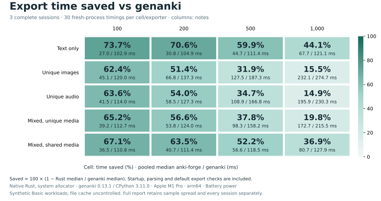
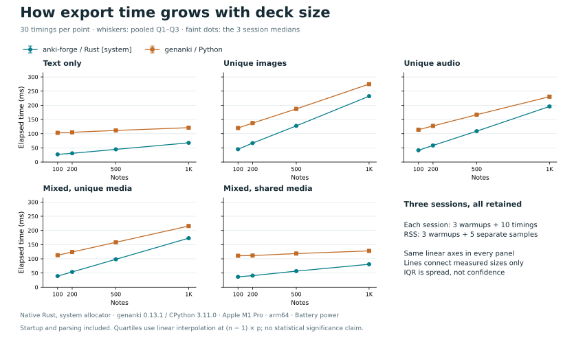
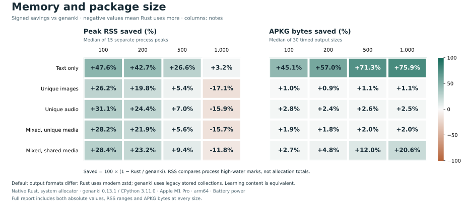

# Three-session export comparison

Measured package: base revision `ab7d261238619e99da9a6b8e5ffff8d952e6153b` plus the frozen uncommitted [source patch](source.patch). The exact [source hashes](source-snapshot.json) and patch hashes were recorded before measurement and remained unchanged across all three sessions.

Five synthetic Basic scenes × 100/200/500/1,000 notes. Each cell/exporter has 30 timing samples and 15 separate RSS samples; each session has 3 warmups before each pass. All 2,520 exports passed original SQLite/template/media checks; 120 first-timed packages passed pinned Anki import/content/render checks.

Host: Apple M1 Pro; 32 GiB RAM; 10 logical CPUs; macOS-27.0-arm64-arm-64bit. Rust 1.92.0 release/default features/system allocator; genanki 0.13.1 on native CPython 3.11.0.

Time covers fresh-process launch through exit, including imports, input parsing, media registration and default export checks. Media setup, output verification and Anki imports are outside each timed exporter. One exporter runs at a time, with adjacent interleaved controls; the same balanced seed/schedule is repeated in three sequential sessions. No controlled cold-cache or CPU-work claim is made.

PNG images are 64,152 bytes; WAV audio files are 32,044 bytes. Mixed scenes use 30% text, 40% images and 30% audio; shared media uses 49 distinct files. These fixtures do not measure Cloze, Image Occlusion, video, large individual media, bindings, long-lived processes or other hosts.

Anki verification uses the pinned upstream revision with the recorded local `tokio/io-util` build-feature patch in [plan.json](plan.json). This is local descriptive evidence with a patched oracle build, not an unmodified-upstream or cross-platform release benchmark. The patch and executable hashes are preserved; the measured package source and binaries did not change. No GUI or audible playback is exercised.

Power: Battery power. Native readings were recorded before and after all 2,520 exports and checked against the predeclared source; see each session's `power.jsonl`. Absolute times are not compared against earlier sessions with different power conditions.

## Timing

Values pool all equally sized sessions. Q1/Q3 use linear interpolation at `(n - 1) × p`; the original per-session runner reports retain its exclusive convention. IQR describes sample spread, not confidence. Savings = `100 × (1 - Rust median / genanki median)`. No cross-scene/size average, best-run selection or p95 is used.

| Scene | Notes | Rust ms [Q1, Q3] | genanki ms [Q1, Q3] | Time saved | genanki / Rust | ms saved |
| --- | ---: | ---: | ---: | ---: | ---: | ---: |
| Text only | 100 | 27.04 [26.29, 28.11] | 102.92 [102.07, 104.19] | 73.7% | 3.81× | 75.88 |
| Text only | 200 | 30.80 [30.22, 31.92] | 104.92 [103.81, 105.42] | 70.6% | 3.41× | 74.12 |
| Text only | 500 | 44.74 [44.23, 46.52] | 111.43 [110.17, 113.35] | 59.9% | 2.49× | 66.69 |
| Text only | 1000 | 67.73 [66.71, 68.38] | 121.10 [119.82, 123.01] | 44.1% | 1.79× | 53.37 |
| Unique images | 100 | 45.10 [43.27, 47.08] | 119.95 [117.95, 121.35] | 62.4% | 2.66× | 74.85 |
| Unique images | 200 | 66.79 [65.33, 67.84] | 137.33 [135.64, 139.74] | 51.4% | 2.06× | 70.55 |
| Unique images | 500 | 127.52 [126.21, 128.86] | 187.34 [186.52, 188.91] | 31.9% | 1.47× | 59.83 |
| Unique images | 1000 | 232.09 [229.35, 233.95] | 274.71 [272.81, 276.33] | 15.5% | 1.18× | 42.61 |
| Unique audio | 100 | 41.50 [40.61, 42.59] | 114.01 [113.25, 115.35] | 63.6% | 2.75× | 72.52 |
| Unique audio | 200 | 58.51 [57.35, 62.35] | 127.26 [126.39, 129.94] | 54.0% | 2.18× | 68.76 |
| Unique audio | 500 | 108.88 [107.08, 110.22] | 166.85 [165.55, 169.41] | 34.7% | 1.53× | 57.97 |
| Unique audio | 1000 | 195.93 [192.16, 198.57] | 230.34 [229.06, 233.75] | 14.9% | 1.18× | 34.41 |
| Mixed, unique media | 100 | 39.22 [37.88, 40.78] | 112.74 [112.25, 113.90] | 65.2% | 2.87× | 73.52 |
| Mixed, unique media | 200 | 53.79 [52.59, 55.78] | 123.97 [123.29, 125.30] | 56.6% | 2.30× | 70.18 |
| Mixed, unique media | 500 | 98.31 [97.42, 101.17] | 158.18 [157.08, 161.48] | 37.8% | 1.61× | 59.87 |
| Mixed, unique media | 1000 | 172.72 [169.85, 175.14] | 215.50 [213.68, 219.15] | 19.8% | 1.25× | 42.77 |
| Mixed, shared media | 100 | 36.46 [35.44, 38.38] | 110.82 [109.96, 113.20] | 67.1% | 3.04× | 74.36 |
| Mixed, shared media | 200 | 40.71 [39.87, 42.16] | 111.41 [110.83, 113.04] | 63.5% | 2.74× | 70.69 |
| Mixed, shared media | 500 | 56.63 [55.59, 58.69] | 118.50 [117.37, 121.72] | 52.2% | 2.09× | 61.87 |
| Mixed, shared media | 1000 | 80.73 [79.70, 82.48] | 127.87 [127.19, 129.75] | 36.9% | 1.58× | 47.14 |





## Across-session variation

Each entry below is Rust/genanki median milliseconds, followed by the same-session time saving. The predeclared diagnostic flags a range exceeding 5 percentage points. All three sessions stay in the aggregate regardless of the flag; it is not a significance test.

| Scene | Notes | Session 1 | Session 2 | Session 3 | Saving spread (pp) |
| --- | ---: | ---: | ---: | ---: | ---: |
| Text only | 100 | 27.11/103.48 (73.8%) | 26.68/103.00 (74.1%) | 27.63/102.76 (73.1%) | 0.99 |
| Text only | 200 | 31.21/104.45 (70.1%) | 30.91/105.25 (70.6%) | 30.44/104.65 (70.9%) | 0.79 |
| Text only | 500 | 44.51/111.72 (60.2%) | 45.54/110.78 (58.9%) | 44.95/111.10 (59.5%) | 1.27 |
| Text only | 1000 | 67.96/122.54 (44.5%) | 68.29/121.73 (43.9%) | 67.06/120.10 (44.2%) | 0.64 |
| Unique images | 100 | 45.64/119.71 (61.9%) | 44.17/120.13 (63.2%) | 45.43/119.82 (62.1%) | 1.36 |
| Unique images | 200 | 67.14/135.86 (50.6%) | 66.66/137.40 (51.5%) | 66.59/137.85 (51.7%) | 1.11 |
| Unique images | 500 | 127.23/187.08 (32.0%) | 127.53/187.47 (32.0%) | 128.30/187.60 (31.6%) | 0.38 |
| Unique images | 1000 | 230.88/274.08 (15.8%) | 231.84/275.91 (16.0%) | 233.01/274.50 (15.1%) | 0.86 |
| Unique audio | 100 | 40.84/113.68 (64.1%) | 41.73/114.01 (63.4%) | 41.66/115.16 (63.8%) | 0.68 |
| Unique audio | 200 | 59.48/126.75 (53.1%) | 57.61/129.60 (55.6%) | 58.81/127.19 (53.8%) | 2.48 |
| Unique audio | 500 | 107.86/166.93 (35.4%) | 109.34/167.55 (34.7%) | 109.62/166.15 (34.0%) | 1.36 |
| Unique audio | 1000 | 194.21/231.93 (16.3%) | 196.87/229.31 (14.1%) | 196.67/232.68 (15.5%) | 2.12 |
| Mixed, unique media | 100 | 38.88/112.47 (65.4%) | 39.77/113.11 (64.8%) | 39.36/112.50 (65.0%) | 0.60 |
| Mixed, unique media | 200 | 53.47/123.72 (56.8%) | 53.28/124.11 (57.1%) | 54.43/124.48 (56.3%) | 0.80 |
| Mixed, unique media | 500 | 97.48/157.86 (38.3%) | 99.31/158.18 (37.2%) | 98.44/160.12 (38.5%) | 1.30 |
| Mixed, unique media | 1000 | 173.21/217.36 (20.3%) | 171.98/214.88 (20.0%) | 172.68/215.59 (19.9%) | 0.40 |
| Mixed, shared media | 100 | 36.47/110.79 (67.1%) | 35.93/110.97 (67.6%) | 37.38/110.69 (66.2%) | 1.40 |
| Mixed, shared media | 200 | 39.96/111.01 (64.0%) | 41.03/111.64 (63.2%) | 41.60/111.59 (62.7%) | 1.28 |
| Mixed, shared media | 500 | 56.74/117.91 (51.9%) | 56.33/118.16 (52.3%) | 56.60/119.36 (52.6%) | 0.70 |
| Mixed, shared media | 1000 | 79.96/127.79 (37.4%) | 80.67/127.26 (36.6%) | 81.53/129.34 (37.0%) | 0.83 |

## Memory and output size

RSS is the median [minimum, maximum] of 15 independent process high-water marks. APKG size uses only the 30 timed outputs. Rust writes a modern zstd collection plus a legacy compatibility placeholder; genanki writes a legacy stored collection. Size savings include those default format/compression choices. Matching learning content does not imply byte-identical packages or styles.

| Scene | Notes | Rust RSS MiB [min, max] | genanki RSS MiB [min, max] | Rust APKG KiB | genanki APKG KiB |
| --- | ---: | ---: | ---: | ---: | ---: |
| Text only | 100 | 13.94 [13.83, 14.06] | 26.61 [26.47, 27.34] | 72.64 | 132.21 |
| Text only | 200 | 15.78 [15.58, 16.05] | 27.55 [26.91, 28.97] | 87.91 | 204.21 |
| Text only | 500 | 21.22 [21.12, 21.66] | 28.91 [28.44, 29.56] | 133.13 | 464.21 |
| Text only | 1000 | 30.28 [30.12, 30.89] | 31.28 [30.98, 32.23] | 204.17 | 848.21 |
| Unique images | 100 | 19.81 [19.42, 20.27] | 26.83 [26.59, 27.77] | 6349.31 | 6411.18 |
| Unique images | 200 | 22.22 [21.95, 22.36] | 27.69 [27.45, 28.27] | 12641.49 | 12762.47 |
| Unique images | 500 | 29.02 [28.59, 29.22] | 30.66 [30.30, 32.31] | 31517.22 | 31868.35 |
| Unique images | 1000 | 40.48 [40.08, 40.97] | 34.58 [34.27, 35.81] | 62972.33 | 63664.82 |
| Unique audio | 100 | 18.80 [18.47, 19.23] | 27.27 [26.72, 27.98] | 3184.97 | 3275.63 |
| Unique audio | 200 | 21.30 [20.94, 21.62] | 28.16 [27.48, 29.58] | 6331.77 | 6487.38 |
| Unique audio | 500 | 28.41 [28.03, 29.27] | 30.55 [30.19, 31.92] | 15754.95 | 16174.62 |
| Unique audio | 1000 | 40.41 [40.14, 41.05] | 34.86 [34.53, 36.11] | 31452.66 | 32269.35 |
| Mixed, unique media | 100 | 19.42 [19.08, 19.80] | 27.03 [26.58, 27.80] | 3518.16 | 3588.02 |
| Mixed, unique media | 200 | 21.89 [20.97, 22.33] | 28.05 [27.33, 28.56] | 6983.60 | 7111.97 |
| Mixed, unique media | 500 | 28.38 [28.02, 28.66] | 30.05 [29.50, 30.58] | 17373.83 | 17736.09 |
| Mixed, unique media | 1000 | 39.16 [38.78, 39.41] | 33.84 [33.42, 34.84] | 34684.56 | 35400.30 |
| Mixed, shared media | 100 | 19.22 [18.88, 19.50] | 26.86 [26.50, 27.34] | 2482.42 | 2552.47 |
| Mixed, shared media | 200 | 21.11 [20.75, 21.86] | 27.50 [27.12, 28.27] | 2498.15 | 2624.47 |
| Mixed, shared media | 500 | 26.50 [26.05, 26.75] | 29.25 [28.73, 30.06] | 2544.99 | 2892.47 |
| Mixed, shared media | 1000 | 35.69 [35.17, 36.00] | 31.92 [31.72, 32.42] | 2618.29 | 3296.47 |



## Reproduce

See the [suite instructions](../../README.md) for locked preparation and measurement. [plan.json](plan.json) was saved before fixture generation or measurement. Original manifests, attempts, verified samples and compressed check records live in `round-1/`, `round-2/`, `round-3/`. Source paths inside these immutable records describe the measurement host; fixtures regenerate from the frozen repository recipe. APKG/media files and executables are excluded from this compact snapshot.

Regenerate this report offline from the archived evidence:

```sh
benchmarks/.venv/bin/python benchmarks/media_report.py benchmarks/results/20260907-streaming-followup
```

[summary.json](summary.json) contains all statistics; [evidence-sha256.json](evidence-sha256.json) pins the original evidence bytes. The renderer rejects changed evidence, differing experiment identities, incomplete cells, failed attempts or missing Anki checks before calculating scores.
