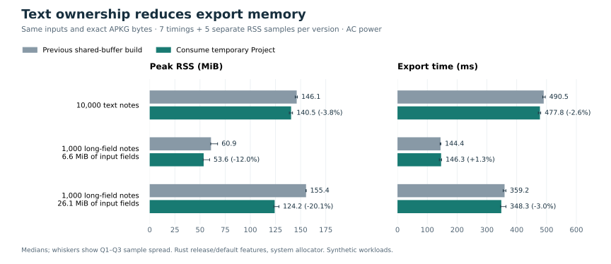

# 文本所有权优化：减少临时 Project 的字段副本

本轮主要降低长字段内存，整体耗时收益较小。Deck/Package 导出创建的临时 Project 现在会被消费：先解析身份，再移动 HTML 字符串，并在归一化后续阶段开始前释放临时笔记和身份缓存。公开 Deck、Project 接口仍可重复编辑和导出。



## 同一会话的完整对照

Apple M1 Pro / 32 GiB / macOS ARM64，Rust 1.92.0 release、默认 features、system allocator，2026-09-07，**AC Power**。对照为上一版共享媒体缓冲池与本次文本所有权改动。固定 29 个输入，每版本每场景 2 次预热 + 7 次计时；另跑 2 次预热 + 5 次 RSS。顺序交替、进程独立，文件缓存不受控；没有同时编译、测试或运行 Anki 导入。所有样本均保留，四分位数使用线性插值。

| 场景 | 时间 ms，前 → 后 | 时间变化 | 峰值 RSS MiB，前 → 后 | RSS 变化 |
| --- | ---: | ---: | ---: | ---: |
| text-1000 | 60.120 → 59.817 | -0.50% | 30.59 → 29.53 | -3.47% |
| image-1000 | 203.990 → 206.605 | +1.28% | 40.53 → 39.58 | -2.35% |
| audio-1000 | 174.573 → 172.238 | -1.34% | 40.11 → 39.05 | -2.65% |
| mixed-1000 | 152.531 → 150.874 | -1.09% | 39.00 → 37.91 | -2.80% |
| shared-1000 | 70.443 → 69.196 | -1.77% | 35.31 → 34.56 | -2.12% |
| text-100 | 23.158 → 23.103 | -0.24% | 14.20 → 14.14 | -0.44% |
| text-10000 | 490.495 → 477.831 | -2.58% | 146.09 → 140.53 | -3.81% |
| long-back-1000 | 144.411 → 146.286 | +1.30% | 60.92 → 53.62 | -11.98% |
| boundary-65536 | 207.794 → 204.759 | -1.46% | 40.77 → 39.89 | -2.15% |
| boundary-65537 | 208.234 → 207.282 | -0.46% | 40.47 → 39.83 | -1.58% |
| image-256x256k | 139.152 → 136.834 | -1.67% | 27.08 → 26.83 | -0.92% |
| image-64x1m | 143.541 → 142.339 | -0.84% | 27.58 → 27.50 | -0.28% |
| image-skewed-128 | 101.927 → 101.312 | -0.60% | 27.88 → 27.53 | -1.23% |
| text-200 | 27.601 → 26.282 | -4.78% | 16.08 → 15.77 | -1.94% |
| text-500 | 39.679 → 39.467 | -0.53% | 21.66 → 20.91 | -3.46% |
| image-100 | 40.172 → 39.091 | -2.69% | 19.97 → 19.84 | -0.63% |
| image-200 | 57.433 → 57.071 | -0.63% | 22.42 → 22.25 | -0.77% |
| image-500 | 112.158 → 113.283 | +1.00% | 29.14 → 28.47 | -2.31% |
| audio-100 | 36.162 → 35.615 | -1.51% | 18.84 → 18.70 | -0.75% |
| audio-200 | 51.211 → 50.368 | -1.65% | 21.56 → 21.34 | -1.01% |
| audio-500 | 96.420 → 96.558 | +0.14% | 28.53 → 27.81 | -2.52% |
| mixed-100 | 33.764 → 34.015 | +0.74% | 19.45 → 19.38 | -0.40% |
| mixed-200 | 45.653 → 46.479 | +1.81% | 21.86 → 21.52 | -1.57% |
| mixed-500 | 87.586 → 88.232 | +0.74% | 28.45 → 27.83 | -2.20% |
| shared-100 | 30.816 → 31.334 | +1.68% | 19.22 → 19.08 | -0.73% |
| shared-200 | 34.484 → 35.369 | +2.57% | 20.98 → 20.80 | -0.89% |
| shared-500 | 47.401 → 48.493 | +2.30% | 26.53 → 25.86 | -2.53% |
| long-back-quarter-1000 | 81.627 → 81.047 | -0.71% | 38.94 → 35.83 | -7.99% |
| long-back-quadruple-1000 | 359.213 → 348.278 | -3.04% | 155.39 → 124.20 | -20.07% |

时间变化为负表示更快，为正表示更慢。普通长字段本轮为 +1.30%，共享媒体部分小场景为 +1.68%～+2.57%；不把微小变化当作普遍提速。29 个场景的 RSS 中位数均降低。完整分布见 [summary.json](summary.json)，原始过程见 [runs](runs)。RSS 使用独立测量阶段；该阶段的耗时没有混入计时结果。

## 实际存活分配与阶段耗时

私有分配探针把每次分配转发给 System，只记录计数；它的进程 RSS 和整体耗时不用于上表。每版本每场景 1 次预热 + 3 次采样。峰值统计包含原始 Deck；累计分配量只取导出前后之差。

| 场景 | Rust 活跃堆峰值 MiB，前 → 后 | 导出累计分配 MiB，前 → 后 | 导出分配次数，前 → 后 |
| --- | ---: | ---: | ---: |
| text-1000 | 8.89 → 6.98 | 26.94 → 26.24 | 218,819 → 208,685 |
| text-10000 | 86.71 → 68.34 | 255.85 → 248.84 | 1,973,619 → 1,872,288 |
| long-back-1000 | 28.39 → 20.20 | 71.08 → 64.11 | 218,850 → 208,716 |
| long-back-quarter-1000 | 12.98 → 9.75 | 36.11 → 34.09 | 218,835 → 208,701 |
| long-back-quadruple-1000 | 90.03 → 62.00 | 209.99 → 183.17 | 218,850 → 208,716 |

四倍长字段累计分配减少约 26.82 MiB，符合消除一份完整字段副本的预期。Rust 活跃堆和进程 RSS 是不同口径；分配器释放对象后未必马上归还页面。

阶段探针每版本 2 次预热 + 5 次采样。由于身份提取从 reconcile 移到了准备阶段，公平比较范围是 **归一化 + 身份提取**：

- text-10000：91.070 → 84.555 ms（-7.15%）。
- long-back-quadruple-1000：18.379 → 13.848 ms（-24.65%）。

先前约 101 ms 的归一化数值来自另一次电源/测量会话，不能直接减去这里的新数值。本次万条旧版单独归一化为 84.008 ms，另有约 7.187 ms 的身份提取；上面的合计先逐样本相加，再取中位数。各阶段和探针源码均保留。

## 正确性与边界

- 正式前后对照共 **928 次导出**，每个场景两个版本的 APKG 全部逐字节一致。
- 58 份选定产物分别通过独立 ZIP、SQLite 行、身份和媒体核验；29 个场景均通过固定 upstream Anki 的导入、字段、媒体与渲染核验。
- 所有 1,175 次已产出文件的尝试，包括诊断探针和中断批次，均绑定到对应场景已经独立核验的产物哈希，见 [核验绑定](verification/attempt-bindings.json)。
- 完整工作区 **1,015 项 Rust 测试通过、25 项原有忽略**；43 项基准工具测试通过。Clippy `-D warnings`、格式、文档、打包、契约、版本及依赖检查通过。
- 新增测试覆盖长 HTML 的存储转移、嵌套内容渲染、精确 APKG/锁文件一致、重复导出和媒体修复后重试；扩展了无效部分计划、身份冲突及来源映射的差分检查。

## 保留的试验与来源

`baseline-reproduction` 复现初始分配；`early-release-screen` 只提前释放临时 Project，没有稳定的耗时收益。`move-fields-screen` 在第 57 次导出遇到原生电源来源切换而停止，**整批排除于性能比较**。其原始日志、来源和逐字节产物核验保留。之后修复 Clippy 报告的内部枚举体积问题，并从预热重新开始最终完整对照，没有续接或筛选旧样本。初次检查失败日志也保留。

- 基线二进制：`4abdcea28de9157d255ef80969be573631a4b38a1ce4483d2075a45877b5a75e`。
- 采用二进制：`4a3b8857ee9c1477f63990cb511fb221c71f18c32753bdd41f367d03c38ba4af`。
- [源码差异](source.patch) 可应用于 [上一版快照](../20260907-bounded-media/implementation.md)；已重放并验证全部 199 个 crate/adapter 文件的哈希。
- [源码内容包](source-content.tar.gz) 通过 [路径映射](source-content.json) 保存基线、所有测量候选和探针的真实文件内容；全部与构建时哈希相符。私有探针每次强制刷新源码 mtime，构建日志确认编译，随后恢复正式 adapter。
- [输入列表](cases.json)、[正式构建身份](accepted-build.json)、[源码复核](source-audit.json)、[测试结果](quality-summary.json) 和原始命令均保留。
- Anki checker 保留已记录的 `tokio/io-util` 构建 feature 补丁。旧档案全部按各自 SHA256SUMS 重新核验，内容未改动。

README 中旧的 Rust/genanki 三会话矩阵仍属于其原始冻结版本；这里是两个 Rust 版本的对照，电源条件也不同，不叠加百分比或把旧 genanki 耗时与新 Rust 耗时交叉比较。

## 复现

恢复源码时，先按 `source-content.json` 的 `accepted` 集合恢复完整仓库，再覆盖 `baseline` 集合可得到旧版 crate/adapter。探针用各自集合的源码与 workspace 配置；复用的 `current-memory` 与 `current-stages` 共用根配置。输入生成方法及其哈希来自前一份媒体与长字段基准档案。

在新的 `benchmarks/.work/<name>/` 目录准备 `cases.json` 指向相同哈希的冻结输入，并恢复 `binaries/current`、`binaries/accepted` 后，执行归档的 `final_compare.py`。它调用 `run.py` 写入计划、每次导出前后检查原生电源、交替顺序并验证哈希。使用同一固定 inspector/oracle 执行 `verify_final.py`；不要把编译、导入或绘图与计时并行。`setup_probe.py`、`build_probe.py` 与对应源码集合记录了私有探针构建方式。

离线重新绘图（不重测）：

```sh
benchmarks/.venv/bin/python benchmarks/results/20260907-text-ownership/render_chart.py benchmarks/results/20260907-text-ownership
```
