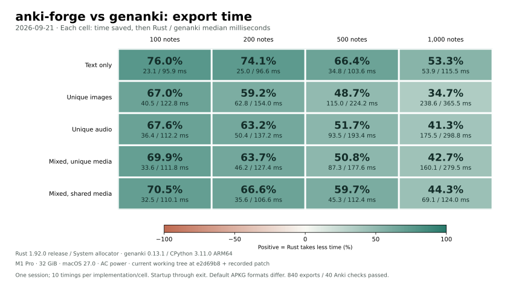
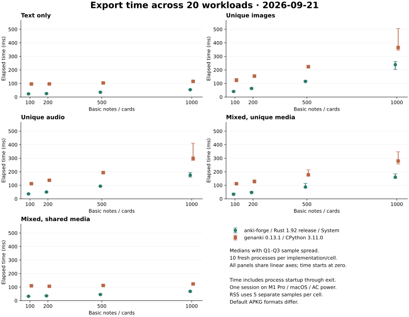
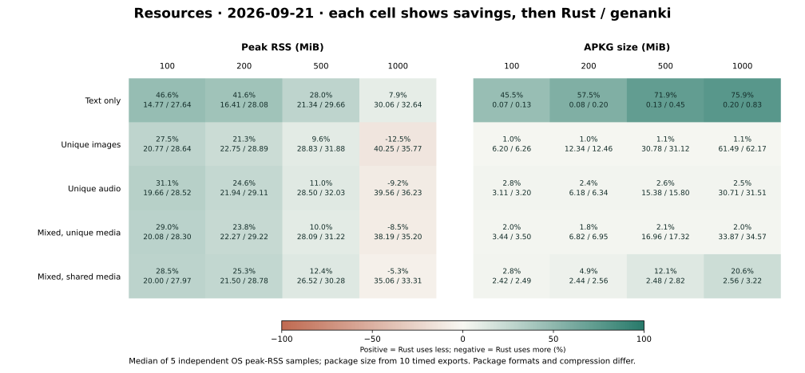

# Current Rust / genanki export comparison

Measured **2026-09-21 16:18:15–16:22:25 Asia/Shanghai** in one complete session. This report uses the current working tree, including uncommitted Rust optimizations.

The measured base commit is `e2d69b8025fd6dcf817ccbe56208bd7022c5671c` plus the frozen [source patch](source.patch). [Exact source and executable hashes](source-snapshot.json) were recorded before measurement and checked again afterward. These results describe this source snapshot, not a published release.

## Results at 1,000 notes

| Workload | Rust ms | genanki ms | Time saved | Rust / genanki peak RSS MiB |
| --- | ---: | ---: | ---: | ---: |
| Text only | 53.871 | 115.469 | 53.3% | 30.06 / 32.64 |
| Unique images | 238.638 | 365.490 | 34.7% | 40.25 / 35.77 |
| Unique audio | 175.458 | 298.849 | 41.3% | 39.56 / 36.23 |
| Mixed, unique media | 160.060 | 279.531 | 42.7% | 38.19 / 35.20 |
| Mixed, shared media | 69.053 | 124.043 | 44.3% | 35.06 / 33.31 |

## Method

- Host: Apple M1 Pro, 10 physical / 10 logical cores, 32 GiB RAM, macOS 27.0 (26A428), native ARM64, AC power.
- Rust: 1.92.0, release build, public `Deck` API, default product features, System allocator. No batch-only or benchmark-only product API.
- Comparator: genanki 0.13.1 on native CPython 3.11.0; dependencies use the repository hash-locked environment. Both implementations were measured again in this session.
- Matrix: five synthetic workloads × 100 / 200 / 500 / 1,000 Basic notes, one card per note. Text uses v1 fixtures; PNG/WAV media uses the frozen portable v2 recipe.
- Each implementation/cell: 3 timing warmups + 10 timing samples, then 3 RSS warmups + 5 independent RSS samples. Total: 400 timings, 200 RSS samples, 240 warmups.
- Adjacent Rust/genanki pairs alternate order; each timing cell has 5 Rust-first and 5 genanki-first pairs. Scene order is shuffled with seed 20260907. No outlier removal or selective retries.
- Timing spans native process launch through exit, including imports, input parsing, escaping, authoring, media registration, default export checks and file writes. Compilation, external validation and Anki imports are outside the timed interval.
- Verification and cleanup occur after each adjacent exporter pair. No other compilation, tests or plotting from this task ran during measurement. Filesystem cache and unrelated desktop background work are uncontrolled.
- Medians and Q1/Q3 use Hyndman–Fan type 7 interpolation. IQR shows sample spread, not confidence intervals. RSS is the median of five OS process high-water marks, not mean memory or total process-tree memory.

## Complete timing results

| Workload | Notes | Rust median [Q1, Q3] ms | genanki median [Q1, Q3] ms | Time saved | genanki / Rust |
| --- | ---: | ---: | ---: | ---: | ---: |
| Text only | 100 | 23.053 [21.286, 26.687] | 95.936 [91.578, 100.407] | 76.0% | 4.16× |
| Text only | 200 | 25.029 [23.778, 25.624] | 96.599 [95.222, 99.868] | 74.1% | 3.86× |
| Text only | 500 | 34.763 [34.510, 37.554] | 103.609 [101.308, 107.437] | 66.4% | 2.98× |
| Text only | 1000 | 53.871 [51.639, 56.461] | 115.469 [111.431, 121.832] | 53.3% | 2.14× |
| Unique images | 100 | 40.495 [38.883, 45.346] | 122.781 [119.930, 136.388] | 67.0% | 3.03× |
| Unique images | 200 | 62.847 [59.364, 67.453] | 153.972 [144.959, 162.697] | 59.2% | 2.45× |
| Unique images | 500 | 114.956 [111.656, 122.954] | 224.231 [213.784, 231.131] | 48.7% | 1.95× |
| Unique images | 1000 | 238.638 [203.457, 261.596] | 365.490 [345.866, 505.633] | 34.7% | 1.53× |
| Unique audio | 100 | 36.375 [34.410, 39.224] | 112.245 [110.828, 114.233] | 67.6% | 3.09× |
| Unique audio | 200 | 50.431 [48.139, 52.058] | 137.209 [134.377, 142.481] | 63.2% | 2.72× |
| Unique audio | 500 | 93.453 [90.271, 94.735] | 193.370 [188.127, 202.754] | 51.7% | 2.07× |
| Unique audio | 1000 | 175.458 [161.321, 194.333] | 298.849 [283.511, 410.238] | 41.3% | 1.70× |
| Mixed, unique media | 100 | 33.647 [31.194, 42.584] | 111.810 [107.028, 115.396] | 69.9% | 3.32× |
| Mixed, unique media | 200 | 46.186 [45.372, 55.716] | 127.401 [124.184, 139.895] | 63.7% | 2.76× |
| Mixed, unique media | 500 | 87.337 [81.707, 114.224] | 177.579 [170.692, 213.900] | 50.8% | 2.03× |
| Mixed, unique media | 1000 | 160.060 [151.089, 184.401] | 279.531 [257.632, 347.692] | 42.7% | 1.75× |
| Mixed, shared media | 100 | 32.535 [30.906, 34.036] | 110.142 [104.421, 118.093] | 70.5% | 3.39× |
| Mixed, shared media | 200 | 35.584 [34.208, 39.459] | 106.569 [104.928, 110.273] | 66.6% | 2.99× |
| Mixed, shared media | 500 | 45.346 [44.053, 49.827] | 112.430 [111.213, 118.738] | 59.7% | 2.48× |
| Mixed, shared media | 1000 | 69.053 [63.731, 72.555] | 124.043 [118.237, 127.806] | 44.3% | 1.80× |

## Memory and package size

| Workload | Notes | Rust RSS MiB, median [min, max] | genanki RSS MiB, median [min, max] | Rust / genanki APKG MiB |
| --- | ---: | ---: | ---: | ---: |
| Text only | 100 | 14.77 [14.64, 14.80] | 27.64 [27.30, 27.98] | 0.070 / 0.129 |
| Text only | 200 | 16.41 [16.39, 16.53] | 28.08 [27.78, 28.80] | 0.085 / 0.199 |
| Text only | 500 | 21.34 [21.30, 21.39] | 29.66 [29.36, 30.42] | 0.128 / 0.453 |
| Text only | 1000 | 30.06 [29.84, 30.23] | 32.64 [32.08, 32.69] | 0.200 / 0.828 |
| Unique images | 100 | 20.77 [20.16, 20.94] | 28.64 [28.08, 28.69] | 6.200 / 6.261 |
| Unique images | 200 | 22.75 [22.47, 23.00] | 28.89 [28.70, 29.14] | 12.344 / 12.463 |
| Unique images | 500 | 28.83 [28.73, 29.66] | 31.88 [31.70, 32.25] | 30.776 / 31.121 |
| Unique images | 1000 | 40.25 [39.23, 40.80] | 35.77 [35.56, 36.17] | 61.495 / 62.173 |
| Unique audio | 100 | 19.66 [19.52, 19.73] | 28.52 [28.20, 28.69] | 3.110 / 3.199 |
| Unique audio | 200 | 21.94 [21.47, 22.47] | 29.11 [28.84, 29.73] | 6.182 / 6.335 |
| Unique audio | 500 | 28.50 [28.23, 28.94] | 32.03 [31.33, 32.39] | 15.383 / 15.796 |
| Unique audio | 1000 | 39.56 [39.25, 40.27] | 36.23 [35.75, 36.81] | 30.715 / 31.513 |
| Mixed, unique media | 100 | 20.08 [20.00, 20.19] | 28.30 [27.97, 28.59] | 3.435 / 3.504 |
| Mixed, unique media | 200 | 22.27 [21.75, 22.55] | 29.22 [29.00, 29.41] | 6.819 / 6.945 |
| Mixed, unique media | 500 | 28.09 [27.75, 28.31] | 31.22 [31.00, 32.05] | 16.964 / 17.320 |
| Mixed, unique media | 1000 | 38.19 [37.97, 38.73] | 35.20 [35.03, 35.52] | 33.871 / 34.571 |
| Mixed, shared media | 100 | 20.00 [19.80, 20.64] | 27.97 [27.89, 28.23] | 2.424 / 2.493 |
| Mixed, shared media | 200 | 21.50 [21.39, 21.64] | 28.78 [28.28, 29.36] | 2.439 / 2.563 |
| Mixed, shared media | 500 | 26.52 [26.36, 26.78] | 30.28 [30.19, 30.42] | 2.483 / 2.825 |
| Mixed, shared media | 1000 | 35.06 [35.02, 35.59] | 33.31 [32.72, 33.70] | 2.557 / 3.219 |

Rust uses a modern zstd-compressed collection and a legacy compatibility placeholder; genanki uses a legacy stored collection. Learning content is checked for equivalence, but output formats, styling, identity metadata and compression differ. Package-size savings include those default differences.

## Verification and limits

All **840 exports** passed original SQLite row/field/template checks and exact media name/content/reference checks. The first timed artifact for each implementation/cell passed the pinned Anki import, field and representative-render checks: **40/40**. All warmups are retained in the evidence. No GUI interaction or audible playback is tested.

The independently pinned Anki oracle was reused after verifying its executable, six source/lock files, upstream revision and local patch against the earlier archived evidence. The oracle uses upstream `2d44d4d6bc486803f9236033ad840df203c87036` with the recorded `tokio/io-util` build-feature patch. See [oracle provenance](oracle-reuse-check.json) and [build records](prepared-builds.json). The Rust exporter, inspector and native collector were prepared before this run.

The benchmark harness passed 43 tests and the separate 200-note smoke passed both exporters before measurement. Source, executable, Python package, fixture and media hashes stayed unchanged; every recorded export began and ended on AC power. The raw power and host-state records remain archived.

The 1-minute system load was 19.51 before and 16.09 after the run. Thermal status queries were unavailable; their raw errors are preserved in [the run manifest](run-manifest.json). Battery remained charged at 100% on AC power, with low-power mode disabled at both endpoints. This is a desktop-session comparison, not a controlled idle machine or cross-platform performance claim.

One session provides descriptive evidence for this machine and these workloads. Startup costs are included, so these ratios do not describe only the writer or a long-lived process. Memory savings depend on workload and size. No samples from earlier dates or implementations are pooled into these results.

Machine-readable results: [JSON](summary.json), [CSV](comparison.csv), and [verification summary](verification-summary.json). See the [evidence index and reproduction instructions](README.md).
