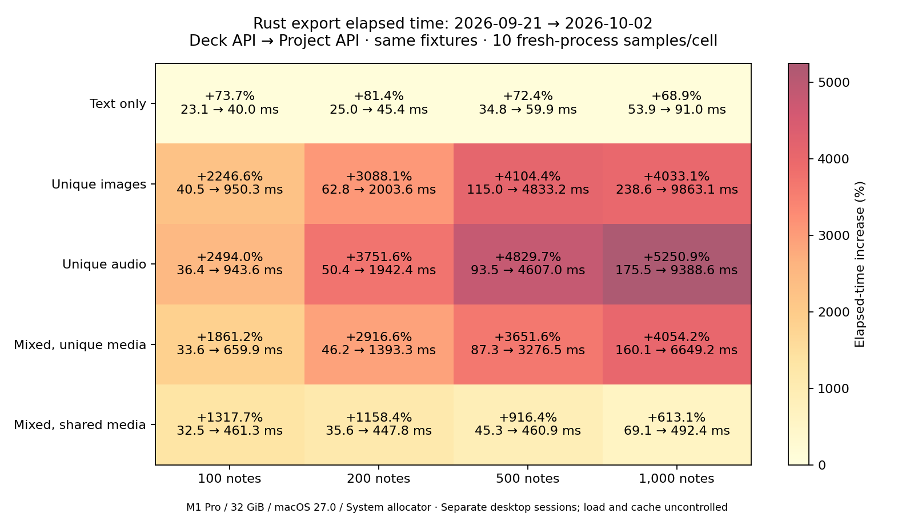

# 2026-10-02 当前代码 benchmark 与历史基线对比

全部 20 格 Rust 耗时中位数均高于旧基线。1,000 条独立图片/音频的耗时达到旧值的约 41.3/53.5 倍；峰值 RSS 也分别从 40.25/39.56 升至 98.28/66.80 MiB。本轮纯文本仍快于 genanki，全部媒体场景则慢于 genanki。跨日期比较包含环境与 API 路径差异，未定位单一根因。

当前提交：`4265fc4751daa18164cbf85bda425f2120e0f57d`。测量：2026-10-02 15:31:03–2026-10-02 15:51:59（Asia/Taipei）。

基线：[2026-09-21 完整报告](../20260921-readme-genanki/report.md)。当前测量使用 Rust `Project` API；基线使用旧 `Deck` API。两者测量学习内容相同的默认完整导出路径，不能把差异归因到单一函数或提交。

## 1,000 条笔记

| 场景 | Rust 旧 → 新 ms | 耗时变化 | RSS 旧 → 新 MiB | genanki 旧 → 新 ms | 当前 Rust / genanki 耗时 |
| --- | ---: | ---: | ---: | ---: | ---: |
| 纯文本 | 53.871 → 90.990 | +68.9% | 30.06 → 28.41 | 115.469 → 132.268 | 0.69× |
| 独立图片 | 238.638 → 9863.095 | +4033.1% | 40.25 → 98.28 | 365.490 → 424.981 | 23.21× |
| 独立音频 | 175.458 → 9388.619 | +5250.9% | 39.56 → 66.80 | 298.849 → 386.333 | 24.30× |
| 混合独立媒体 | 160.060 → 6649.202 | +4054.2% | 38.19 → 68.17 | 279.531 → 341.000 | 19.50× |
| 混合共享媒体 | 69.053 → 492.393 | +613.1% | 35.06 → 32.91 | 124.043 → 142.931 | 3.44× |

耗时变化 =（当前 / 历史 − 1）× 100%，负值表示更快。

## 全部 20 格耗时

| 场景 | 笔记 | Rust 旧 → 新 ms | 变化 | 当前 Rust Q1–Q3 ms | genanki 变化 | 相对 genanki 节省 旧 → 新 |
| --- | ---: | ---: | ---: | ---: | ---: | ---: |
| 纯文本 | 100 | 23.053 → 40.036 | +73.7% | 38.332–43.669 | +17.3% | 76.0% → 64.4% |
| 纯文本 | 200 | 25.029 → 45.411 | +81.4% | 42.532–47.831 | +20.6% | 74.1% → 61.0% |
| 纯文本 | 500 | 34.763 → 59.938 | +72.4% | 58.455–61.934 | +19.3% | 66.4% → 51.5% |
| 纯文本 | 1000 | 53.871 → 90.990 | +68.9% | 86.866–93.914 | +14.5% | 53.3% → 31.2% |
| 独立图片 | 100 | 40.495 → 950.267 | +2246.6% | 900.525–969.032 | +14.4% | 67.0% → -576.8% |
| 独立图片 | 200 | 62.847 → 2003.635 | +3088.1% | 1928.213–2043.307 | +13.1% | 59.2% → -1051.0% |
| 独立图片 | 500 | 114.956 → 4833.230 | +4104.4% | 4793.736–4934.808 | +18.5% | 48.7% → -1719.5% |
| 独立图片 | 1000 | 238.638 → 9863.095 | +4033.1% | 9590.812–10131.250 | +16.3% | 34.7% → -2220.8% |
| 独立音频 | 100 | 36.375 → 943.585 | +2494.0% | 875.035–950.669 | +22.8% | 67.6% → -584.4% |
| 独立音频 | 200 | 50.431 → 1942.411 | +3751.6% | 1874.757–1978.852 | +16.6% | 63.2% → -1114.1% |
| 独立音频 | 500 | 93.453 → 4606.968 | +4829.7% | 4438.913–4808.736 | +19.1% | 51.7% → -1900.8% |
| 独立音频 | 1000 | 175.458 → 9388.619 | +5250.9% | 8948.454–9918.327 | +29.3% | 41.3% → -2330.2% |
| 混合独立媒体 | 100 | 33.647 → 659.882 | +1861.2% | 642.827–667.272 | +24.7% | 69.9% → -373.4% |
| 混合独立媒体 | 200 | 46.186 → 1393.252 | +2916.6% | 1356.705–1423.890 | +18.7% | 63.7% → -821.2% |
| 混合独立媒体 | 500 | 87.337 → 3276.538 | +3651.6% | 3196.416–3456.469 | +19.5% | 50.8% → -1444.1% |
| 混合独立媒体 | 1000 | 160.060 → 6649.202 | +4054.2% | 6422.665–6918.309 | +22.0% | 42.7% → -1849.9% |
| 混合共享媒体 | 100 | 32.535 → 461.253 | +1317.7% | 429.934–492.201 | +17.5% | 70.5% → -256.5% |
| 混合共享媒体 | 200 | 35.584 → 447.795 | +1158.4% | 442.098–460.021 | +25.0% | 66.6% → -236.2% |
| 混合共享媒体 | 500 | 45.346 → 460.893 | +916.4% | 450.946–471.520 | +19.4% | 59.7% → -243.2% |
| 混合共享媒体 | 1000 | 69.053 → 492.393 | +613.1% | 467.856–505.394 | +15.2% | 44.3% → -244.5% |

## 内存和文件体积

| 场景 | 笔记 | Rust RSS 旧 → 新 MiB | RSS 变化 | Rust APKG 旧 → 新 MiB | APKG 变化 |
| --- | ---: | ---: | ---: | ---: | ---: |
| 纯文本 | 100 | 14.77 → 14.03 | -5.0% | 0.070 → 0.092 | +30.7% |
| 纯文本 | 200 | 16.41 → 15.70 | -4.3% | 0.085 → 0.128 | +51.1% |
| 纯文本 | 500 | 21.34 → 20.30 | -4.9% | 0.128 → 0.236 | +85.2% |
| 纯文本 | 1000 | 30.06 → 28.41 | -5.5% | 0.200 → 0.416 | +108.6% |
| 独立图片 | 100 | 20.77 → 22.95 | +10.5% | 6.200 → 6.237 | +0.6% |
| 独立图片 | 200 | 22.75 → 31.41 | +38.0% | 12.344 → 12.419 | +0.6% |
| 独立图片 | 500 | 28.83 → 56.41 | +95.7% | 30.776 → 30.962 | +0.6% |
| 独立图片 | 1000 | 40.25 → 98.28 | +144.2% | 61.495 → 61.869 | +0.6% |
| 独立音频 | 100 | 19.66 → 19.69 | +0.2% | 3.110 → 3.147 | +1.2% |
| 独立音频 | 200 | 21.94 → 25.05 | +14.2% | 6.182 → 6.257 | +1.2% |
| 独立音频 | 500 | 28.50 → 40.58 | +42.4% | 15.383 → 15.570 | +1.2% |
| 独立音频 | 1000 | 39.56 → 66.80 | +68.8% | 30.715 → 31.088 | +1.2% |
| 混合独立媒体 | 100 | 20.08 → 19.73 | -1.7% | 3.435 → 3.468 | +0.9% |
| 混合独立媒体 | 200 | 22.27 → 25.30 | +13.6% | 6.819 → 6.884 | +1.0% |
| 混合独立媒体 | 500 | 28.09 → 41.70 | +48.4% | 16.964 → 17.127 | +1.0% |
| 混合独立媒体 | 1000 | 38.19 → 68.17 | +78.5% | 33.871 → 34.197 | +1.0% |
| 混合共享媒体 | 100 | 20.00 → 18.38 | -8.1% | 2.424 → 2.453 | +1.2% |
| 混合共享媒体 | 200 | 21.50 → 20.20 | -6.0% | 2.439 → 2.490 | +2.1% |
| 混合共享媒体 | 500 | 26.52 → 24.80 | -6.5% | 2.483 → 2.599 | +4.7% |
| 混合共享媒体 | 1000 | 35.06 → 32.91 | -6.1% | 2.557 → 2.781 | +8.8% |

## 方法与验证

- 测前当前 HEAD 的产品源代码无已跟踪修改；当时工作区有 3 份未跟踪文档，完整 Git 状态已记录。测量按仓库规则保留为 exploratory 单次本机结果。
- 相同 Apple M1 Pro、32 GiB、macOS 27.0 (26A428)、ARM64；Rust 1.92.0 release/default features/System allocator；genanki 0.13.1、CPython 3.11.0。未测 Node/Python 绑定。
- 5 种场景 × 100/200/500/1,000 条笔记，20 份输入 JSON 与历史基线 SHA-256 全部相同，2,749 个媒体文件测前测后核验。
- 每实现每格：3 次计时预热、10 次计时、3 次 RSS 预热、5 次独立 RSS 采样；共 840 次导出，含 400 次计时、200 次 RSS 和 240 次预热。每格计时有 5 次 Rust 先运行、5 次 genanki 先运行。
- 840 次输出内容/SQLite/媒体校验和 40 次 Anki 导入/内容/代表性渲染校验全部通过；代码、二进制、依赖与输入哈希测前测后保持相同；每次导出前后均检查 AC Power。
- 46 项 benchmark 测试和单独 200 条 smoke 导出通过。Anki oracle 按当前锁定依赖重建，仍使用与基线一致的 benchmark checker 源文件和 pinned upstream Anki/patch。
- 计时覆盖新进程启动、解析、构建和默认导出检查、写文件到进程退出；RSS 为独立进程 OS 高水位。Q1/Q3 使用 Hyndman–Fan type 7；不删除异常值。
- 当前系统负载（1/5/15 分钟）：测前 [11.46533203125, 12.55029296875, 12.7509765625]；测后 [28.7470703125, 21.3154296875, 18.5263671875]。历史 1 分钟负载为 19.51 → 16.09。桌面负载与缓存未控制，跨日期变化包含运行环境影响；重新测量 genanki 作为参照，不能视为受控的同会话旧/新 Rust A/B。
- 供电细节（原生记录）：测前 "Now drawing from 'AC Power'\n -InternalBattery-0 (id=25034851)\t16%; discharging; 0:59 remaining present: true"；测后 "Now drawing from 'AC Power'\n -InternalBattery-0 (id=25034851)\t12%; charging; 2:18 remaining present: true"。历史基线电池为 100%；本轮电池电量和充电状态不同，虽 AC Power 来源保持一致，也不把它视为完全匹配的供电条件。
- 单轮结果为描述性统计，不提供显著性或跨机器结论；两库默认 APKG 格式和压缩不同，体积比较包含这些差异。

机器数据：[本轮 summary.json](summary.json)、[完整差异 delta.csv](delta.csv)、[验证记录](verification-summary.json)。原始记录和复现脚本见 [README](README.md)。
