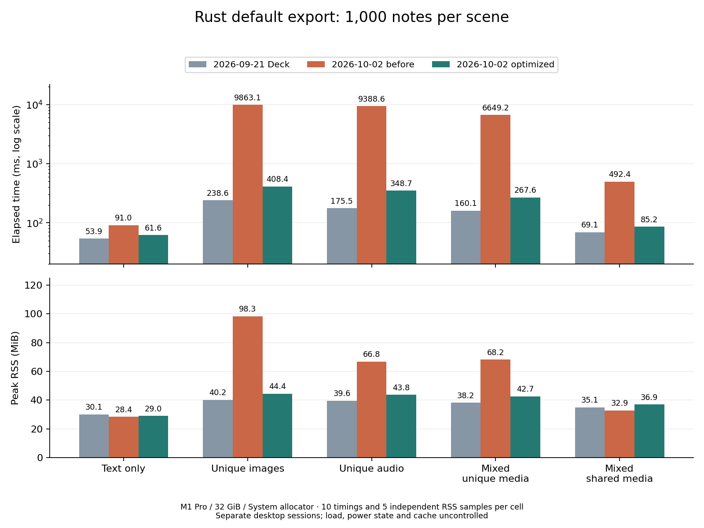

# 2026-10-02 性能优化与完整 benchmark 复测

20 格矩阵中有 20 格 Rust 耗时中位数低于本日优化前结果。全部 840 次导出验证和 40 次 Anki 导入、内容、代表性渲染检查通过。以下同时给出 9 月 21 日历史基线与本轮 genanki 数据，供评估剩余差距。

测量时间：2026-10-02 17:45:36–2026-10-02 17:49:46（Asia/Taipei）。Git HEAD：`4265fc4751daa18164cbf85bda425f2120e0f57d`；本轮包含未提交的生产优化，精确源码和补丁已冻结，结果为 exploratory 本机描述性数据。

## 实现修改

- Project 的不可变媒体快照直接进入 PreparedMedia 的有界压缩队列和顺序 ZIP 写入。移除了原始快照到输入文件、CAS、staging 的重复字节拷贝及中间文件 sync；最终产物同步、校验与发布保留。持久化 CAS 的底层接口保留原来的完整性和同步逻辑。
- 媒体快照共享 4 MiB 驻留内存预算（按 Vec capacity 计费）；大对象或预算之外的对象进入私有临时文件。去重快照共享一次计费，最后一个所有者释放预算和存储。临时快照只保留 TempPath，读时打开文件，避免长期占用数百个句柄。该预算不包含导入中的缓冲、调用者原有内存、编码池、数据库或检查器，所以不是整个进程的 RSS 上限。
- 身份校验从已有 notes 扫描读取字段和标签，复用 cards/decks SQL 语句，每个模型只解码一次模板目标 deck 配置，并复用同一批 card ordinal 做映射校验。内容指纹、缺失 deck/template、目标 deck、flags、重复/未映射 card 检查仍然执行。
- 完成检查和策略判定后，独占临时产物在同一文件系统中同步并原子 rename 到目的地，避免再次复制整包；跨设备使用原来的 copy-before-replace 路径。公共 persist_to 和共享句柄仍然复制原文件。目录同步失败的已发布/持久性未确认事实仍然上报。

## 1,000 条笔记

| 场景 | 优化前 → 后 ms | 耗时变化 | 9/21 ms | 相对 9/21 | RSS 前 → 后 MiB | 9/21 RSS MiB | 本轮 genanki ms |
| --- | ---: | ---: | ---: | ---: | ---: | ---: | ---: |
| 纯文本 | 90.990 → 61.593 | -32.3% | 53.871 | +14.3% | 28.41 → 28.98 | 30.06 | 103.060 |
| 独立图片 | 9863.095 → 408.419 | -95.9% | 238.638 | +71.1% | 98.28 → 44.39 | 40.25 | 321.007 |
| 独立音频 | 9388.619 → 348.739 | -96.3% | 175.458 | +98.8% | 66.80 → 43.75 | 39.56 | 272.925 |
| 混合独立媒体 | 6649.202 → 267.571 | -96.0% | 160.060 | +67.2% | 68.17 → 42.73 | 38.19 | 231.516 |
| 混合共享媒体 | 492.393 → 85.222 | -82.7% | 69.053 | +23.4% | 32.91 → 36.94 | 35.06 | 114.328 |

负值表示降低。耗时为新进程启动到退出的中位数，包含媒体导入、构建、默认检查、发布和清理。RSS 为另 5 次独立进程的 OS 高水位中位数。

本轮 1,000 条笔记的 genanki 耗时也比优化前降低约 20%–32%，提示会话环境存在变化。Rust 的独立媒体耗时相对本日优化前降低约 96%，但仍比 9/21 高约 67%–99%，且比本轮 genanki 慢约 16%–28%。共享媒体 RSS 从 32.91 升到 36.94 MiB，文本 RSS 也小幅增加；有界并行压缩有额外工作内存。这轮没有给这些剩余差距做新的单变量归因。

## 完整 20 格耗时

| 场景 | 笔记 | 优化前 → 后 ms | 变化 | 优化后 Q1–Q3 ms | 相对 9/21 | 本轮 genanki ms | Rust / genanki |
| --- | ---: | ---: | ---: | ---: | ---: | ---: | ---: |
| 纯文本 | 100 | 40.036 → 31.382 | -21.6% | 29.993–35.413 | +36.1% | 89.675 | 0.35× |
| 纯文本 | 200 | 45.411 → 34.520 | -24.0% | 33.699–36.581 | +37.9% | 89.257 | 0.39× |
| 纯文本 | 500 | 59.938 → 48.334 | -19.4% | 43.914–59.138 | +39.0% | 96.144 | 0.50× |
| 纯文本 | 1000 | 90.990 → 61.593 | -32.3% | 58.599–64.861 | +14.3% | 103.060 | 0.60× |
| 独立图片 | 100 | 950.267 → 56.346 | -94.1% | 54.664–60.322 | +39.1% | 108.905 | 0.52× |
| 独立图片 | 200 | 2003.635 → 95.485 | -95.2% | 93.989–100.034 | +51.9% | 129.255 | 0.74× |
| 独立图片 | 500 | 4833.230 → 202.047 | -95.8% | 199.867–206.337 | +75.8% | 197.632 | 1.02× |
| 独立图片 | 1000 | 9863.095 → 408.419 | -95.9% | 403.656–417.429 | +71.1% | 321.007 | 1.27× |
| 独立音频 | 100 | 943.585 → 50.075 | -94.7% | 46.169–57.247 | +37.7% | 104.061 | 0.48× |
| 独立音频 | 200 | 1942.411 → 75.370 | -96.1% | 73.159–77.843 | +49.5% | 123.337 | 0.61× |
| 独立音频 | 500 | 4606.968 → 169.404 | -96.3% | 167.790–173.996 | +81.3% | 178.844 | 0.95× |
| 独立音频 | 1000 | 9388.619 → 348.739 | -96.3% | 339.135–351.983 | +98.8% | 272.925 | 1.28× |
| 混合独立媒体 | 100 | 659.882 → 47.059 | -92.9% | 44.081–59.495 | +39.9% | 102.160 | 0.46× |
| 混合独立媒体 | 200 | 1393.252 → 71.703 | -94.9% | 65.400–76.105 | +55.3% | 121.392 | 0.59× |
| 混合独立媒体 | 500 | 3276.538 → 143.594 | -95.6% | 140.427–145.296 | +64.4% | 158.793 | 0.90× |
| 混合独立媒体 | 1000 | 6649.202 → 267.571 | -96.0% | 262.484–284.889 | +67.2% | 231.516 | 1.16× |
| 混合共享媒体 | 100 | 461.253 → 45.639 | -90.1% | 39.640–61.709 | +40.3% | 99.429 | 0.46× |
| 混合共享媒体 | 200 | 447.795 → 43.834 | -90.2% | 43.396–45.813 | +23.2% | 99.377 | 0.44× |
| 混合共享媒体 | 500 | 460.893 → 57.441 | -87.5% | 54.911–59.586 | +26.7% | 102.269 | 0.56× |
| 混合共享媒体 | 1000 | 492.393 → 85.222 | -82.7% | 74.274–91.681 | +23.4% | 114.328 | 0.75× |

## 完整 20 格 RSS 和包体积

| 场景 | 笔记 | RSS 前 → 后 MiB | RSS 变化 | 9/21 RSS MiB | APKG 前 → 后 MiB |
| --- | ---: | ---: | ---: | ---: | ---: |
| 纯文本 | 100 | 14.03 → 14.09 | +0.4% | 14.77 | 0.092 → 0.092 |
| 纯文本 | 200 | 15.70 → 15.80 | +0.6% | 16.41 | 0.128 → 0.128 |
| 纯文本 | 500 | 20.30 → 20.52 | +1.1% | 21.34 | 0.236 → 0.236 |
| 纯文本 | 1000 | 28.41 → 28.98 | +2.0% | 30.06 | 0.416 → 0.416 |
| 独立图片 | 100 | 22.95 → 24.27 | +5.7% | 20.77 | 6.237 → 6.237 |
| 独立图片 | 200 | 31.41 → 26.69 | -15.0% | 22.75 | 12.419 → 12.419 |
| 独立图片 | 500 | 56.41 → 33.02 | -41.5% | 28.83 | 30.962 → 30.962 |
| 独立图片 | 1000 | 98.28 → 44.39 | -54.8% | 40.25 | 61.869 → 61.869 |
| 独立音频 | 100 | 19.69 → 22.72 | +15.4% | 19.66 | 3.147 → 3.147 |
| 独立音频 | 200 | 25.05 → 25.94 | +3.6% | 21.94 | 6.257 → 6.257 |
| 独立音频 | 500 | 40.58 → 32.94 | -18.8% | 28.50 | 15.570 → 15.570 |
| 独立音频 | 1000 | 66.80 → 43.75 | -34.5% | 39.56 | 31.088 → 31.088 |
| 混合独立媒体 | 100 | 19.73 → 23.20 | +17.6% | 20.08 | 3.468 → 3.468 |
| 混合独立媒体 | 200 | 25.30 → 26.45 | +4.6% | 22.27 | 6.884 → 6.884 |
| 混合独立媒体 | 500 | 41.70 → 32.39 | -22.3% | 28.09 | 17.127 → 17.127 |
| 混合独立媒体 | 1000 | 68.17 → 42.73 | -37.3% | 38.19 | 34.197 → 34.197 |
| 混合共享媒体 | 100 | 18.38 → 21.95 | +19.5% | 20.00 | 2.453 → 2.453 |
| 混合共享媒体 | 200 | 20.20 → 23.64 | +17.0% | 21.50 | 2.490 → 2.490 |
| 混合共享媒体 | 500 | 24.80 → 28.47 | +14.8% | 26.52 | 2.599 → 2.599 |
| 混合共享媒体 | 1000 | 32.91 → 36.94 | +12.3% | 35.06 | 2.781 → 2.781 |

## 验证与条件

- 修复前的媒体复制路径回归测试和共享内存预算测试均观察到失败；64 个文件描述符的子进程测试另复现了溢出后长期持有文件句柄的问题。修复后 142 项默认核心测试和 8 项媒体生命周期测试通过，包括部分写入失败、资源清理、去重、相对 TMPDIR 和 fork 锁/所有权行为。
- 仓库 verify-ci.sh --fast（含 Python 脚本测试、格式、合同治理、clippy 和 workspace tests）通过；最后一次实现调整后又运行 workspace clippy、核心和生命周期测试。完整日志归档。
- 46 项 benchmark 行为测试及最终独立 200-note smoke 导出通过。正式矩阵不包含构建、测试、smoke 或绘图。Anki oracle 在当前锁定依赖上重建，保留相同 pinned upstream 和 checker 源文件。
- 相同 M1 Pro / 32 GiB / macOS 27.0 (26A428) / ARM64、Rust 1.92.0 release/default/System allocator、CPython 3.11.0 / genanki 0.13.1。只测 Rust API；Node/Python 绑定未单独计时。
- 5 场景 × 100/200/500/1,000；20 份输入 JSON 与历史基线 SHA-256 一致，2,749 个媒体文件测前测后相同。每实现每格 3 次计时预热、10 次交错计时、3 次 RSS 预热、5 次独立 RSS。共 840 次导出，400 计时、200 RSS、240 预热；每格计时次序各 5 次 Rust-first/genanki-first。
- 840 个原始 APKG 的 SQLite、内容、媒体及语义验证通过，40 个选中产物的 Anki 导入检查通过。源码、二进制、依赖、输入测前测后哈希相同，每次测量前后为 AC Power。Q1/Q3 为 Hyndman–Fan type 7，不剔除异常值。
- 负载（1/5/15 分钟）：测前 [19.40478515625, 22.537109375, 20.31005859375]，测后 [18.44775390625, 20.1943359375, 19.8388671875]。供电详情：测前 "Now drawing from 'AC Power'\n -InternalBattery-0 (id=25034851)\t31%; charging; 2:01 remaining present: true"，测后 "Now drawing from 'AC Power'\n -InternalBattery-0 (id=25034851)\t36%; charging; 1:54 remaining present: true"。三次完整矩阵来自不同桌面会话，负载、充电和缓存未受控；本日优化前电池为 17% 放电 → 12% 充电，9/21 为 100%。不能将跨会话差值直接等同于单变量因果效果。诊断的同二进制消融和同机历史源码对照见 [诊断证据](../20261002-performance-diagnosis/report.md)。
- 新旧 API 对比仍包含 Project 快照所有权、身份完整性检查、报告等新行为；与 genanki 的文件大小比较包含默认 APKG 格式和压缩差异。保留所有慢于历史基线或 genanki 的格子，不作显著性或跨机器推断。
- 测前 Git 状态包含本轮生产优化和其他正在进行的 README/网站/文档修改；本轮未修改这些无关内容，完整状态与快照记录在 plan/source-snapshot 中。

机器数据：[summary.json](summary.json)、[comparison.csv](comparison.csv)、[两份基线差异 delta.csv](delta.csv)。完整证据与重放方法见 [README](README.md)。
