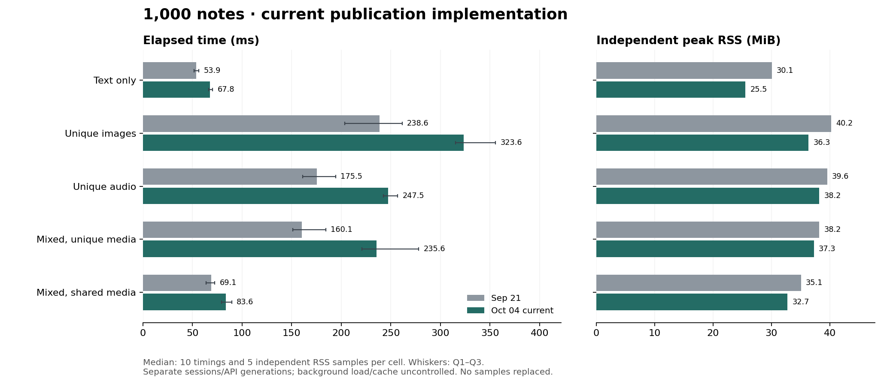

# 当前实现与 9 月 21 日基准对比

**本轮相对 9 月 21 日：0/20 格耗时中位数降低，20/20 格升高，0/20 格相同。** 当前 Rust 在 20/20 格快于本轮新测的 genanki。

测量源码为 `c61188e8744b3abcd76b7acf97c37d0c30e1445c`（当前发布性能实现）；工作区已有无关未提交文件，完整状态与差异已冻结。这是一轮完整会话，没有选择性重跑、替换或删去慢样本。

测量时间：2026-10-04 08:36:09–08:41:15 Asia/Taipei。同一台 M1 Pro / 32 GiB / macOS 27，System allocator、默认产品 features、Rust 1.92.0、CPython 3.11.0、genanki 0.13.1。每实现每格 10 次计时、5 次独立 RSS，两阶段各 3 次预热，Rust/genanki 相邻交错。

## 1,000 条结果

| 场景 | 笔记数 | 9/21 ms | 本轮 ms | 耗时变化 | 9/21 RSS MiB | 本轮 RSS MiB | 本轮 genanki ms |
|---|---:|---:|---:|---:|---:|---:|---:|
| 纯文本 | 1000 | 53.871 | 67.800 | +25.9% | 30.06 | 25.55 | 134.286 |
| 独立图片 | 1000 | 238.638 | 323.634 | +35.6% | 40.25 | 36.34 | 564.486 |
| 独立音频 | 1000 | 175.458 | 247.465 | +41.0% | 39.56 | 38.19 | 422.389 |
| 混合独立媒体 | 1000 | 160.060 | 235.637 | +47.2% | 38.19 | 37.27 | 372.659 |
| 混合共享媒体 | 1000 | 69.053 | 83.615 | +21.1% | 35.06 | 32.73 | 152.270 |

负百分比表示更快；RSS 为独立进程峰值。耗时包含启动、输入读取、转换、导出、检查、写入和退出。

## 全部 20 格

| 场景 | 笔记数 | 9/21 ms | 本轮 ms | 耗时变化 | 9/21 RSS MiB | 本轮 RSS MiB | 本轮 genanki ms |
|---|---:|---:|---:|---:|---:|---:|---:|
| 纯文本 | 100 | 23.053 | 31.572 | +37.0% | 14.77 | 13.77 | 109.619 |
| 纯文本 | 200 | 25.029 | 38.078 | +52.1% | 16.41 | 15.08 | 112.672 |
| 纯文本 | 500 | 34.763 | 50.746 | +46.0% | 21.34 | 18.84 | 121.834 |
| 纯文本 | 1000 | 53.871 | 67.800 | +25.9% | 30.06 | 25.55 | 134.286 |
| 独立图片 | 100 | 40.495 | 55.320 | +36.6% | 20.77 | 20.83 | 154.950 |
| 独立图片 | 200 | 62.847 | 90.930 | +44.7% | 22.75 | 22.83 | 203.646 |
| 独立图片 | 500 | 114.956 | 188.866 | +64.3% | 28.83 | 28.03 | 310.936 |
| 独立图片 | 1000 | 238.638 | 323.634 | +35.6% | 40.25 | 36.34 | 564.486 |
| 独立音频 | 100 | 36.375 | 49.924 | +37.2% | 19.66 | 21.09 | 138.781 |
| 独立音频 | 200 | 50.431 | 69.534 | +37.9% | 21.94 | 24.02 | 169.445 |
| 独立音频 | 500 | 93.453 | 145.290 | +55.5% | 28.50 | 29.52 | 258.185 |
| 独立音频 | 1000 | 175.458 | 247.465 | +41.0% | 39.56 | 38.19 | 422.389 |
| 混合独立媒体 | 100 | 33.647 | 51.116 | +51.9% | 20.08 | 22.33 | 137.178 |
| 混合独立媒体 | 200 | 46.186 | 66.553 | +44.1% | 22.27 | 24.53 | 157.400 |
| 混合独立媒体 | 500 | 87.337 | 127.437 | +45.9% | 28.09 | 29.61 | 234.214 |
| 混合独立媒体 | 1000 | 160.060 | 235.637 | +47.2% | 38.19 | 37.27 | 372.659 |
| 混合共享媒体 | 100 | 32.535 | 44.648 | +37.2% | 20.00 | 21.17 | 125.957 |
| 混合共享媒体 | 200 | 35.584 | 46.292 | +30.1% | 21.50 | 22.19 | 129.791 |
| 混合共享媒体 | 500 | 45.346 | 66.352 | +46.3% | 26.52 | 26.25 | 142.174 |
| 混合共享媒体 | 1000 | 69.053 | 83.615 | +21.1% | 35.06 | 32.73 | 152.270 |

## 验证与解释范围

- 20 份 JSON 输入及 2,749 份媒体与 9/21 的记录一致；输入、源码、依赖及可执行工具在测量前后不变。
- 840 次导出的原始 SQLite、字段、媒体与语义检查全部通过；40 个选定包实际通过 Anki 导入、内容和渲染验证。全部导出前后均为 AC Power。
- 采集前 46 项 benchmark 测试通过，并完成 200 条 smoke。所有构建、测试和 smoke 在正式采集前结束。
- 旧版 Deck API 与当前 Project API 的默认工作范围不同；不同日期的后台负载、页缓存、温度与 CPU 状态未隔离。这些差值是跨会话观察，不能全归因于新增优化，也不使用 genanki 比例校正历史数字。
- 本轮只测普通 Rust build，不覆盖 Node 提交/COW、compare 后复用候选或重复大字节媒体导入的专门收益；也不解除上一轮宽字段 RSS 与跨平台 CI 的验收缺口。
- 图中耗时误差线是 Q1–Q3，非置信区间；全部分布、包大小及新测 genanki RSS 见 [summary.json](summary.json) 和 [comparison.csv](comparison.csv)。历史差值见 [delta.csv](delta.csv)。

## 可复查证据

[README](README.md) 列出固定协议、源码与输入身份、逐次采集记录、校验和及离线重放方式。硬件 JSON 沿用同机记录；本次负载、电源及可获取的温度信息独立保存，不把旧硬件记录当作新探测。实际 APKG 在验证并记录哈希后删除；离线重放只复核保留记录，不重新导出或导入 Anki。
