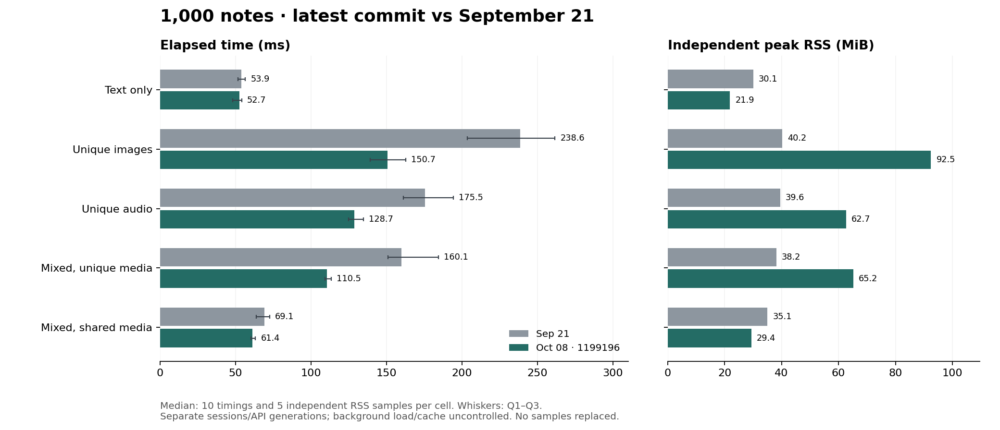

# 最新提交与 9 月 21 日基准对比

**相对 9 月 21 日，本轮 15/20 格耗时中位数降低，5/20 格升高。** 当前 Rust 在 20/20 格快于本轮同步测量的 genanki。下方同时保留速度和 RSS 的变化。

测量提交为 `11991964b06896b2e07ba09cbb3e6465f7585099`，包含构建时预生成默认值和不可变内存媒体摘要复用，以及此前的 4 并发导入、16 MiB 编码池和 64 MiB 快照预算。生产代码、适配器和测量代码与该提交一致；工作区另有文档修改，其状态与补丁独立记录。这是一轮完整会话，没有选择性重跑、替换或删去慢样本。

测量时间为 2026-10-08 20:57:57–21:01:35 Asia/Taipei。同一台 M1 Pro / 32 GiB / macOS 27，System allocator、默认产品 features、Rust 1.92.0、CPython 3.11.0、genanki 0.13.1。每实现每格 10 次计时、5 次独立 RSS，两阶段各 3 次预热，Rust/genanki 相邻交错。

## 1,000 条结果

| 场景 | 笔记数 | 9/21 ms | 本轮 ms | 耗时变化 | RSS MiB，9/21 → 本轮 | 本轮 genanki ms |
|---|---:|---:|---:|---:|---:|---:|
| 纯文本 | 1000 | 53.871 | 52.692 | -2.2% | 30.06 → 21.91 | 105.028 |
| 独立图片 | 1000 | 238.638 | 150.735 | -36.8% | 40.25 → 92.45 | 320.173 |
| 独立音频 | 1000 | 175.458 | 128.659 | -26.7% | 39.56 → 62.66 | 275.447 |
| 混合独立媒体 | 1000 | 160.060 | 110.476 | -31.0% | 38.19 → 65.19 | 239.494 |
| 混合共享媒体 | 1000 | 69.053 | 61.350 | -11.2% | 35.06 → 29.36 | 112.912 |

负百分比表示耗时降低；RSS 为另一组独立进程的峰值。耗时包含进程启动、输入读取、媒体导入、构建、检查、写入和退出。

## 全部 20 格

| 场景 | 笔记数 | 9/21 ms | 本轮 ms | 耗时变化 | RSS MiB，9/21 → 本轮 | 本轮 genanki ms |
|---|---:|---:|---:|---:|---:|---:|
| 纯文本 | 100 | 23.053 | 25.497 | +10.6% | 14.77 → 10.52 | 91.843 |
| 纯文本 | 200 | 25.029 | 26.611 | +6.3% | 16.41 → 11.77 | 90.370 |
| 纯文本 | 500 | 34.763 | 35.712 | +2.7% | 21.34 → 15.23 | 93.656 |
| 纯文本 | 1000 | 53.871 | 52.692 | -2.2% | 30.06 → 21.91 | 105.028 |
| 独立图片 | 100 | 40.495 | 35.520 | -12.3% | 20.77 → 19.89 | 110.561 |
| 独立图片 | 200 | 62.847 | 49.337 | -21.5% | 22.75 → 28.03 | 134.932 |
| 独立图片 | 500 | 114.956 | 82.807 | -28.0% | 28.83 → 52.27 | 201.181 |
| 独立图片 | 1000 | 238.638 | 150.735 | -36.8% | 40.25 → 92.45 | 320.173 |
| 独立音频 | 100 | 36.375 | 35.361 | -2.8% | 19.66 → 17.88 | 108.334 |
| 独立音频 | 200 | 50.431 | 42.735 | -15.3% | 21.94 → 23.17 | 125.321 |
| 独立音频 | 500 | 93.453 | 74.191 | -20.6% | 28.50 → 38.00 | 180.377 |
| 独立音频 | 1000 | 175.458 | 128.659 | -26.7% | 39.56 → 62.66 | 275.447 |
| 混合独立媒体 | 100 | 33.647 | 33.971 | +1.0% | 20.08 → 19.16 | 104.028 |
| 混合独立媒体 | 200 | 46.186 | 40.002 | -13.4% | 22.27 → 24.28 | 121.614 |
| 混合独立媒体 | 500 | 87.337 | 66.234 | -24.2% | 28.09 → 39.61 | 165.639 |
| 混合独立媒体 | 1000 | 160.060 | 110.476 | -31.0% | 38.19 → 65.19 | 239.494 |
| 混合共享媒体 | 100 | 32.535 | 31.366 | -3.6% | 20.00 → 17.81 | 97.799 |
| 混合共享媒体 | 200 | 35.584 | 33.644 | -5.5% | 21.50 → 18.97 | 101.456 |
| 混合共享媒体 | 500 | 45.346 | 46.600 | +2.8% | 26.52 → 22.89 | 107.246 |
| 混合共享媒体 | 1000 | 69.053 | 61.350 | -11.2% | 35.06 → 29.36 | 112.912 |

## 包大小

1,000 条笔记的完整 APKG 大小如下。全部 20 格的字节数与变化保存在 [delta.csv](delta.csv)。两代 API 的默认输出范围有所变化，不能用包大小变化单独判断压缩效率。

| 场景 | 9/21 KiB | 本轮 KiB | 变化 |
|---|---:|---:|---:|
| 纯文本 | 204.32 | 426.25 | +108.62% |
| 独立图片 | 62970.38 | 63353.58 | +0.61% |
| 独立音频 | 31451.79 | 31833.92 | +1.21% |
| 混合独立媒体 | 34684.06 | 35017.96 | +0.96% |
| 混合共享媒体 | 2618.25 | 2847.84 | +8.77% |

## 如何解释这些变化

9 月 21 日采用旧 Deck API，本轮采用当前 Project API，并通过正式 `Media::files` 批量接口导入媒体。两代实现的默认检查、所有权和发布工作不同；后台负载、页缓存、温度及 CPU 状态也未在两个日期之间隔离。因此这些是跨会话的实际观测，不能把所有差值归因于最后一个 commit，也不使用 genanki 比例校正历史数字。

最新两项优化相对其父提交的同会话增量，另见[实现对照报告](../20261008-defaults-digest-implementation/report.md)。预生成默认值主要减少冷进程首次初始化；内存摘要复用仅作用于不可变内存快照，落盘媒体仍重算摘要。本轮每次均为新进程，不测 Node/Python 宿主、同进程重复构建、prepared publication 或大于 1 MiB 的单个媒体。

64 MiB 是整个进程共享的存活快照容量预算，16 MiB 是每次 preparation 的编码缓存预算，两者均不是总 RSS 上限。图中耗时误差线是 Q1–Q3，非置信区间；中位数、四分位数、范围、包大小和新测 genanki RSS 均见 [summary.json](summary.json) 与 [comparison.csv](comparison.csv)。

## 验证

- 20 份 JSON 输入及 2,749 份媒体与 9/21 的记录逐项哈希一致；输入、源码、依赖及可执行文件在测量前后不变。
- 840 次导出全部通过原始 SQLite、字段、媒体字节及语义检查；40 个代表样本实际通过 Anki 导入、内容和渲染验证。所有导出前后均为 AC Power。
- 运行前重新编译 release 导出器、检查器和原生采集器；46 项 benchmark 测试通过，并完成两种实现各 200 条的 smoke。构建、测试和 smoke 均在正式采样前完成；采样期间没有并行构建或测试。
- Anki oracle 复用既有已验证的可执行文件，并重新核对其 SHA、记录的 checker 源码/锁文件、上游 revision 和 patch。本轮未重新编译 Anki，仍实际执行全部 40 次导入检查。
- 本轮未修改生产代码。此前 Rust/Node/Python 回归、篡改检查及独立打包验证见[提交前质量记录](../20261008-defaults-digest-implementation/quality.json)；本轮未重复这些测试，也未运行跨平台 CI。

## 可复核证据

[README](README.md) 列出固定协议、源码与输入身份、原始观测及离线重放方法。[verification-summary.json](verification-summary.json) 保存每次核验和顺序审计；[measured-source-check.json](measured-source-check.json) 记录代码与提交的一致性。

硬件身份沿用同机记录，本次负载、电源和可获取的温度信息独立采集。APKG 在验证并记录哈希后删除，二进制及媒体载荷不放入归档；离线重放只复核保留记录和统计，不会重新导出或导入 Anki。
