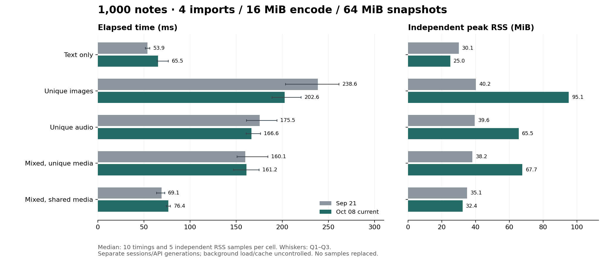

# 当前实现与 9 月 21 日基准对比

**本轮相对 9 月 21 日：4/20 格耗时中位数降低，16/20 格升高，0/20 格相同。** 当前 Rust 在 20/20 格快于本轮新测的 genanki。

测量源码为 `b81fb49e46c7e276e2bbeb2da1d3dcd255ae5244`加上归档的未提交补丁（4 并发批量媒体导入、16 MiB 编码缓存、64 MiB 快照预算）；工作区已有无关未提交文件，完整状态与差异已冻结。这是一轮完整会话，没有选择性重跑、替换或删去慢样本。

测量时间：2026-10-08 17:15:45–17:20:28 Asia/Taipei。同一台 M1 Pro / 32 GiB / macOS 27，System allocator、默认产品 features、Rust 1.92.0、CPython 3.11.0、genanki 0.13.1。每实现每格 10 次计时、5 次独立 RSS，两阶段各 3 次预热，Rust/genanki 相邻交错。

## 1,000 条结果

| 场景 | 笔记数 | 9/21 ms | 本轮 ms | 耗时变化 | 9/21 RSS MiB | 本轮 RSS MiB | 本轮 genanki ms |
|---|---:|---:|---:|---:|---:|---:|---:|
| 纯文本 | 1000 | 53.871 | 65.464 | +21.5% | 30.06 | 25.03 | 135.546 |
| 独立图片 | 1000 | 238.638 | 202.646 | -15.1% | 40.25 | 95.14 | 420.257 |
| 独立音频 | 1000 | 175.458 | 166.628 | -5.0% | 39.56 | 65.50 | 363.019 |
| 混合独立媒体 | 1000 | 160.060 | 161.214 | +0.7% | 38.19 | 67.69 | 351.548 |
| 混合共享媒体 | 1000 | 69.053 | 76.430 | +10.7% | 35.06 | 32.36 | 148.683 |

负百分比表示更快；RSS 为独立进程峰值。耗时包含启动、输入读取、转换、导出、检查、写入和退出。

## 全部 20 格

| 场景 | 笔记数 | 9/21 ms | 本轮 ms | 耗时变化 | 9/21 RSS MiB | 本轮 RSS MiB | 本轮 genanki ms |
|---|---:|---:|---:|---:|---:|---:|---:|
| 纯文本 | 100 | 23.053 | 32.081 | +39.2% | 14.77 | 13.89 | 114.447 |
| 纯文本 | 200 | 25.029 | 34.069 | +36.1% | 16.41 | 15.06 | 116.898 |
| 纯文本 | 500 | 34.763 | 47.576 | +36.9% | 21.34 | 18.78 | 125.684 |
| 纯文本 | 1000 | 53.871 | 65.464 | +21.5% | 30.06 | 25.03 | 135.546 |
| 独立图片 | 100 | 40.495 | 46.972 | +16.0% | 20.77 | 23.08 | 141.063 |
| 独立图片 | 200 | 62.847 | 61.784 | -1.7% | 22.75 | 31.05 | 178.315 |
| 独立图片 | 500 | 114.956 | 118.213 | +2.8% | 28.83 | 55.08 | 275.627 |
| 独立图片 | 1000 | 238.638 | 202.646 | -15.1% | 40.25 | 95.14 | 420.257 |
| 独立音频 | 100 | 36.375 | 43.938 | +20.8% | 19.66 | 21.14 | 136.826 |
| 独立音频 | 200 | 50.431 | 56.025 | +11.1% | 21.94 | 26.41 | 165.951 |
| 独立音频 | 500 | 93.453 | 100.654 | +7.7% | 28.50 | 40.95 | 242.960 |
| 独立音频 | 1000 | 175.458 | 166.628 | -5.0% | 39.56 | 65.50 | 363.019 |
| 混合独立媒体 | 100 | 33.647 | 40.972 | +21.8% | 20.08 | 22.09 | 129.210 |
| 混合独立媒体 | 200 | 46.186 | 52.892 | +14.5% | 22.27 | 27.23 | 161.428 |
| 混合独立媒体 | 500 | 87.337 | 85.223 | -2.4% | 28.09 | 42.48 | 205.887 |
| 混合独立媒体 | 1000 | 160.060 | 161.214 | +0.7% | 38.19 | 67.69 | 351.548 |
| 混合共享媒体 | 100 | 32.535 | 40.962 | +25.9% | 20.00 | 20.83 | 130.345 |
| 混合共享媒体 | 200 | 35.584 | 42.817 | +20.3% | 21.50 | 22.09 | 127.442 |
| 混合共享媒体 | 500 | 45.346 | 54.017 | +19.1% | 26.52 | 26.00 | 138.376 |
| 混合共享媒体 | 1000 | 69.053 | 76.430 | +10.7% | 35.06 | 32.36 | 148.683 |

## 验证与解释范围

- 20 份 JSON 输入及 2,749 份媒体与 9/21 的记录一致；输入、源码、依赖及可执行工具在测量前后不变。
- 840 次导出的原始 SQLite、字段、媒体与语义检查全部通过；40 个选定包实际通过 Anki 导入、内容和渲染验证。全部导出前后均为 AC Power。
- 采集前 46 项 benchmark 测试通过，并完成 200 条 smoke。测量所需构建、回归测试和 smoke 均在正式采集前结束；采集期间未运行构建或测试。
- 旧版 Deck API 与当前 Project API 的默认工作范围不同；不同日期的后台负载、页缓存、温度与 CPU 状态未隔离。这些差值是跨会话观察，不能全归因于新增优化，也不使用 genanki 比例校正历史数字。
- 本轮 Rust 适配器调用正式 `Media::files` 批量接口，最多 4 并发；旧版使用逐个注册。单文件接口保持同步快照语义，应用需要改用批量接口才能获得导入并发。两项预算为所有 SDK 的核心默认值。此矩阵不测 Node/Python 性能、prepared reuse 或大于 1 MiB 的单个媒体；编码缓存对大文件的收益见前一轮隔离实验，不能从本矩阵单独归因。
- 图中耗时误差线是 Q1–Q3，非置信区间；全部分布、包大小及新测 genanki RSS 见 [summary.json](summary.json) 和 [comparison.csv](comparison.csv)。历史差值见 [delta.csv](delta.csv)。

## 实现与回归

- Rust 新增 `Media::files` / `files_with_limits`；Node/Python 新增 `Media.files`。小于 16 个文件串行，较大批次最多四个 worker，按输入顺序返回并确定首个错误。所有工作在返回前结束，失败时释放本批快照，保留原有 owner。
- 64 MiB 是整个进程共享的存活快照容量预算，单个大于 1 MiB 的资产仍写临时文件；16 MiB 是每次 preparation 的延迟分配编码池，耗尽仍回退磁盘。两者都不是 RSS 上限。
- Rust 完整 internal-tools 测试 540 通过、23 项原有 ignored；默认核心 169 通过，默认媒体测试 26 通过。Node 30 通过/1 跳过；Python 68 通过/1 跳过，mypy 14 文件通过。失败批次清理、顺序、重复内容、限额、源删除后导出、spool 写入/轮转失败、文件描述符限制和 Node Worker 终止均覆盖。
- 初次 Node 终止用例将输入夹具放入被观测临时目录，修正夹具后全套通过；初次 Anki oracle 重建无法写入受限 cargo 缓存中的缺失 Git checkout。核对 10/4 归档的可执行 SHA、全部 checker 源码/锁文件及上游 revision/patch 后复用原 oracle；本轮仍实际执行了全部 40 次 Anki 检查。原始失败日志一并保留。
- 采集后补充 Rust 分发清单中的 `src/media/batch.rs`，并完成两处绑定新代码的 rustfmt 格式化；crate payload、workspace rustfmt 和全 targets/features clippy（`-D warnings`）通过。核心与 benchmark 适配器源码未再改变，绑定差异已核对为 rustfmt 输出。后续补丁单列为 [post-measurement.patch](post-measurement.patch)，前后身份见 [final-source-check.json](final-source-check.json)。
- 本轮不声称已完成跨平台 CI 或发布；源码改动留在工作区。

## 可复查证据

[README](README.md) 列出固定协议、源码与输入身份、逐次采集记录、校验和及离线重放方式。硬件 JSON 沿用同机记录；本次负载、电源及可获取的温度信息独立保存，不把旧硬件记录当作新探测。实际 APKG 在验证并记录哈希后删除；离线重放只复核保留记录，不重新导出或导入 Anki。
