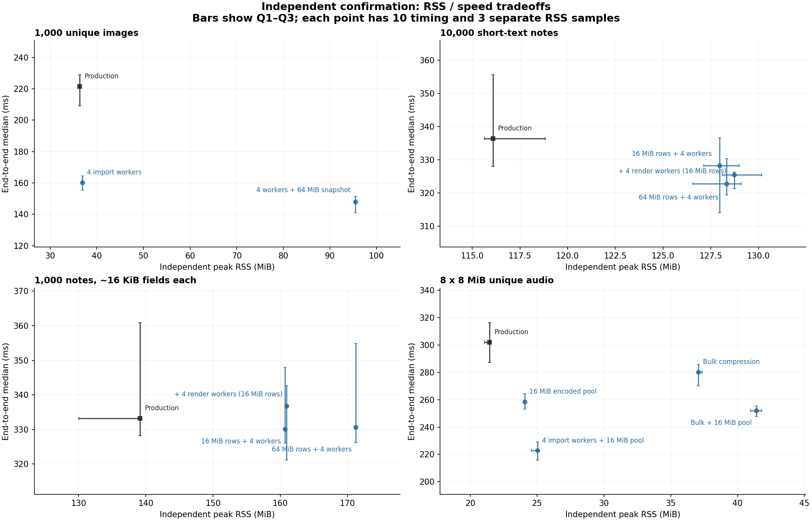

# RSS 换速度：四条路径的实验结果

2026-10-08，生产基线 `b81fb49`。结论：优先实现 **4 并发媒体导入 + 16 MiB 编码缓存**；大快照预算适合做可选档位；文本派生值缓存收益较小，长字段尚未证明值得增加内存；zstd pledged/bulk 暂不优先。

以下均为本机 Rust public Project API 的一次完整导出，包含进程启动、读入输入、媒体导入、构建、包内检查、发布及清理。外部正确性检查不计时。候选在隔离源码副本中实现，生产实现未修改。

## 独立复测的主要结果

每个配置 2 次预热、10 次计时、3 次另起进程的峰值 RSS。表中基线是同一复测组内重新编译的生产原版 `stock`；耗时和 RSS 均为各自中位数，降低百分比按耗时中位数计算。

| 路径与场景 | 原版 → 候选耗时 | 耗时降低 | 原版 → 候选峰值 RSS | 判断 |
|---|---:|---:|---:|---|
| 4 并发导入，1,000 独立图片 | 221.4 → 160.3 ms | **27.6%** | 36.3 → 36.9 MiB | 优先落地 |
| 4 并发导入，1,000 独立音频 | 173.4 → 135.3 ms | **21.9%** | 37.6 → 38.7 MiB | 优先落地 |
| 仅编码缓存 4.5 → 16 MiB，16 × 2 MiB 音频 | 107.0 → 100.0 ms | 6.5% | 29.8 → 33.6 MiB | 有收益，2 MiB 场景波动较大 |
| 仅编码缓存 4.5 → 16 MiB，8 × 8 MiB 音频 | 302.1 → 258.6 ms | **14.4%** | 21.4 → 24.1 MiB | 值得落地 |
| **4 并发导入 + 16 MiB 编码缓存**，16 × 2 MiB 音频 | 107.0 → 72.9 ms | **31.9%** | 29.8 → 34.2 MiB | 本轮优先组合 |
| 同上，8 × 8 MiB 音频 | 302.1 → 222.8 ms | **26.2%** | 21.4 → 25.0 MiB | 本轮优先组合 |
| 16 MiB 派生值缓存 + 4 并发，10,000 短文本 | 336.5 → 328.3 ms | 2.4% | 116.1 → 128.0 MiB | 小收益，复测区间跨零 |
| 64 MiB 派生值缓存 + 4 并发，10,000 短文本 | 336.5 → 322.9 ms | 4.0% | 116.1 → 128.3 MiB | 小收益；不能归因于更大的预算 |
| 16 MiB 派生值缓存 + 4 并发，1,000 长字段 | 333.3 → 330.1 ms | 0.9% | 139.1 → 160.7 MiB | 未证明稳定改善 |
| bulk 压缩，8 × 8 MiB 音频 | 302.1 → 280.3 ms | 7.2% | 21.4 → 37.0 MiB | 相对生产原版的区间跨零，优先级低 |

图中误差线是 Q1–Q3，**不是置信区间**。完整首轮、复测、控制组及未获益方案均保留在 [全部结果](tables.md)、[CSV](comparison.csv) 与 [原始统计](analysis.json)。区间采用同一轮 baseline − candidate 的配对差值，10,000 次固定 seed 重采样得到描述性 95% bootstrap 区间。它不修正多重比较，也不代表跨机器或生产环境保证。

## 路径一：有界并发媒体导入

在适配器中用 2/4 个工作线程调用现有 `Media::file`，随后按输入顺序收集并添加到 Project。内部构建/编码线程设置保持原样。这个实验测的是“调用者导入阶段并发”，不是给后续压缩再加线程。

首轮 4 并发相对同一候选可执行文件的默认模式，图片耗时降低 29.2%，音频降低 27.3%；复测相对生产原版分别为 27.6% 和 21.9%。复测配对节省为图片 **60.4 ms [47.6, 73.6]**、音频 **37.4 ms [30.8, 42.2]**。与候选默认模式比较也保持收益，排除了只比较实验二进制与生产二进制带来的解释问题。

RSS 实测只增加约 0.5/1.0 MiB。1,000 条笔记共享 49 份媒体时，复测仅节省约 1.7 ms（2.7%），符合导入工作量更少的预期。因此生产化应保留小输入的串行路径、限制并发数、保持顺序和出错清理语义。当前实验适配器是可测量原型，尚未变成 SDK 的批量导入接口。

## 路径二：缓存文本派生值并行预计算

实验缓存每条 note 的 joined fields、sort field、checksum、tags、card plan 和 content hash，供 identity 与 SQLite 写入复用；分别测串行、2/4 并发预计算和独立的 2/4 并发渲染。模型绑定和 SQLite 写入仍按顺序进行。

- **万条短文本**：首轮 4 并发缓存约降低 3.3%–3.4%；复测相对生产原版约 2.4%–4.0%。64 MiB 档配对节省 **8.4 ms [1.2, 41.1]**，16 MiB 档为 **11.5 ms [-1.3, 43.3]**。这是小幅改善信号，不是大幅提速。
- **千条长字段**：首轮中位数改善约 5%，复测仅约 0.8%–0.9%，两档区间都跨零，RSS 却增加约 22/32 MiB。不能把首轮结果直接当作可落地收益。
- **仅串行缓存**：没有可靠加速，长字段 16 MiB 档首轮反而变慢。
- **渲染并发**：单独开启没有可靠收益；复测加到缓存方案上也没有证明额外收益，长字段中位数还回退。

诊断记录中 10,000 短文本的派生行约 9.2 MiB，16/64 MiB 档均完整保留 10,000 条。因此两档的时间差不能解释为“多给内存就更快”。长字段完整派生行约 24.4 MiB，64 MiB 档保留全部 1,000 条，16 MiB 档只能部分保留。部分缓存提前结束时没有写入 retained_rows 计数，缺失值不能解释为零。

建议保留此方向，但下一步先减少中间字符串复制、串行 identity/SQLite 工作及缓存生命周期；不建议仅靠扩大长字段缓存作为默认优化。预算按保留容量估算，另有约 8 MiB 的估算预计算窗口、原始数据和数据库内存，不是整个进程 RSS 上限。

## 路径三：提高内存预算

**快照预算**与**编码缓存**效果不同，需要分别决策。

快照默认 4 MiB，测了 16/32/64 MiB，以及与 2/4 并发导入的组合。固定 4 并发，在复测中从 4 → 64 MiB：

| 场景 | 4 MiB → 64 MiB 耗时 | 在 4 并发基础上再降低 | 额外 RSS | 配对节省及描述区间 |
|---|---:|---:|---:|---:|
| 1,000 图片 | 160.3 → 147.9 ms | 7.8% | **+58.6 MiB** | 12.6 ms [9.0, 20.0] |
| 1,000 音频 | 135.3 → 129.6 ms | 4.2% | **+27.3 MiB** | 6.3 ms [4.4, 11.1] |

这可以做高内存可选档。首轮的边际区间跨零，音频首轮中位数还略回退，故不能保证每次都兑现复测收益。16 MiB 快照档也没有稳定的额外改善。诊断中图片 4 MiB 档约有 57 MiB 写入快照 spool，64 MiB 档消除了这一计数，但避免落盘不等于等量减少端到端时间。

编码缓存默认 4.5 MiB，测了 16/32 MiB。在 2/8 MiB 独立媒体中，首轮 16 MiB 档均约快 12.5%，复测为 6.5%/14.4%，峰值 RSS 只增加约 3 MiB。2 MiB 复测相对候选默认模式的区间跨零，而相对生产原版为正，说明这一场景收益大小仍需保守看待；8 MiB 以及最终并发组合的证据更强。

诊断记录中，原档分别发生 16/8 次编码 spill；16 MiB 档这两组均没有 spill。32 MiB 档首轮中位数仅比 16 MiB 略好，本轮没有证明继续增加预算值得。配置值是上限，实际占用受 worker 分摊、任务数和生命周期影响，因此提高 11.5 MiB 预算并不意味着 RSS 增加 11.5 MiB。

最终 **4 并发导入 + 16 MiB 编码缓存**：2 MiB 组配对节省 **33.2 ms [26.2, 36.3]**，8 MiB 组 **79.4 ms [61.6, 95.5]**。在同一个复测组内，相比只提高编码缓存，也分别有正的配对节省区间。该组合与生产原版/候选默认两种控制比较均获益。

## 路径四：zstd pledged size / bulk 压缩

`pledged` 保持流式编码，仅声明源长度；`bulk` 对本实验覆盖的 ≤8 MiB owned snapshots 使用一次性压缩和每 worker 复用的输入/输出缓冲。压缩级别保持 PNG 为 -1，其余为 3；哈希、媒体检查和最终包检查保留。

`pledged` 的四个场景均没有可靠改善。bulk 在小图片/音频组也未证明稳定收益；大媒体首轮约快 4%–6%，但增加约 10–16 MiB RSS。复测大媒体中位数约快 4%–7%，相对生产原版的配对区间均跨零。

叠加到 16 MiB 编码缓存后，8 MiB 媒体的 bulk 可再节省约 6.5 ms（配对 6.0 ms [4.3, 14.7]），代价是再加 **17.3 MiB RSS**；2 MiB 组的额外收益区间跨零。同场景下，把并发导入叠加到缓存上收益更大、RSS 更少，因此 bulk 不列为当前优先项。

## 测量范围与校验

- 本机 Apple M1 Pro、10 核、32 GiB、macOS 27.0、arm64；Rust 1.92.0，release、默认 features、系统 allocator。版本与主机查询见 [environment.json](environment.json)，逐组负载、电源和时间保留在原始计划中。
- 8 个测量场景：1,000/10,000 短文本；1,000 条每面约 8 KiB 的长字段；1,000 独立图片（源媒体约 61.2 MiB）；1,000 独立音频（约 30.6 MiB）；1,000 条共享 49 份媒体；100 notes/16 × 2 MiB 音频；100 notes/8 × 8 MiB 音频。冻结了 10 份输入，额外两份 bytes fixture 未用于本轮正式计时。
- 每个配置的预热、计时和 RSS 都使用新进程，轮次内循环轮换模式顺序。阶段诊断 TRACE 另跑，未混入性能统计。组间不并行运行测试/构建；系统其他负载、文件缓存和温度未隔离，温度 API 返回不可用。所有样本保留，无选择性剔除或重试。
- 首轮 1,095 次、独立复测 585 次、smoke 73 次、单独 trace 73 次，共 **1,826 次导出**。全部通过 SQLite/字段/媒体字节及语义校验，各组同场景 logical SHA 一致；其中 **185 次实际 Anki 检查**全部通过。包文件校验、记录 SHA 后删除。压缩帧或数据库物理布局可能改变，未要求 APKG 二进制逐字节一致。
- 候选默认核心测试 **407 通过**；开启完整文本缓存/预计算/渲染的核心测试另 **407 通过**；三个集成测试组共 **28 通过**；bulk/pledged owned-media 定向测试各 **1 通过**；benchmark harness **46 通过**。这不等于已完成生产化所需的全部失败路径和跨平台测试。
- 首次准备副本时漏拷贝 `contracts/` 导致测试编译失败，补齐后通过，失败日志保留。正式测量没有失败或删样本。
- 生产源码清单 **487 个文件**前后 SHA 一致。控制组 `stock` 是单独构建的生产原版，`original` 是候选二进制全部开关默认值；首轮主要用后者隔离变量，独立复测同时加入两者。长字段原版 RSS 在初始控制组约 120.9 MiB、复测约 139.1 MiB，说明会话/布局噪声不可忽略；没有跨组相减来归因收益。
- trace 中的 worker 计时可能重叠，锁等待是线程累计值，不能直接从总耗时减去。阶段数据只解释机制；结论以未开启 TRACE 的进程计时为准。
- 此次没有运行 Node/Python SDK 的新性能测试、跨平台 CI 或完整 genanki 对比矩阵；也没有测长期服务、多次 prepared reuse、真实用户牌组或压力下的全局并发上限。

## 证据与复查

[全部结果](tables.md) · [边际组合比较](contrasts.json) · [实验补丁](experimental.patch) · [审计结果](audit.json) · [压缩证据](evidence.tar.gz) · [归档文件清单](archive-manifest.json)

证据归档包含基线/候选源码、构建及测试日志、冻结 input JSON、全部样本的原始 collector/执行参数/检查记录、分析脚本、每份输入媒体的 SHA。为控制体积，未归档媒体字节、工具和导出器二进制、构建缓存与已校验的 APKG；原始媒体和可执行文件仍留在 `benchmarks/.work/rss-speed-20261008/`。大媒体生成配方见归档内 `scripts/setup.py`，历史媒体沿用前次冻结输入。

每次构建记录绑定完整源码清单和二进制 SHA。测量计划的 source_manifest 选到了较早的核心源码清单，该清单覆盖 272 个未再改动的文件；后补的 contracts 等文件由最终 release 构建清单、归档清单和生产前后清单覆盖，不能声称每份运行计划独自覆盖了完整工作区。

在本目录运行 `python3 replay.py`，可在临时目录验证归档 SHA、基线/候选完整源码清单，独立重算 `analysis.json`/`contrasts.json` 并对账 1,826 次导出记录和 185 次 Anki 记录。它不重新导出或运行 Anki，也不重新验证省略的媒体、APKG 或二进制。结果见 [replay-result.json](replay-result.json)。
