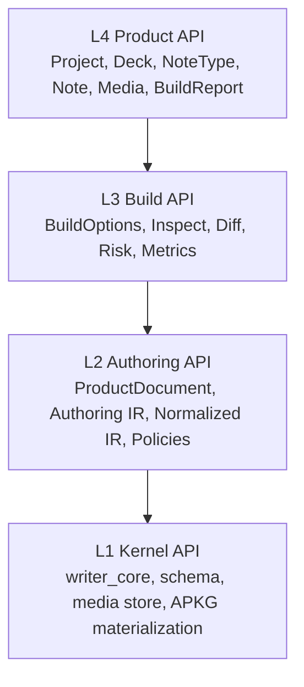
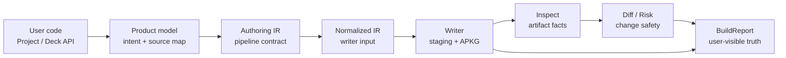
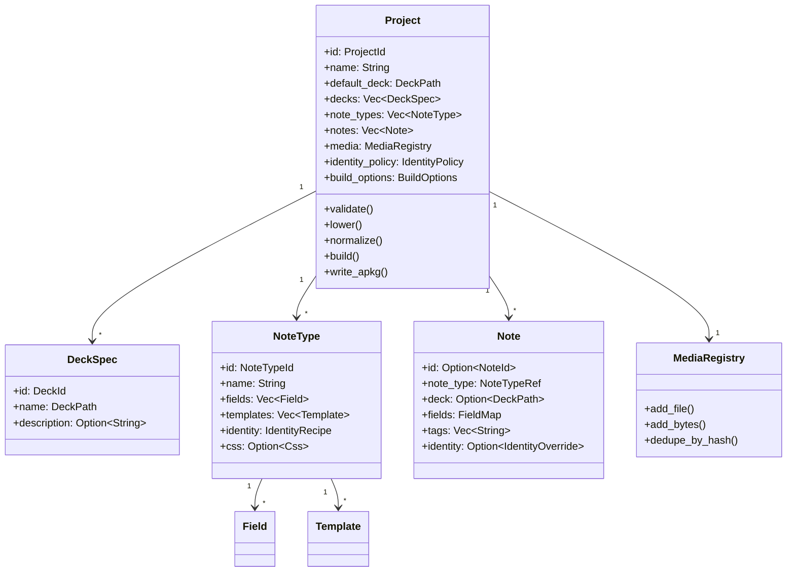
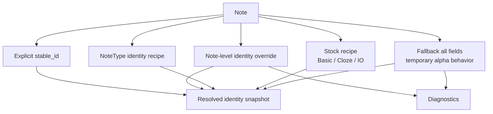
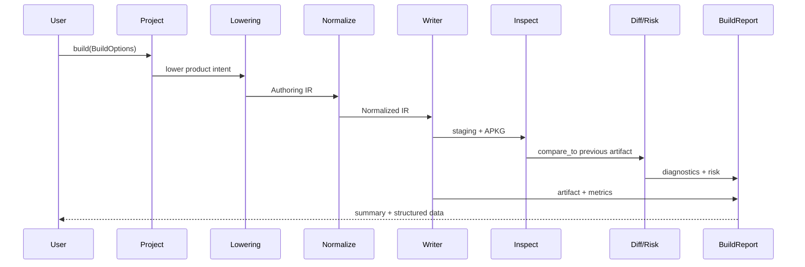
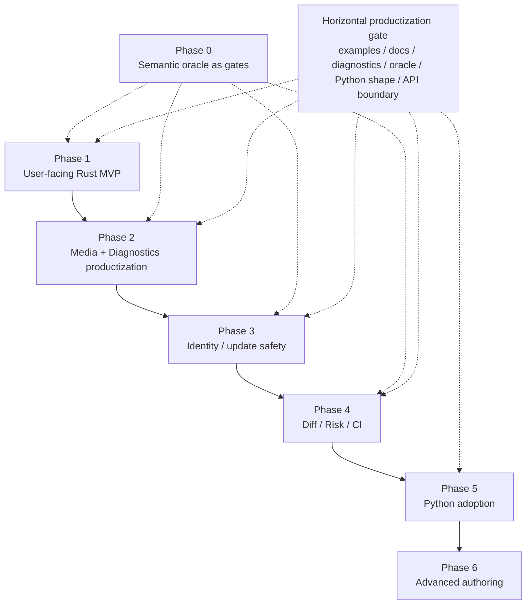

# anki-forge 目标 API 设计

- 状态：目标态设计草案
- 日期：2026-05-16
- 范围：公开 Rust/Python API、用户心智模型、核心类型、使用方式、预期效果与研发路线
- 相关文档：
  - `docs/superpowers/specs/2026-04-10-rust-north-star-api-design.md`
  - `docs/superpowers/specs/2026-04-07-phase-5a-product-authoring-features-design.md`
  - `docs/superpowers/specs/2026-05-03-production-media-pipeline-design.md`

## 1. 一句话结论

`anki-forge` 的目标 API 应该设计成：

> **Project-first、Deck-friendly、IR-backed、Report-driven**

也就是：

```text
用户面对：Project / Deck / NoteType / Field / Template / Note / Content / Media / BuildReport
内部保持：ProductDocument -> Authoring IR -> Normalized IR -> Writer -> Inspect -> Diff -> Risk
```

这套设计的目的不是把 `anki-forge` 做成一个“Rust 版本的 genanki”，而是把它定位成：

> 一个可重复、可验证、可差异检查、可接入 CI、适合长期维护的现代 Anki 构建库。

API 需要同时服务两类用户：

1. 普通用户能像使用 genanki 一样快速生成卡组。
2. 高级用户能获得稳定 identity、media 校验、inspect、diff、risk、CI 等长期维护能力。

路线设计不应该是“先做完底层语义，再最后补产品体验”。更稳的方式是：

```text
纵向能力 phase：
  每个 phase 聚焦一组核心能力。

横向产品化 gate：
  每个 phase 都必须同时交付用户示例、文档、diagnostics、snapshot/oracle、
  Python API shape 评估和 public API 边界检查。
```

这样可以避免前期只得到“能写 APKG”的内部工具，最后才发现 API、错误信息、媒体体验或 Python 迁移路径不好用。

## 2. 设计原则

目标 API 遵守八条原则。

1. **Public API 表达用户意图**
   用户写的是“我要构建什么卡组”，不是“APKG 内部应该怎么写”。

2. **IR 是内部稳定契约**
   Product API 不绕过底层管线，而是 lower 到 `Authoring IR`，再 normalize 成 writer 输入。

3. **Normalized IR 是 writer 唯一语义输入**
   writer 不理解 Product API 的高级语义，只消费规范化后的结构。

4. **BuildReport 是最终真相**
   构建不只是“写出一个文件”。从第一版 `Project::write_apkg()` 开始，用户就应该拿到 artifact path、notes/cards/media counts、diagnostics、warnings、inspect summary 和 duration/metrics。完整 diff/risk 可以后续增强，但 basic report 不能后置。

5. **易用性不能绕过验证**
   `Deck::new(...).basic(...)` 这种快捷 API 也必须走同一条 lowering/normalize/build/inspect/report 路径。`Deck` 只能是 `Project` facade，不能拥有独立 writer path、identity/media/card-generation semantics。

6. **Product API 不承诺 Anki 无法稳定表达的语义**
   所有高级语义必须能 lower 成 Anki-compatible artifact；如果只能存在于 anki-forge 中，必须明确标记为 Forge-only metadata。

7. **用户可见 ID 与 Anki 内部 ID 分离**
   用户面对 `stable_id`、`FieldKey`、`TemplateKey`、`DeckPath`；writer 负责稳定派生或保留 deck id、notetype id、field id、template id、note guid。

8. **更新安全必须以真实 Anki import 行为为 oracle**
   diff/risk 不能只比较 JSON。关键行为需要用 Anki 手册、上游源码、roundtrip oracle 或导入场景回归测试校验。oracle 不应该是一次性前置大阶段，而应该绑定到每个新 Product API 语义的验收门槛。

## 3. API 分层

目标 API 分成四层。



### 3.1 L4 Product API

这是默认用户入口。

包含：

- `Project`
- `Deck`
- `DeckSpec`
- `NoteType`
- `Field`
- `Template`
- `GenerationRule`
- `Note`
- `Content`
- `MediaRegistry`
- `MediaRef`
- `IdentityRecipe`
- `BuildReport`

它回答的问题是：

> 用户想构建什么 Anki 项目？

### 3.2 L3 Build API

这是构建流程和反馈层。

包含：

- `BuildOptions`
- `BuildReport`
- `BuildCounts`
- `BuildMetrics`
- `InspectReport`
- `DiffReport`
- `MergeRiskReport`
- `RiskLevel`
- `Compatibility`

它回答的问题是：

> 构建发生了什么？结果是否安全？是否适合导入或发布？

### 3.3 L2 Authoring API

这是高级用户和内部 lowering 使用的契约层。

包含：

- `ProductDocument`
- `AuthoringDocument`
- `NormalizationRequest`
- `NormalizeOptions`
- `NormalizedIr`
- `WriterPolicy`
- `IdentityPolicy`
- diagnostics
- source mapping

它回答的问题是：

> Product API 被编译成了什么稳定管线输入？

### 3.4 L1 Kernel API

这是底层写包与检查实现。

包含：

- APKG/SQLite materialization
- media map 写入
- staging artifact
- inspect/diff 原语
- writer policies
- schema 细节

它回答的问题是：

> Normalized artifact 如何被真实写成可验证的 APKG？

## 4. 端到端数据流

所有公开构建路径都应该走同一条主流程。



核心约束：

```text
Public API 表达用户意图；
Product lowering 保留 source map；
Authoring IR 是中间契约；
Normalized IR 是 writer 的唯一输入；
BuildReport 是用户最终看到的真相。
```

## 5. Anki 语义约束

Product API 的语义必须压到真实 Anki 模型上，而不是只在 anki-forge 内部自洽。

关键事实：

1. 普通卡片生成主要取决于 front template 渲染后是否为空；back template 不参与是否生成卡片。
2. cloze note type 的卡片生成规则与普通 note type 不同：Anki 根据 front template 中的 `{{cloze:FieldName}}` 和字段中的 `{{c1::...}}` 编号生成 card ord。
3. Anki notetype proto 中存在用于导入合并的 field/template `config.id`，field 还有可用于 required field 识别的 `tag`，notetype config 也有 `reqs`。
4. Anki cards 表通过 `nid` 关联 note，并用 `ord` 表示模板/card ordinal；因此模板顺序是导入更新安全的一部分。

这些事实应进入 API 设计、lowering、risk report 和回归测试。参考资料包括：

- [Anki Manual: Card Generation](https://docs.ankiweb.net/templates/generation.html)
- [Anki `cardgen.rs`](https://raw.githubusercontent.com/ankitects/anki/main/rslib/src/notetype/cardgen.rs)
- [Anki `notetypes.proto`](https://raw.githubusercontent.com/ankitects/anki/main/proto/anki/notetypes.proto)
- [Anki `schema11.sql`](https://raw.githubusercontent.com/ankitects/anki/main/rslib/src/storage/schema11.sql)

## 6. 顶层心智模型

目标 API 以 `Project` 为完整入口。



概念边界：

```text
Deck            = 快速制卡 facade
Project         = 完整 artifact project
ProductDocument = lower-level product data model
Authoring IR    = pipeline-facing contract
Normalized IR   = writer input
```

## 7. `Deck` 与 `Project` 的关系

保留 `Deck`，但它不是完整 API 的中心。完整 API 的中心应该是 `Project`。

| 类型 | 定位 | 适合用户 |
| --- | --- | --- |
| `Deck` | 单 deck、stock note 的最短路径 | 新用户、示例、脚本 |
| `Project` | 完整项目入口，支持 note type、media、identity、report | 长期维护、CI、自定义卡组 |
| `ProductDocument` | 显式产品层数据结构 | 高级用户、测试、lowering fixtures |
| `AuthoringDocument` | 管线契约输入 | 工具作者、绑定层、contract tests |

长期设计上，`Deck` 应该是 `Project` 的薄封装，而不是第二套模型。

```text
Deck is a Project facade.
Deck 不拥有独立 writer path。
Deck 不拥有独立 identity/media/card generation semantics。
Deck::write_apkg() 内部等价于 Project::from(deck).write_apkg()。
Deck::build() 返回与 Project::build() 同类型 BuildReport。
Deck 的 media、identity、generation diagnostics 全部来自 Product lowering pipeline。
```

这样可以避免快捷 API 和完整 API 在 media、identity、card generation、diagnostics 上出现两套语义。

这不是 1.0 之后的清理项，而是 Phase 1 的硬验收。当前实现如果仍存在 `Deck` 自己的 model、media、identity snapshot 或 export 路径，可以作为过渡状态；但 Phase 1 退出时必须满足：

```text
Deck::write_apkg(path)
  == Project::from(deck).write_apkg(path)

Deck::build(options)
  == Project::from(deck).build(options)

Deck public diagnostics
  == Product lowering / normalize / build pipeline diagnostics
```

验收测试应直接覆盖同一个 deck 通过 `Deck` 和 `Project::from(deck)` 构建后得到相同的 note/card/media counts、diagnostic codes、artifact inspect summary 和 identity/media lowering 结果。

### 7.1 快捷 API：`Deck`

```rust
use anki_forge::prelude::*;

fn main() -> anyhow::Result<()> {
    Deck::new("Spanish")
        .basic("hola", "hello")
        .write_apkg("spanish.apkg")?;

    Ok(())
}
```

这是面向“马上生成一个 APKG”的入口。

### 7.2 完整 API：`Project`

```rust
use anki_forge::prelude::*;

fn main() -> anyhow::Result<()> {
    let mut project = Project::new("Spanish A1")
        .stable_id("spanish-a1")
        .default_deck("Spanish::A1");

    project.add_note(Note::basic("hola", "hello").stable_id("es:hola"))?;
    project.add_note(Note::basic("adios", "goodbye").stable_id("es:adios"))?;

    project.validate().ensure_success()?;
    let report = project.write_apkg("spanish-a1.apkg")?;

    report.ensure_success()?;
    Ok(())
}
```

这是面向“长期维护一个 Anki 项目”的入口。

## 8. 核心类型设计

### 8.1 `Project`

`Project` 表示一个可构建的 Anki artifact project。

目标 API：

```rust
impl Project {
    pub fn new(name: impl Into<String>) -> Self;

    pub fn stable_id(self, stable_id: impl Into<ProjectId>) -> Self;
    pub fn default_deck(self, deck_name: impl Into<String>) -> Self;
    pub fn deck(self, deck: DeckSpec) -> Self;

    pub fn add_notetype(&mut self, note_type: NoteType) -> Result<&mut Self, ProjectAddError>;
    pub fn add_note(&mut self, note: Note) -> Result<&mut Self, ProjectAddError>;

    pub fn media(&self) -> &MediaRegistry;
    pub fn media_mut(&mut self) -> &mut MediaRegistry;

    pub fn validate(&self) -> ValidationReport;
    pub fn lower(&self) -> Result<LoweringPlan>;
    pub fn normalize(&self) -> Result<NormalizedProject>;

    pub fn build(&self, options: BuildOptions) -> Result<BuildReport, BuildError>;
    pub fn write_apkg(&self, path: impl AsRef<Path>) -> Result<BuildReport, BuildError>;

    pub fn inspect_apkg(path: impl AsRef<Path>) -> Result<InspectReport>;
    pub fn diff_against_apkg(&self, path: impl AsRef<Path>) -> Result<DiffReport>;
}
```

设计要点：

- `Project` 是长期维护场景的主入口。
- `Project` lower 到 `ProductDocument`，再 lower 到 `Authoring IR`。
- `Project` 主 API 采用 mutable style，适合循环、批量生成和渐进式错误处理。
- 短示例可以另设 `ProjectBuilder` 或继续使用 `Deck` 的 chain style。
- `Project::build()` 成功时返回 `BuildReport`，失败时 `BuildError` 也必须携带 report/diagnostics。
- `Project` 拥有 media registry、identity policy、build options。
- `Project` 应保留 source map，方便 diagnostics 指回用户定义的对象。

### 8.2 `DeckSpec` / `DeckPath`

`DeckSpec` 用来表达 deck 名称、稳定 id、描述和迁移相关设置。

目标 API：

```rust
let deck = DeckSpec::new("Japanese::Core")
    .id("deck.jp.core")
    .description("Core vocabulary deck");

let project = Project::new("Japanese Core")
    .stable_id("jp-core")
    .deck(deck)
    .default_deck("Japanese::Core");
```

默认规则：

```text
deck.name     = Anki 中用户可见 deck path，例如 Japanese::Core
deck.id       = 稳定字符串 id；未显式设置时从 project id + deck path 派生
deck.anki_id  = 可选高级迁移 escape hatch
```

普通用户不应该需要手动生成随机 numeric deck id。

### 8.3 `NoteType`

`NoteType` 替代 genanki 的 `Model`，但命名跟 Anki 现代概念保持一致。

目标 API：

```rust
let vocab = NoteType::custom("jp-vocab")
    .name("Japanese Vocabulary")
    .version("v1")
    .field(Field::new("Expression").key("expr").identity().sort())
    .field(Field::new("Reading").key("reading").identity())
    .field(Field::new("Meaning").key("meaning"))
    .field(Field::new("Audio").key("audio").optional())
    .template(
        Template::new("Recognition")
            .key("recognition")
            .front("{{Expression}}{{#Audio}}<br>{{Audio}}{{/Audio}}")
            .back("{{FrontSide}}<hr id=\"answer\">{{Reading}}<br>{{Meaning}}")
            .generate_when(GenerationRule::all(["expr"]))
    )
    .identity(IdentityRecipe::fields(["expr", "reading"]))
    .css(include_str!("cards.css"));
```

目标结构：

```rust
pub struct NoteType {
    id: NoteTypeId,
    name: String,
    version: Option<String>,
    kind: NoteTypeKind,
    fields: Vec<Field>,
    templates: Vec<Template>,
    css: Option<Css>,
    identity: IdentityRecipe,
    sort_field: Option<FieldKey>,
    anki_model_id: Option<i64>,
}
```

`anki_model_id` 只用于迁移或高级兼容场景。普通用户使用稳定字符串 id。

### 8.3.1 Anki notetype merge 映射

`FieldKey` 和 `TemplateKey` 不是只给 anki-forge 自己看的。导出到 Anki 时，它们需要稳定映射到 Anki 近年用于导入合并的 notetype metadata。

```text
Product 层：
  Field.key
  Template.key
  NoteType.id

Anki artifact 层：
  field.config.id
  field.config.tag
  template.config.id
  template.ord
  notetype id / original id
```

设计要求：

1. `FieldKey` 稳定派生或保留 `field.config.id`。
2. required/generation 相关字段应能稳定映射到 `field.config.tag` 或等价 metadata。
3. `TemplateKey` 稳定派生或保留 `template.config.id`。
4. `template.ord` 是导入更新安全的一部分，不能只当显示顺序处理。
5. 字段重命名、字段重排、模板重命名、模板重排都必须能进入 diff/risk。

提前性要求：

```text
Phase 1 就必须定义 Field.key、Template.key 和稳定 config id 派生规则。
Phase 1 不应允许用户大量创建 custom note type，却只把 custom field/template 当 name/qfmt/afmt 处理。
```

原因是早期生成的 APKG 如果缺少足够稳定的 field/template merge metadata，后续 Phase 3/4 再补 update safety 会很痛。至少应在 Phase 1 做到：

1. custom `Field` 拥有稳定 `FieldKey`，alpha 可自动派生但必须可诊断；beta/1.0 倾向显式或可复现派生。
2. custom `Template` 拥有稳定 `TemplateKey`，并在 lowering 时写入可追踪的 Anki merge metadata。
3. `FieldKey` / `TemplateKey` 到 artifact `config.id` 的派生规则固定、可 snapshot、可 oracle 验证。
4. template reorder 必须保留 `TemplateKey` 与 `template.config.id`，同时把 `template.ord` 变化暴露给 diff/risk。
5. diagnostics/source map 能指回 `NoteType.fields["expr"]`、`NoteType.templates["recognition"]`，而不只报告 Anki 层 ordinal。

### 8.4 `Field`

字段不只是名字，还应该承载 identity、sort、required、metadata 和未来迁移信息。

目标 API：

```rust
Field::new("Expression")
    .key("expr")
    .identity()
    .sort()
    .required();

Field::new("Audio")
    .optional()
    .content(ContentKind::Media);
```

目标结构：

```rust
pub struct Field {
    key: FieldKey,
    name: String,
    identity: bool,
    sort: bool,
    required: bool,
    metadata: FieldMetadata,
}
```

`key` 和 `name` 要分开。

```text
name = Anki 中显示给用户看的字段名
key  = anki-forge 用于长期演进的稳定字段身份
```

这样未来可以支持字段重命名：

```rust
Field::new("Expression")
    .key("expr")
    .renamed_from("Word");
```

这会让字段演进可以被 diff 和 diagnostics 追踪，而不是靠用户记住旧字段名。

### 8.5 `Template`

`Template` 表达卡片模板、浏览器显示、目标 deck 和卡片生成规则。

目标 API：

```rust
Template::new("Recognition")
    .key("recognition")
    .front("{{Expression}}")
    .back("{{FrontSide}}<hr id=\"answer\">{{Reading}}<br>{{Meaning}}")
    .generate_when(GenerationRule::all(["expr"]))
    .browser_front("{{Expression}}")
    .browser_back("{{Meaning}}")
    .target_deck("Japanese::Recognition");
```

目标结构：

```rust
pub struct Template {
    key: TemplateKey,
    name: String,
    front: TemplateSource,
    back: TemplateSource,
    browser_front: Option<TemplateSource>,
    browser_back: Option<TemplateSource>,
    target_deck: Option<DeckPath>,
    generation_rule: GenerationRule,
}
```

`GenerationRule` 应该尽早进入 API，但它不能表达 Anki 无法稳定复现的任意逻辑。

```rust
pub enum GenerationRule {
    AnkiDefault,
    All(Vec<FieldKey>),
    Any(Vec<FieldKey>),
    Cloze { field: FieldKey },
    RawTemplateCondition(TemplateSource),
}
```

Anki-compatible 约束：

1. 普通 note type 的卡片生成取决于 front template 渲染后是否为空。
2. back template 不参与是否生成卡片；back 为空仍可能生成卡。
3. 模板源码可以继续使用 Anki 可见字段名；`GenerationRule` 和 identity recipe 优先使用稳定 `FieldKey`。
4. `GenerationRule::All/Any` 需要 lower 成 front template 上的 conditional replacement，并派生 Anki notetype `reqs`。
5. cloze note type 不使用普通模板数量来决定卡片数量，而是根据 `{{cloze:FieldName}}` 和字段中的 `{{c1::...}}` 编号生成 card ord。
6. `RawTemplateCondition` 是高级 escape hatch，必须明确它直接影响 front template，而不是任意运行时逻辑。

第一版实现可以只支持 `AnkiDefault`、`All`、`Any` 和 stock cloze 规则，但 API 不应该永久固化成“每个模板总是生成一张卡”。

### 8.6 `Note`

`Note` 表达一条 note，而不是直接表达 card。

目标 API：

```rust
let note = Note::new("jp-vocab")
    .deck("Japanese::Core")
    .stable_id("jp-vocab:taberu")
    .text("expr", "食べる")
    .text("reading", "たべる")
    .text("meaning", "to eat")
    .sound("audio", audio_ref)
    .identity(["expr", "reading"])
    .tag("jlpt-n5")
    .tag("verb");
```

目标结构：

```rust
pub struct Note {
    id: Option<NoteId>,
    note_type: NoteTypeRef,
    deck: Option<DeckPath>,
    fields: FieldMap,
    tags: Vec<String>,
    identity: Option<IdentityOverride>,
    sort_field: Option<Content>,
}
```

快捷构造：

```rust
Note::basic("hola", "hello");

Note::cloze("La capital de Espana es {{c1::Madrid}}")
    .extra("Europe");

Note::image_occlusion(image_ref)
    .mode(IoMode::HideAllGuessOne)
    .rect(10, 20, 80, 40)
    .header("Heart")
    .back_extra("Identify the chamber");
```

Project 中的直接 Image Occlusion 用法：

```rust
let image = project
    .media_mut()
    .add_file("heart.png")?
    .export_as("heart.png")?;

project.add_note(
    Note::image_occlusion(image)
        .stable_id("heart:io:1")
        .mode(IoMode::HideAllGuessOne)
        .rect(10, 20, 80, 40)
        .build()?,
)?;
```

`Note::image_occlusion(...).build()` 要求显式 `stable_id`。这个 Project
builder 会验证至少存在一个 mask、rect 的宽高非零、以及重复 rect；它当前不校验
rect 是否落在图片边界内。直接使用低层 `Note::new("image_occlusion")` 也应显式提供
`stable_id`，直到 Project media identity 与 Deck IO identity 完全对齐。

### 8.7 `Content`

`Content` 是 anki-forge 相比 genanki 应该明显改进的地方。

genanki 的字段本质上是 HTML，普通用户需要自己记住什么时候 escape。目标 API 应该默认安全。

目标模型：

```rust
pub enum Content {
    Text(String),
    Html(String),
    Media(MediaRef),
    Composite(Vec<Content>),
}
```

目标 API：

```rust
note.text("Question", "AT&T");
note.html("Answer", "<b>Bell Telephone Company</b>");
note.sound("Audio", audio_ref);
note.image("Picture", image_ref);
```

默认策略：

```text
Text      = 自动 HTML escape
Html      = 明确 raw HTML
Media     = 通过 Anki-compatible helper 生成 sound/image 引用
Composite = 有序混合内容
```

新 API 默认应使用安全 text。可以为迁移提供 HTML-by-default 模式，但不应作为默认行为。

`Markdown` 不进入 MVP。它会引入 CommonMark 版本、HTML sanitizer、代码高亮、MathJax/LaTeX、换行规则、media reference 解析、identity canonicalization 等策略问题，适合作为后续明确策略后的扩展能力。

### 8.8 `MediaRegistry` / `MediaRef`

Media 应该是一等对象，而不是让用户手写 `[sound:...]` 或 ``。

目标 API：

```rust
let audio = project.media_mut()
    .add_file("media/taberu.mp3")?
    .export_as("taberu.mp3")?;

let image = project.media_mut()
    .add_file("images/heart.png")?
    .dedupe_by_hash()
    .export_name_strategy(MediaNameStrategy::ContentHash)?;

project.add_note(
    Note::new("jp-vocab")
        .text("expr", "食べる")
        .sound("audio", audio)
        .image("picture", image)
)?;
```

目标 API surface：

```rust
pub struct MediaRegistry {
    pub fn add_file(&mut self, path: impl AsRef<Path>) -> Result<MediaRef>;
    pub fn add_bytes(&mut self, filename: &str, bytes: Vec<u8>) -> Result<MediaRef>;
}

impl MediaRef {
    pub fn filename(&self) -> &str;
    pub fn sound(&self) -> Content;
    pub fn image(&self) -> Content;
    pub fn html_img(&self, attrs: ImgAttrs) -> Content;
}
```

预期能力：

1. 内容 hash 去重。
2. filename 冲突检测。
3. 自动生成 `[sound:...]`。
4. 自动生成 ``。
5. 字段或模板引用未知 media 时给 diagnostic。
6. media 已注册但未引用时给 warning。
7. 通过生产级 media pipeline 支持大文件。

MVP 拆分：

```text
Phase 1 minimal media:
  add_file / add_bytes
  export_as
  MediaRef::sound() / MediaRef::image()
  Note::sound(field, ref) / Note::image(field, ref)
  基础 media counts 和 missing media diagnostics 进入 BuildReport

Phase 2 media productization:
  hash dedupe
  collision policy
  unknown/unused media 扫描
  source path diagnostics
  pretty summary
```

带音频/图片的 basic deck 不是高级场景，而是 Anki 核心场景。因此最小 sound/image helper 必须进入 Phase 1，不能要求用户手写 `[sound:xxx]`、`` 或理解 Anki media map。

`add_url()` 不进入 MVP。可重复构建系统不应默认依赖远程网络。后续如果支持远程资源，应使用显式 cache/checksum/offline policy：

```rust
project.media_mut()
    .add_remote(url)
    .expected_sha256("...")
    .cache_dir(".anki-forge/media-cache")
    .offline_policy(OfflinePolicy::RequireCached);
```

media pipeline 还应拒绝或诊断未打包的本地绝对路径、`file://` 引用和无法复现的外部引用。

## 9. Identity 设计

Identity 应该是 anki-forge 的核心优势之一。

genanki 暴露 GUID 行为，但大部分长期 identity 设计交给用户自己处理。anki-forge 应把 identity 做成明确、可检查、可报告的一等 API。



### 9.1 目标 API

```rust
let vocab = NoteType::custom("jp-vocab")
    .field(Field::new("Expression").key("expr").identity())
    .field(Field::new("Reading").key("reading").identity())
    .field(Field::new("Meaning").key("meaning"))
    .identity(IdentityRecipe::fields(["expr", "reading"]));
```

note 层 override：

```rust
Note::new("jp-vocab")
    .text("expr", "銀行")
    .text("reading", "ぎんこう")
    .text("meaning", "bank")
    .identity(["expr", "reading"]);
```

显式 stable id：

```rust
Note::new("jp-vocab")
    .stable_id("jp-vocab:taberu:v1")
    .text("expr", "食べる");
```

带理由的 override：

```rust
Note::new("jp-vocab")
    .identity_override(
        IdentityOverride::fields(["expr", "reading"])
            .reason("sense-disambiguation")
    );
```

### 9.2 推荐默认规则

```text
Basic:
  默认 identity = Front

Cloze:
  默认 identity = cloze skeleton + cloze structure

Image Occlusion:
  默认 identity = image content anchor + image size + mode + sorted masks

Custom alpha:
  没有 identity recipe 时 fallback 到 all fields，并产生 warning

Custom stable:
  必须显式 identity fields，或者每条 note 显式 stable_id
```

稳定版应对 custom note type 更严格。默认 hash all fields 对长期维护不安全，因为用户新增一个非身份字段也可能改变 GUID 行为。

### 9.3 `stable_id`、`resolved_identity` 与 Anki `guid`

`stable_id` 是 anki-forge Product 层的语义身份，不应直接等同于 Anki `notes.guid` 字段。

```text
stable_id:
  用户可读、可诊断、可 snapshot 的 Product 层稳定 ID。

resolved_identity:
  根据 identity recipe 生成的 canonical payload 和 hash。

anki_guid:
  writer 根据 resolved_identity 稳定派生出的 Anki note guid，用于 import/update。

identity_snapshot:
  保存 stable_id、recipe_id、payload_hash、provenance、used_override。
```

设计要求：

1. `stable_id("jp-vocab:taberu")` 不承诺原样写入 Anki `guid`。
2. `stable_id` 可以参与 `anki_guid` 派生，但 `guid` 默认是 writer 实现细节。
3. 高级兼容模式可以提供 explicit `guid` escape hatch，但必须标记风险。
4. diff/risk 必须能发现 `same stable_id -> different anki_guid`。
5. identity snapshot 是 CI 和回归测试的主要稳定断言。

## 10. Build API 与 BuildReport

构建输出应该是结构化结果，而不是只返回“写入成功”。

`BuildReport` 分两层交付：

```text
Phase 1 basic BuildReport:
  artifact path
  notes/cards/media counts
  diagnostics 和 warning count
  inspect summary
  duration/metrics
  ensure_success()

Phase 4 full BuildReport:
  compare_to previous artifact
  artifact diff
  semantic diff
  import risk
  fail_on policy
  machine-readable JSON report
```

这意味着 `Project::write_apkg()` 和 `Deck::write_apkg()` 从第一版开始就返回 `BuildReport`，而不是先返回 `()` 或裸路径，等 Phase 4 再替换。

目标 API：

```rust
project.validate().ensure_success()?;
let report = project.build(
    BuildOptions::new()
        .output("jp-core.apkg")
        .compare_to("previous.apkg")
        .fail_on(RiskLevel::High)
        .compatibility(Compatibility::ModernWithLegacyFallback)
)?;

println!("{}", report.summary());
report.ensure_success()?;
```

`build()` 使用 Rust `Result`，但错误不能只是字符串。失败时也必须能取到 diagnostics 和 partial report。

```rust
project.validate().ensure_success()?;
match project.build(options) {
    Ok(report) => report.ensure_success()?,
    Err(err) => {
        eprintln!("{}", err.report().summary());
        return Err(err.into());
    }
}
```

语义约束：

```text
Ok(BuildReport):
  构建流程完成，artifact/report 可用；report 里仍可能有 warning 或 policy-blocking risk。

Err(BuildError):
  构建流程无法完成，或 fail_on policy 阻止发布；error 必须携带 report/diagnostics。

BuildReport::ensure_success():
  根据 diagnostics、risk policy 和 artifact 状态判断是否可继续。
```

目标结构：

```rust
pub struct BuildReport {
    pub artifact: ApkgArtifact,
    pub counts: BuildCounts,
    pub diagnostics: Vec<Diagnostic>,
    pub metrics: BuildMetrics,
    pub inspect: Option<InspectReport>,
    pub diff: Option<DiffReport>,
    pub risk: Option<MergeRiskReport>,
}
```

`ApkgArtifact` 至少应能表达最终 artifact path；`BuildCounts` 至少应包含 notes/cards/media；`BuildMetrics` 至少应包含总 duration。`InspectReport` 在 Phase 1 可以先是摘要级结构，Phase 4 再扩展到完整 diff/risk 输入。

```rust
pub struct BuildError {
    pub report: BuildReport,
    pub cause: BuildFailureCause,
}
```

用户可读 summary 示例：

```text
Built jp-core.apkg
Notes: 2,000
Cards: 2,340
Media files: 812
Warnings: 3
Risk: low

Changes compared with previous.apkg:
  + 120 notes
  ~ 45 notes updated
  + 20 media files
  0 destructive template changes
```

### 10.1 Report-driven build flow



### 10.2 Inspect / Diff / Risk 比较层级

diff/risk 需要明确“比较什么”，否则容易把 JSON 差异误当成 Anki 导入风险。

```text
ArtifactDiff:
  比较 APKG 可观察事实：notes、cards、media、notetype、deck、schema。
  面向普通用户和 CI。

SemanticDiff:
  比较 Product/Normalized IR：field key、template key、identity recipe、media object。
  面向开发者和 API 回归。

ImportRisk:
  基于 previous APKG + current project 推断导入 Anki 后的风险。
  重点看 guid、field/template merge id、card ord、media filename。
```

`ImportRisk` 至少应覆盖：

1. same stable_id -> different anki_guid
2. same note type name -> different field order
3. same field key -> different Anki field merge id
4. same template key -> different Anki template merge id
5. same template name -> different ord
6. removed template causes cards to disappear
7. card ord changed, existing scheduling may attach to wrong card
8. media export filename same but hash different
9. field renamed but key/id not preserved

Anki cards 通过 `nid + ord` 关联 note 和模板序号，因此模板顺序变化不是普通 UI 变化，而是潜在更新安全问题。

## 11. Rust 目标 API 示例

### 11.1 最小 Basic deck

```rust
use anki_forge::prelude::*;

fn main() -> anyhow::Result<()> {
    let mut project = Project::new("Spanish A1")
        .stable_id("spanish-a1")
        .default_deck("Spanish::A1");

    project.add_note(Note::basic("hola", "hello").stable_id("es:hola"))?;
    project.add_note(Note::basic("adios", "goodbye").stable_id("es:adios"))?;

    project.validate().ensure_success()?;
    let report = project.write_apkg("spanish-a1.apkg")?;
    report.ensure_success()?;

    Ok(())
}
```

### 11.2 自定义 note type

```rust
use anki_forge::prelude::*;

fn main() -> anyhow::Result<()> {
    let vocab = NoteType::custom("jp-vocab")
        .name("Japanese Vocabulary")
        .field(Field::new("Expression").key("expr").identity().sort())
        .field(Field::new("Reading").key("reading").identity())
        .field(Field::new("Meaning").key("meaning"))
        .field(Field::new("Audio").key("audio").optional())
        .template(
            Template::new("Recognition")
                .key("recognition")
                .front("{{Expression}}{{#Audio}}<br>{{Audio}}{{/Audio}}")
                .back("{{FrontSide}}<hr id=\"answer\">{{Reading}}<br>{{Meaning}}")
                .generate_when(GenerationRule::all(["expr"]))
        )
        .identity(IdentityRecipe::fields(["expr", "reading"]))
        .css(include_str!("cards.css"));

    let mut project = Project::new("Japanese Core")
        .stable_id("jp-core")
        .default_deck("Japanese::Core");

    project.add_notetype(vocab)?;

    let audio = project
        .media_mut()
        .add_file("media/taberu.mp3")?
        .export_as("taberu.mp3")?;

    project.add_note(
        Note::new("jp-vocab")
            .stable_id("jp-vocab:taberu")
            .text("expr", "食べる")
            .text("reading", "たべる")
            .text("meaning", "to eat")
            .sound("audio", audio)
            .tag("jlpt-n5")
    )?;

    project.validate().ensure_success()?;
    let report = project.build(
        BuildOptions::new()
            .output("jp-core.apkg")
            .inspect(true)
    )?;

    report.ensure_success()?;
    Ok(())
}
```

### 11.3 Diff / update safety

```rust
project.validate().ensure_success()?;
let report = project.build(
    BuildOptions::new()
        .output("jp-core.apkg")
        .compare_to("previous/jp-core.apkg")
        .fail_on(RiskLevel::High)
)?;

report.ensure_success()?;

for change in report.diff().changes() {
    println!("{change}");
}
```

### 11.4 高级 IR 访问

该接口仅供仓库工具和深度一致性测试使用，需要显式启用不受兼容性承诺的
`internal-tools` feature；它不属于默认的 0.1 消费者接口。

```rust
let lowering = project.lower()?;
let normalized = project.normalize()?;

std::fs::write(
    "normalized-ir.json",
    anki_forge::authoring::to_authoring_canonical_json(&normalized)?
)?;
```

IR 访问应该存在，但不应该成为普通用户教程的第一屏。

### 11.5 README 和 examples 的双入口

公开文档应从 contract-first 改成双入口：

第一屏是 `Deck` 快捷入口：

```rust
use anki_forge::prelude::*;

fn main() -> anyhow::Result<()> {
    Deck::new("Spanish")
        .basic("hola", "hello")
        .write_apkg("spanish.apkg")?;

    Ok(())
}
```

第二屏是 `Project` 长期入口：

```rust
let mut project = Project::new("Japanese Core")
    .stable_id("jp-core")
    .default_deck("Japanese::Core");

project.add_note(Note::basic("食べる", "to eat").stable_id("jp:taberu"))?;

project.validate().ensure_success()?;
let report = project.write_apkg("jp-core.apkg")?;
report.ensure_success()?;
```

后续章节再介绍 IR、contract、normalize、diff、oracle。也就是说，README 的心智模型顺序应该是：

```text
Deck 快捷入口 -> Project 长期入口 -> BuildReport/diagnostics -> media/identity -> IR/contract/oracle
```

## 12. Python 目标 API

Python API 应该是一等 Product API，而不只是 CLI wrapper。

Python 不应该完全等到 Phase 5 才开始。若目标用户包含 genanki 用户，Python 的书写体验、安装体验和 exception 形状会反过来影响 Rust Product API 的边界。

拆分策略：

```text
Phase 1/2 并行验证：
  Python API shape spike
  maturin/wheel 构建验证
  structured diagnostics exception 形状验证
  不要求完整发布，但要能证明 Rust API 不会把 Python 写法锁死

Phase 5 adoption：
  PyPI 发布
  全平台 wheels
  Python Product API 完整文档
  genanki migration guide
  CSV/pandas helper
```

目标 API：

```python
from anki_forge import Project, NoteType, Note, IdentityRecipe

project = Project(
    name="Japanese Core",
    stable_id="jp-core",
    default_deck="Japanese::Core",
)

vocab = NoteType.custom("jp-vocab", name="Japanese Vocabulary")
vocab.field("Expression", key="expr", identity=True, sort=True)
vocab.field("Reading", key="reading", identity=True)
vocab.field("Meaning", key="meaning")
vocab.field("Audio", key="audio", optional=True)
vocab.template(
    "Recognition",
    key="recognition",
    front="{{Expression}}{{#Audio}}<br>{{Audio}}{{/Audio}}",
    back="{{FrontSide}}<hr id='answer'>{{Reading}}<br>{{Meaning}}",
    generate_when={"all": ["expr"]},
)
vocab.identity = IdentityRecipe.fields(["expr", "reading"])

project.add_notetype(vocab)

audio = project.media.add_file("media/taberu.mp3").export_as("taberu.mp3")

project.add_note(
    Note("jp-vocab", stable_id="jp-vocab:taberu")
    .text("expr", "食べる")
    .text("reading", "たべる")
    .text("meaning", "to eat")
    .sound("audio", audio)
    .tag("jlpt-n5")
)

report = project.write_apkg(
    "jp-core.apkg",
    compare_to="previous/jp-core.apkg",
    fail_on="high_risk",
)

report.ensure_success()
```

Python 设计要求：

1. 普通安装不要求本地 Rust toolchain。
2. Python Product API lower 到与 Rust 相同的 product/IR 管线。
3. exception 应暴露 structured diagnostics，而不只是字符串。
4. `text()` 默认安全文本，不是 raw HTML。
5. 可以提供 genanki migration helpers，但不要让它定义主 API。
6. Python 主文档采用 mutable object style；fluent chaining 可以作为可选糖，但不应强行镜像 Rust。

## 13. 推荐模块结构

目标 Rust module layout：

```text
anki_forge
  prelude
  product
    Project
    DeckSpec
    NoteType
    Field
    Template
    GenerationRule
    Note
    Content
    MediaRegistry
    IdentityRecipe
  build
    BuildOptions
    BuildReport
    Compatibility
    BuildMetrics
  diagnostics
    Diagnostic
    DiagnosticCode
    SourcePath
  inspect
    InspectReport
    DiffReport
    MergeRiskReport
  authoring
    ProductDocument
    AuthoringDocument
    NormalizedIr
    NormalizeOptions
  writer
    low-level re-exports, feature gated where possible
```

Phase 1 开始就应该收紧 public API 边界，避免开发期便利 re-export 变成 1.0 稳定承诺。

推荐边界：

| 入口 | 稳定性 | 目标 |
| --- | --- | --- |
| `anki_forge::prelude` | stable | 普通用户主入口，只导出 Product/Build/Diagnostics 常用类型 |
| crate root | stable | 仅保留 `Deck`、`Project`、`Severity` 和 crate/contract 版本查询 |
| `internal-tools` feature modules | unsupported | 仅供未发布的 contract tool 和仓库深层一致性测试使用，不进入 0.1 兼容承诺 |

crate root 不直接摊平 `authoring_core`、`writer_core`、`NormalizedIr`、`MergeRiskReport`、`diff_reports`、`inspect_apkg` 等底层或高级接口。默认依赖也不能导入 product/build/diagnostics/authoring/writer/runtime 等实现模块；README 和公开 examples 只引导用户使用 `prelude`、`Deck` 和 `Project`。

## 14. Diagnostics 设计

Diagnostics 应该结构化，并能指向 Product API 层对象。

目标结构：

```rust
pub struct Diagnostic {
    pub code: DiagnosticCode,
    pub severity: Severity,
    pub message: String,
    pub source: Option<SourcePath>,
    pub help: Option<String>,
}
```

source path 示例：

```text
project.note_types["jp-vocab"].fields["Expression"]
project.notes["jp-vocab:taberu:v1"].fields["Audio"]
project.media["taberu.mp3"]
```

典型 diagnostic：

| Code | Severity | 含义 |
| --- | --- | --- |
| `AFID.STABLE_ID_DUPLICATE` | error | 多条 note resolve 到同一个 stable id |
| `AFID.IDENTITY_OVERRIDE_USED` | warning | 使用了 note-level identity override |
| `MEDIA.UNKNOWN_REFERENCE` | error | 字段或模板引用了未注册 media |
| `MEDIA.UNUSED_BINDING` | warning | media 已注册但没有被引用 |
| `TEMPLATE.GENERATION_RULE_UNSUPPORTED` | error | generation rule 无法 lower 成 Anki-compatible front template |
| `TEMPLATE.REQUIRED_FIELD_MISSING` | error | generation rule 引用的字段不存在或无法满足 |
| `NOTETYPE.IDENTITY_RECIPE_MISSING` | warning/error | custom note type 没有显式 identity |
| `NOTETYPE.MERGE_ID_CHANGED` | warning/error | field/template key 对应的 Anki merge id 发生不安全变化 |

## 15. 与 genanki 的关系

目标是 **concept migration**，不是 API 兼容。

| 领域 | genanki | anki-forge 目标 |
| --- | --- | --- |
| 顶层心智模型 | `Model / Note / Deck / Package` | `Project / NoteType / Note / Media / BuildReport` |
| deck/model id | 用户手动传 numeric id | 用户传稳定字符串 id，numeric id 内部派生 |
| 字段 | positional fields | named fields + stable key + metadata |
| 模板 | `qfmt / afmt` | `front / back / browser / target_deck / generation_rule` |
| 字段内容 | 默认按 HTML 使用 | typed `Text / Html / Media / Composite` |
| media | `media_files` + 手动 basename 引用 | `MediaRegistry` + `MediaRef` helpers |
| GUID | 默认 hash 或 subclass | identity recipe、AFID、stable id、override diagnostics |
| 输出 | `write_to_file` | build、inspect、diff、risk、metrics |
| CI | 用户自己搭 | report + fail_on policy |

可选 migration helper：

```python
from anki_forge.interop import from_genanki_model_shape

note_type = NoteType.from_genanki_shape(
    id="simple-model",
    name="Simple Model",
    fields=["Question", "Answer"],
    templates=[
        {
            "name": "Card 1",
            "qfmt": "{{Question}}",
            "afmt": "{{FrontSide}}<hr id='answer'>{{Answer}}",
        }
    ],
    css="...",
    html_mode=True,
)
```

这些 helper 只用于迁移，不作为主 API 的设计中心。

## 16. 预期效果

### 16.1 对新用户

预期效果：

- 生成简单 deck 的代码很短。
- 不需要先理解 IR 才能写出 APKG。
- 文本字段默认安全。
- media helper 降低文件名、HTML、sound/image 引用错误。
- build summary 能解释构建结果。

### 16.2 对高级作者

预期效果：

- custom note type 足够表达真实卡片结构。
- note identity 可显式设计、可检查、可报告。
- media 注册可复现、可去重、可诊断。
- diff/risk 能保护已有卡组更新。
- normalized IR 可以进入 snapshot 和 CI。

### 16.3 对维护者

预期效果：

- Product API 可以演进，而不破坏 writer contract。
- lowering tests 可以锁定语义。
- 所有公开路径共享同一条 pipeline。
- diagnostics 更容易测试和文档化。
- Python/Node 可以迁移 product semantics，而不必逐字复制 Rust builder 细节。

### 16.4 对 CI

预期效果：

```text
cargo run -- build-deck
anki-forge inspect output.apkg
anki-forge diff previous.apkg output.apkg
anki-forge risk --fail-on high
```

或通过 library：

```rust
project.validate().ensure_success()?;
let report = project.build(
    BuildOptions::new()
        .output("deck.apkg")
        .compare_to("previous.apkg")
        .fail_on(RiskLevel::High)
)?;
report.ensure_success()?;
```

CI 应能阻止：

- duplicate stable ids
- missing media
- destructive note type changes
- unexpected card count changes
- high merge risk
- contract/normalized IR drift

## 17. 研发路线

路线结论：

```text
不要采用纯 P0 -> P1 -> P2 -> P3 -> P4 -> P5 -> P6 的串行补课模式。
应该采用“纵向能力 phase + 横向产品化 gate”。
```

核心变化：

1. `BuildReport basic`、`Deck as Project facade`、`FieldKey/TemplateKey`、minimal `MediaRef` helper、README/examples 和 Python API shape 都要前移。
2. Phase 0 不做成“所有 oracle 都完成后才开始产品 API”的大阶段，而是成为每个新语义的验收门槛。
3. Phase 4 负责完整 diff/risk/CI，不负责从零补 `BuildReport`。
4. Phase 5 负责 Python adoption 和发布，但 Python API 形状、wheel 构建和 diagnostics exception 要在 Phase 1/2 并行验证。



### 17.1 横向产品化 gate

每个 phase 退出时都必须回答这些问题，而不是等最后补：

| Gate | 每个 phase 的最低要求 |
| --- | --- |
| 用户示例 | 至少一个能跑通的 Rust 示例；如果 API 影响 Python，也要有 Python shape sketch |
| 文档 | README 或 docs 中有用户入口、错误解释和迁移注意事项 |
| Diagnostics | 失败不能只是字符串，必须有 code、severity、source path、help |
| BuildReport | 新能力产生的 counts、warnings、metrics 或 summary 必须进入 report |
| Snapshot/oracle | 新语义必须有 snapshot；涉及 Anki import/update 行为时必须有 manual scenario、roundtrip oracle 或等价回归 |
| Public API boundary | 新类型进 `prelude/product/build/diagnostics` 前要确认稳定性；高级接口放 `authoring/writer` |
| Python shape | 不一定实现完整绑定，但要确认 API 不会让 Python 写法别扭 |

### 17.2 Phase 0：Semantic oracle as gates

目标：锁定真实 Anki 行为，避免 Product API 看起来合理但导入后行为不稳定。

Phase 0 不再是一次性前置阶段，而是绑定到功能验收：

| Product API 语义 | 必须绑定的 Anki oracle |
| --- | --- |
| Basic generation | ordinary card generation oracle |
| Cloze | cloze card ord oracle |
| `GenerationRule::All/Any` | front template emptiness 和 `reqs` derivation oracle |
| `FieldKey` / `TemplateKey` | import merge id oracle |
| Template reorder | card ord / scheduling risk oracle |
| `MediaRef::sound()` / `MediaRef::image()` | media reference/import oracle |
| `stable_id -> anki_guid` | GUID/import update oracle |

可用证据包括 Anki Manual、上游源码阅读、manual desktop scenarios、roundtrip oracle 和 previous APKG import/update 回归。原则是按语义增量绑定，不是先做完所有底层验证再开始产品 API。

### 17.3 Phase 1：User-facing Rust MVP

目标：用户不用碰 IR 就能完成 genanki 的核心场景，并且第一印象已经是“可报告、可诊断、可长期维护”的构建库。

必须支持：

1. `Project`
2. `Deck` as Project facade
3. `NoteType::custom`
4. `FieldKey` / `TemplateKey` / stable config id 派生规则
5. `Field` / `Template` / minimal `GenerationRule`
6. `Note::new` with named fields
7. `Note::basic` / `Note::cloze`
8. safe `Content::Text` / explicit `Content::Html`
9. minimal `MediaRegistry::add_file` / `add_bytes` / `export_as`
10. `MediaRef::sound()` / `MediaRef::image()` and `Note::sound()` / `Note::image()`
11. `write_apkg -> BuildReport basic`
12. README 第一屏和 examples 完成

Phase 1 硬验收：

1. `Deck::write_apkg()` 等价于 `Project::from(deck).write_apkg()`。
2. `Deck::build()` 返回与 `Project::build()` 同类型 `BuildReport`。
3. basic `BuildReport` 包含 artifact path、notes/cards/media counts、diagnostics、warnings、inspect summary、duration/metrics。
4. custom note type lowering 不再把 field/template 只当 name 处理，必须带稳定 key 和可 snapshot 的 config id 派生。
5. basic+media 场景不需要用户手写 `[sound:...]` 或 ``。
6. Basic、Cloze、FieldKey/TemplateKey、minimal MediaRef 都有对应 snapshot/oracle gate。
7. Python API shape、wheel 构建方案和 diagnostic exception 形状完成 spike。

### 17.4 Phase 2：Media + Diagnostics 产品化

目标：把 Phase 1 的 minimal media helper 做成生产可用的 media registry 和可读错误体验。

实现：

1. `add_file` / `add_bytes` 的 source path 追踪。
2. export filename validation。
3. content hash 去重。
4. filename collision diagnostics。
5. HTML、template、CSS 中的 media 引用扫描。
6. unknown media / unused media diagnostics。
7. media report summary。
8. pretty error/report summary。
9. Python media API shape 复核。

Phase 2 不再负责第一次引入 sound/image helper，而是负责让 media 体验可靠、可诊断、可扩展。

### 17.5 Phase 3：Identity / update safety

目标：让 anki-forge 明显超过 genanki 的长期更新能力。

实现：

1. custom note type identity recipe
2. note-level identity override
3. stable id -> anki guid derivation
4. stable id collision diagnostics
5. identity snapshot
6. identity lockfile
7. field/template config id preservation tests
8. previous APKG input
9. import/update semantic tests

Phase 3 重点是更新安全闭环，而不是第一次定义 `FieldKey` / `TemplateKey`。这些 key 和 config id 派生规则必须已经在 Phase 1 存在；Phase 3 负责把它们与 previous APKG、identity snapshot、lockfile 和 Anki import/update oracle 接起来。

### 17.6 Phase 4：Diff / Risk / CI

目标：把 Phase 1 的 basic `BuildReport` 升级成完整 compare/risk/CI 产品。

实现：

1. `project.diff_against_apkg()`
2. `build(compare_to = ...)`
3. artifact diff
4. semantic diff
5. import risk
6. `fail_on` risk policy
7. machine-readable JSON report
8. GitHub Actions 示例
9. CI failure examples with actionable diagnostics

### 17.7 Phase 5：Python adoption

目标：让 genanki 用户真正能迁移。

实现：

1. PyPI package
2. wheels，不要求本地 Rust toolchain
3. Python Product API
4. rich diagnostics exception
5. genanki migration guide
6. pandas/csv helper 作为可选扩展

Phase 5 不是 Python 的第一次技术验证；它是发布、文档、迁移和生态 adoption 阶段。若 Phase 1/2 spike 发现 Rust API 对 Python 不友好，应该回流调整 Rust Product API。

### 17.8 Phase 6：Advanced authoring

后续能力：

1. YAML/JSON declarative project format
2. Markdown authoring
3. existing APKG -> project/IR import
4. note type migration plan
5. scheduling/revlog-aware export/import
6. WASM/Node native package
7. large deck streaming build
8. benchmark suite

## 18. 推荐新增或重构的文件

推荐公开文档和示例：

```text
README.md
docs/api-design.md
examples/target_api/basic.rs
examples/target_api/custom_notetype.rs
examples/target_api/media.rs
examples/target_api/diff.rs
examples/target_api/deck_quickstart.rs
bindings/python/examples/target_api_custom.py
```

推荐 Rust 模块：

```text
anki_forge/src/product/project.rs
anki_forge/src/product/notetype.rs
anki_forge/src/product/note.rs
anki_forge/src/product/template.rs
anki_forge/src/product/content.rs
anki_forge/src/product/media_registry.rs
anki_forge/src/product/identity.rs
anki_forge/src/product/report.rs
```

第一批实现应优先打通三条端到端路径：

1. `Project + Basic note`
2. `Project + Custom note type + named fields`
3. `Project + MediaRef + sound/image helper`

## 19. 已收敛的设计决策

以下问题不再作为开放问题处理，先按这里的方向推进。

| 问题 | 决策 |
| --- | --- |
| `Project::add(note)` 用 `Self` 还是 `&mut self` | `Project` 主 API 使用 `&mut self -> Result<&mut Self>` 或 `Result<()>`；`ProjectBuilder`/`Deck` 负责链式短示例 |
| 是否保留 `Note::field("x", "...")` | 不作为主 API；如果保留，必须明确等价于 `.text()` |
| custom note type 何时强制 identity recipe | alpha warning；beta/1.0 strict mode 下 error；`Basic/Cloze/IO` 使用 stock recipe |
| `Deck` 是薄封装还是独立 facade | `Deck` 是 `Project` 薄封装，不能有独立 pipeline |
| `writer_core` 如何 re-export | `prelude` 只导出 Product/Build/Diagnostics 常用类型；writer 放入 `writer` module 或 feature-gated module |
| Python 是否镜像 Rust chaining | Python 主推 mutable + dataclass/typed object style；fluent chaining 只作为可选糖 |

## 20. 成功标准

目标 API 成功时，应满足以下条件。

1. 新用户能在 10 行以内写出 basic deck。
2. custom note type 不需要接触 `Authoring IR`。
3. text field 默认安全。
4. media 注册和引用不需要手写 Anki HTML 片段。
5. 每条 note 都有稳定、可检查的 identity。
6. build 返回 counts、diagnostics、artifact、inspect、diff、risk。
7. CI 能阻止危险更新。
8. 高级用户仍能访问 IR 和 canonical JSON snapshot。
9. Python 用户能从 genanki 概念迁移，而不是必须先学习 Rust。
10. card generation、cloze、field/template merge、guid/import update 有 Anki semantic oracle 覆盖。
11. Public API 强化内部 contract pipeline，而不是绕过它。

## 21. 最终方向

后续 API 设计应始终保持这个方向：

> 用 `Project` 做长期用户入口，用 `Deck` 做快捷入口；用
> `NoteType / Note / Content / Media / Identity` 表达 Anki 可复现的制卡意图；
> 用 IR 保证内部稳定；用 `BuildReport / Inspect / Diff / Risk` 给用户安全感。

这会让 `anki-forge` 的定位非常清晰：

```text
不是普通 package writer；
不是 Rust 版 genanki；
而是一个可验证的 Anki build system。
```
